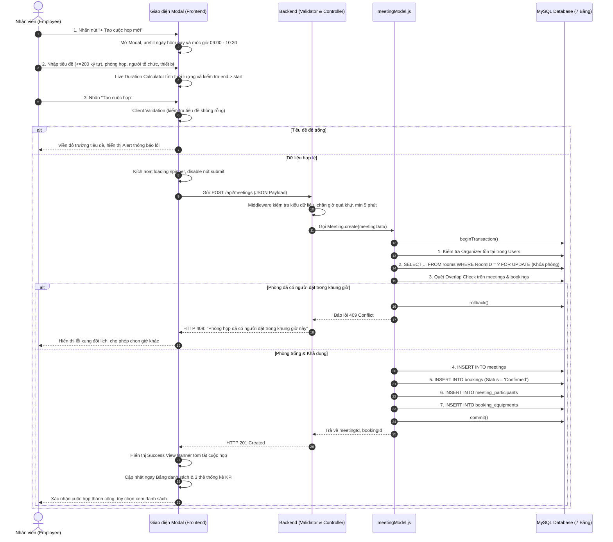
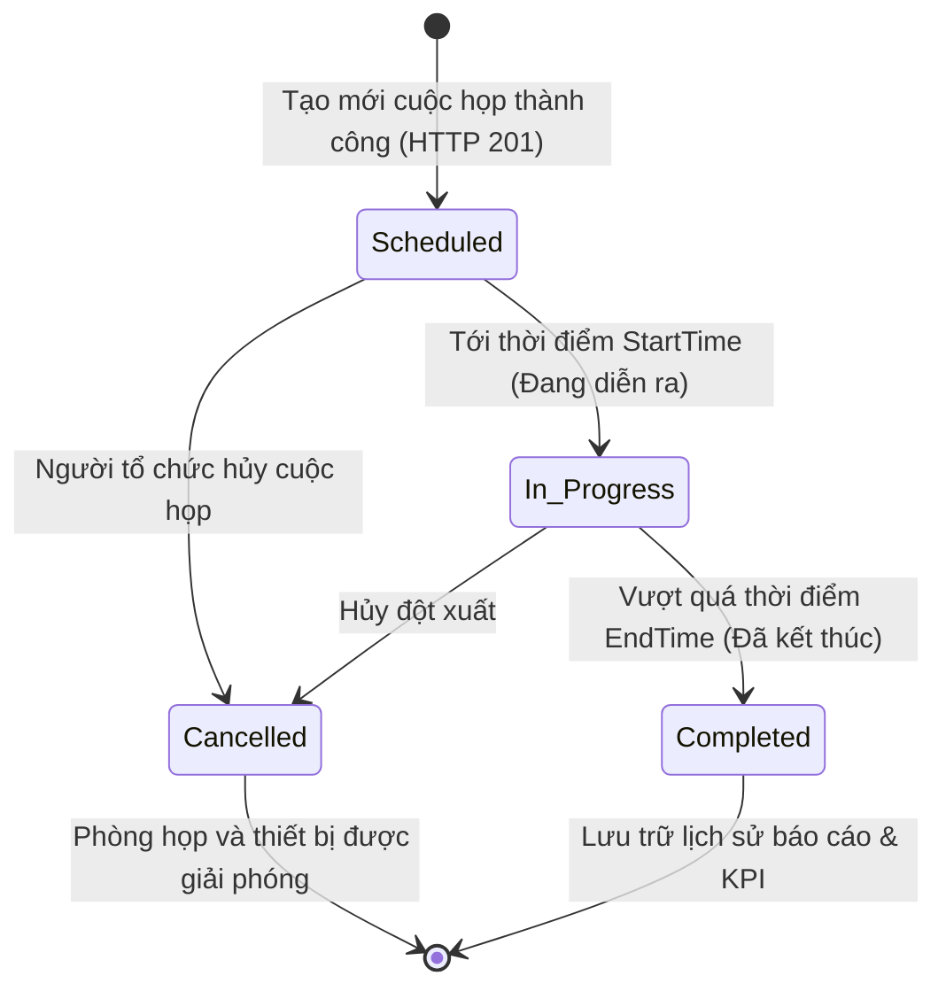
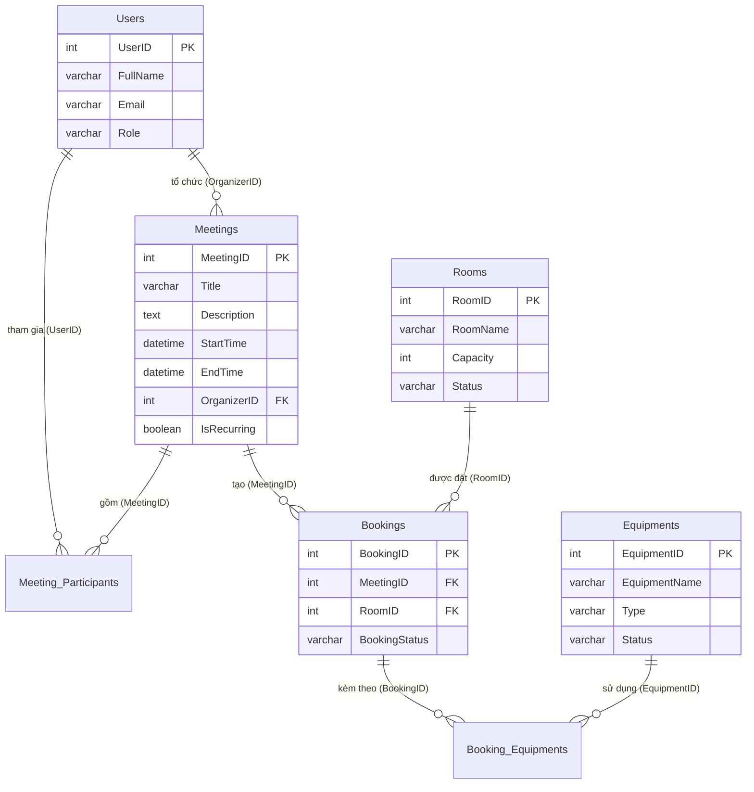

# 🏢 HỆ THỐNG QUẢN LÝ LỊCH HỌP DOANH NGHIỆP (ENTERPRISE SYNC MEETING SUITE)
> **Mã học phần: TTCS_T926_K16C2_N3 • Trường Đại học Công nghệ Thông tin & Truyền thông (ICTU)**

---

## 🌟 Tầm Nhìn Sản Phẩm (Product Vision)

> **"Trở thành giải pháp quản lý lịch họp số 1 cho doanh nghiệp, mang lại hiệu suất làm việc cao hơn thông qua việc tổ chức họp thông minh, tiết kiệm thời gian và tối ưu tài nguyên."**

Nền tảng giúp doanh nghiệp tối ưu hóa việc phân bổ phòng họp, trang thiết bị và thời gian, đảm bảo các cuộc họp được tổ chức hiệu quả, đúng lúc và đúng chỗ.

### Giá trị cốt lõi:
* **Loại bỏ hoàn toàn xung đột:** Cơ chế khóa dòng độc quyền triệt tiêu 100% tình trạng đặt trùng phòng (Double-booking / Race Condition).
* **Minh bạch tài nguyên:** Quản lý rõ ràng trạng thái phòng họp, sức chứa và danh mục thiết bị kỹ thuật (máy chiếu, micro, màn hình TV, bảng trắng) theo thời gian thực.
* **Trải nghiệm tối ưu (Stitch Design):** Giao diện Single Page Application (SPA) hiện đại, trực quan, hỗ trợ tính thời lượng tự động và xuất báo cáo chuẩn Excel.
* **Kiến trúc bền vững:** Phân tầng chuẩn MVC, API RESTful bảo mật và cơ sở dữ liệu MySQL chuẩn 3NF.

---

## 🎯 Mục Tiêu Sản Phẩm (Product Goals)

1. **Tối ưu hóa quy trình đặt lịch:** Thao tác đặt, cập nhật hoặc hủy lịch họp chỉ trong vài cú nhấp chuột với biểu mẫu modal chuẩn Stitch SaaS.
2. **Quản lý hiệu quả phòng họp & thiết bị:** Theo dõi chính xác sức chứa và gắn kèm thiết bị phòng họp tương ứng với từng lượt đặt.
3. **Nâng cao trải nghiệm người dùng:** Giao diện Responsive trên mọi kích thước màn hình, tìm kiếm live tức thì, lọc đa tiêu chí và thông báo trạng thái trực quan.
4. **Báo cáo và phân tích thông minh:** Thống kê các chỉ số KPI cuộc họp (tổng số, sắp diễn ra, đang diễn ra) và xuất file CSV UTF-8 mở trực tiếp trên Excel không bị lỗi font tiếng Việt.
5. **Tiêu chuẩn kiểm thử & QA chuyên nghiệp:** Tài liệu hóa toàn diện quy trình kiểm thử 10 cột, Postman Collection tự động và quản lý Bug chuẩn Jira Software.

---

## 🚀 Các Tính Năng Nổi Bật (Key Features)

| Phân hệ | Mô tả tính năng | Công nghệ phụ trách |
| :--- | :--- | :--- |
| **Meeting Scheduler** | Form tạo/sửa cuộc họp, tự động tính thời lượng, validation chặn giờ kết thúc trước giờ bắt đầu, Success View Banner. | Frontend (`client/main.js`, `index.html`) |
| **Concurrency Shield** | Chống đặt trùng phòng bằng Transaction và khóa dòng `SELECT ... FOR UPDATE` trên MySQL. | Backend (`server/models/meetingModel.js`) |
| **Strict Time Validator** | Chặn đặt lịch trong quá khứ, kiểm tra thời lượng từ 5 phút đến 24 giờ. | Backend Middleware (`meetingValidator.js`) |
| **Resource Allocator** | Điều phối phòng họp (5 phòng: 10 - 50 chỗ) và gắn thiết bị (máy chiếu, TV, mic, bảng trắng). | Fullstack (Database + Model + Form UI) |
| **Multi-Filter & Search**| Tab lọc trạng thái, dropdown lọc theo phòng họp và ô tìm kiếm live đa trường. | Frontend (`client/main.js`) |
| **Excel / CSV Exporter** | Xuất báo cáo danh sách cuộc họp có gắn tiền tố `\uFEFF` (BOM UTF-8) đọc chuẩn trên Excel. | Frontend (`client/main.js`) |
| **Containerization** | Đóng gói toàn bộ Backend và Database thành cụm Docker Compose chạy độc lập. | Docker (`docker-compose.yml`, `Dockerfile`) |

---

## 📁 Cấu Trúc Thư Mục Dự Án (Project Structure)

```text
TTCS_T926_K16C2_N3/
├── .agents/                 # Bộ quy chuẩn Agent & Skills cho phát triển dự án
│   └── skills/
│       └── fe-development-guide/
│           └── SKILL.md     # Cẩm nang quy chuẩn code Frontend & Stitch Design System
│
├── client/                  # Frontend (SPA - HTML5, CSS3, JavaScript thuần)
│   ├── index.html           # App Shell: Navbar, Container <div id="app">, Modal Forms
│   ├── style.css            # Hệ thống Stitch Design Tokens, Components, Animations
│   └── main.js              # Hash Router, Local Store, Live Duration, CRUD, CSV Export
│
├── server/                  # Backend (Node.js & Express RESTful API)
│   ├── config/              # Kết nối MySQL Pool (timezone +07:00)
│   ├── controllers/         # meetingController.js (Xử lý HTTP Request/Response)
│   ├── models/              # meetingModel.js (Transaction, Row Lock & Overlap Check)
│   ├── routes/              # Định tuyến API (/api/meetings, /api/health)
│   ├── validators/          # meetingValidator.js (Xác thực dữ liệu đầu vào nghiêm ngặt)
│   ├── server.js            # Điểm khởi chạy máy chủ Express
│   ├── package.json         # Danh sách dependencies (express, mysql2, cors, dotenv)
│   ├── Dockerfile           # Đóng gói image Node.js 20 Alpine
│   └── .dockerignore        # Loại trừ node_modules khi build image
│
├── database/                # Cơ sở dữ liệu (Database Schema)
│   └── init_database.sql    # Kịch bản DDL/DML khởi tạo 7 bảng và dữ liệu mẫu
│
├── docs/                    # Tài liệu kỹ thuật, kiến trúc & đặc tả nghiệp vụ
│   ├── LUONG_HOAT_DONG_HE_THONG.docx  # [MỚI] File Word đặc tả chi tiết toàn bộ luồng hoạt động
│   ├── LUONG_HOAT_DONG_HE_THONG.md    # [MỚI] Bản Markdown đặc tả luồng hoạt động kèm sơ đồ Mermaid
│   ├── FE_DEVELOPMENT_GUIDE.md        # [MỚI] Hướng dẫn quy chuẩn lập trình Frontend
│   ├── QA_PROCESS_AND_JIRA_STANDARDS.md # Quy trình kiểm thử QA & Quản lý Bug Jira chuẩn
│   ├── related_documents.md           # Hướng dẫn chi tiết kiểm thử Postman & kiến trúc
│   ├── test_case_template.csv         # Biểu mẫu Test Case 10 cột chuẩn UTF-8
│   ├── test_case_template.html        # Bản hiển thị trực quan biểu mẫu Test Case
│   └── SoDo_ERD.png                   # Sơ đồ quan hệ thực thể (ERD)
│
├── docker-compose.yml       # Cấu hình khởi chạy cụm dịch vụ (Node.js + MySQL 8.0)
├── .env.example             # Mẫu biến môi trường
├── .env                     # Biến môi trường thực tế (bảo mật trong .gitignore)
└── README.md                # Tài liệu tổng quan dự án
```

---

## 🔄 Toàn Bộ Luồng Hoạt Động Của Hệ Thống (System Workflows)

> 💡 **Chi tiết đầy đủ:** Xem tại file Word [docs/LUONG_HOAT_DONG_HE_THONG.docx](file:///d:/TTCS_T926_K16C2_N3/docs/LUONG_HOAT_DONG_HE_THONG.docx) hoặc bản trực tuyến [docs/LUONG_HOAT_DONG_HE_THONG.md](file:///d:/TTCS_T926_K16C2_N3/docs/LUONG_HOAT_DONG_HE_THONG.md).

### 1. Luồng Đặt phòng & Tạo cuộc họp (Booking Flow)



### 2. Thuật toán kiểm tra trùng lịch (Overlap Checking)
Hai cuộc họp trên cùng một phòng bị coi là **xung đột** khi thỏa mãn công thức:
$$\text{StartTime}_A < \text{EndTime}_B \quad \text{AND} \quad \text{EndTime}_A > \text{StartTime}_B$$

```sql
SELECT m.MeetingID, m.Title, m.StartTime, m.EndTime
FROM meetings m
JOIN bookings b ON m.MeetingID = b.MeetingID
WHERE b.RoomID = ? 
  AND b.BookingStatus = 'Confirmed'
  AND (m.StartTime < ?) AND (m.EndTime > ?);
```

### 3. Vòng đời trạng thái cuộc họp (Meeting Lifecycle)



---

## 🗄️ Cấu Trúc Cơ Sở Dữ Liệu (Database Schema)

Cơ sở dữ liệu gồm **7 bảng** chuẩn hóa 3NF trong `database/init_database.sql`:



---

## 🐳 Hướng Dẫn Cài Đặt & Khởi Chạy Dự Án

### Cách 1: Khởi chạy nhanh bằng Docker Compose (Khuyến nghị)

Yêu cầu: Đã cài đặt [Docker Desktop](https://www.docker.com/products/docker-desktop/).

```bash
# 1. Clone mã nguồn
git clone https://github.com/mrminh836/TTCS_T926_K16C2_N3.git
cd TTCS_T926_K16C2_N3

# 2. Tạo file biến môi trường từ mẫu
cp .env.example .env

# 3. Khởi động toàn bộ dịch vụ (Backend API + MySQL)
docker compose up --build -d
```

> **Ghi chú:** Khi chạy lần đầu, container MySQL tự động import kịch bản CSDL từ `database/init_database.sql`.

Kiểm tra trạng thái máy chủ:
```bash
curl http://localhost:3000/api/health
# Kết quả: {"status":"ok","database":"connected"}
```

### Cách 2: Khởi chạy Local (Không dùng Docker)

**Yêu cầu:** Node.js >= 18, MySQL Server >= 8.0.

```bash
# 1. Khởi tạo CSDL MySQL
mysql -u root -p meeting_management < database/init_database.sql

# 2. Cài đặt dependencies và chạy Backend API
cd server
npm install
npm run dev

# 3. Khởi chạy Frontend
# Mở thư mục client/ bằng Live Server trong VS Code (chạy trên cổng 5500)
# Hoặc truy cập: http://localhost:5500/#/meetings
```

---

## 📚 Danh Mục Tài Liệu Kỹ Thuật (Documentation Index)

| Tài liệu | Định dạng | Nội dung chính |
| :--- | :---: | :--- |
| **Đặc tả luồng hoạt động hệ thống** | [.docx](file:///d:/TTCS_T926_K16C2_N3/docs/LUONG_HOAT_DONG_HE_THONG.docx) / [.md](file:///d:/TTCS_T926_K16C2_N3/docs/LUONG_HOAT_DONG_HE_THONG.md) | Toàn bộ 5 luồng hoạt động chi tiết, thuật toán Overlap, cơ chế khóa dòng và ma trận ánh xạ FE-BE-DB. |
| **Cẩm nang phát triển Frontend** | [.md](file:///d:/TTCS_T926_K16C2_N3/.agents/skills/fe-development-guide/SKILL.md) | Bộ quy chuẩn UI/UX, Design tokens, cấu trúc code, validation, accessibility và checklist FE QA. |
| **Quy trình QA & Chuẩn hóa Jira** | [.md](file:///d:/TTCS_T926_K16C2_N3/docs/QA_PROCESS_AND_JIRA_STANDARDS.md) | Quy trình kiểm thử chất lượng, biểu mẫu Test Case 10 cột, Bug template và ma trận Severity/Priority. |
| **Hướng dẫn kiểm thử Postman** | [.md](file:///d:/TTCS_T926_K16C2_N3/docs/related_documents.md) | 9 kịch bản test API Postman chi tiết từ Case thành công (201) đến Race Condition (409). |
| **Biểu mẫu Test Case mẫu** | [.csv](file:///d:/TTCS_T926_K16C2_N3/docs/test_case_template.csv) / [.html](file:///d:/TTCS_T926_K16C2_N3/docs/test_case_template.html) | Bảng 10 Test Cases cốt lõi chuẩn UTF-8 có BOM mở trực tiếp bằng Excel hoặc Google Sheets. |

---

## 👥 Đội Ngũ Phát Triển (Team K16C2_N3)

* **Học phần:** Thực tập Chuyên sâu T926 - K16C2 - Nhóm 3
* **Đơn vị:** Khoa Công nghệ Thông tin - Trường Đại học Công nghệ Thông tin & Truyền thông (ICTU)
* **Quy chuẩn Git:** Phân nhánh theo tính năng (`feature/*`, `qa/*`), commit theo chuẩn Conventional Commits (`feat:`, `fix:`, `docs:`) và bắt buộc review qua Pull Request trước khi merge vào `main`.
