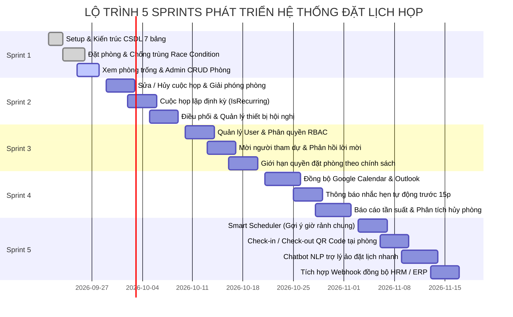
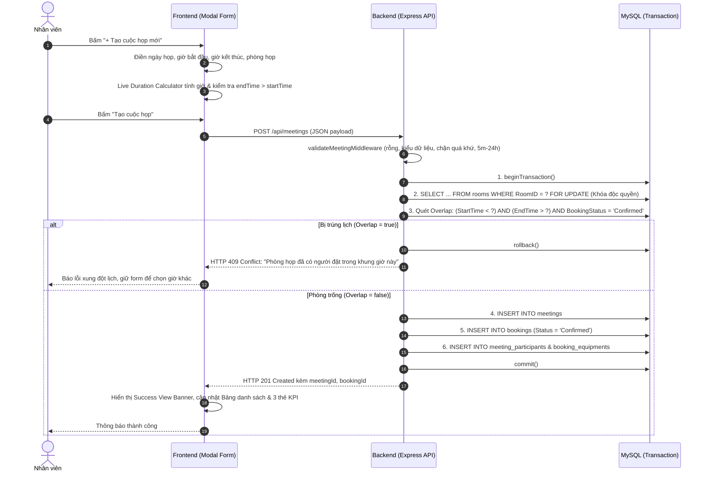
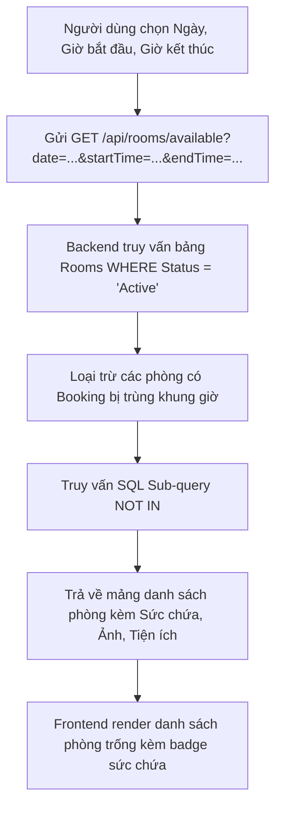
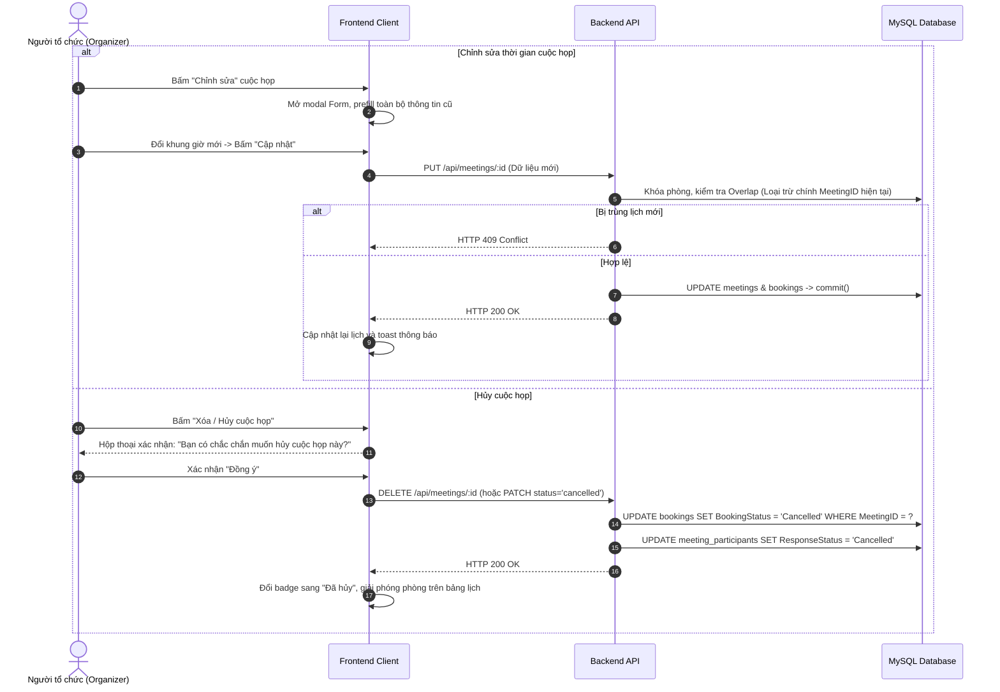
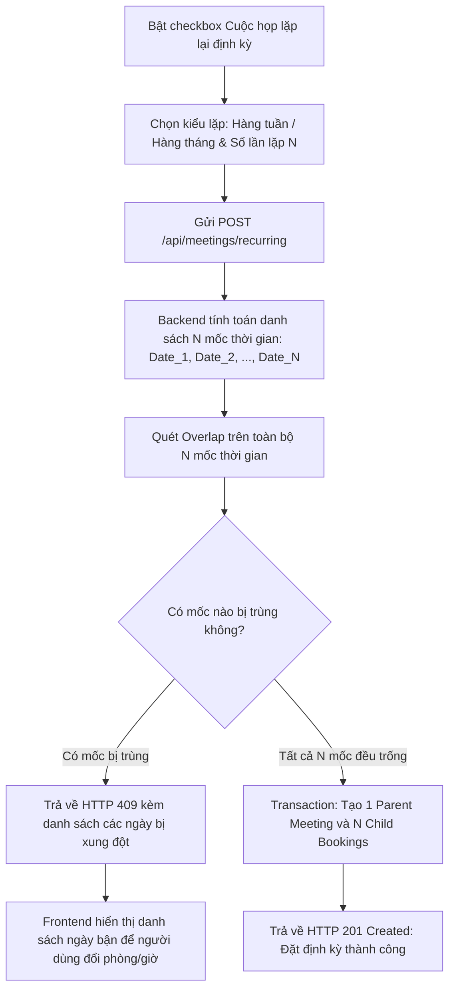
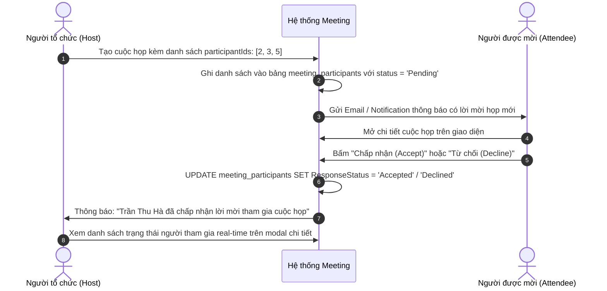
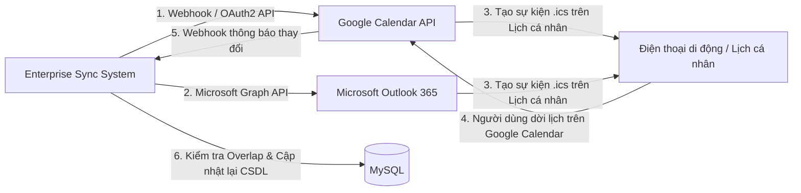
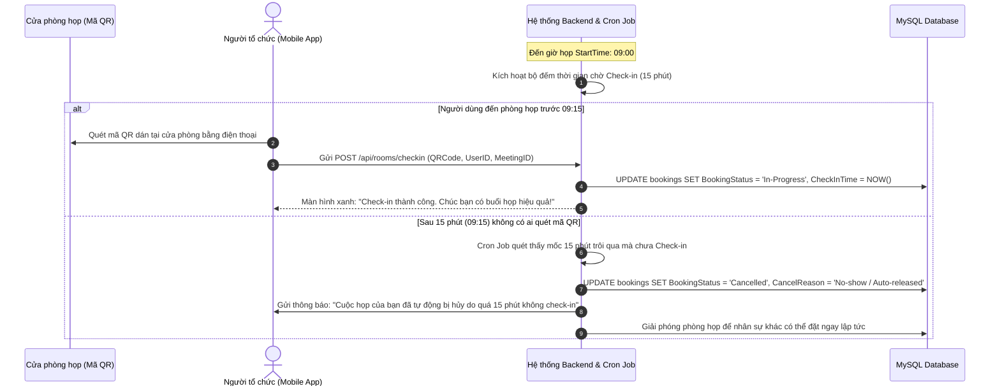

# 📘 TÀI LIỆU THIẾT KẾ TOÀN BỘ LUỒNG HOẠT ĐỘNG HỆ THỐNG THEO PRODUCT BACKLOG
## DÀNH CHO LẬP TRÌNH VIÊN (FE, BE, QA) PHỐI HỢP VỚI AI TRONG MỌI SPRINT
> **Dự án:** Quản lý Lịch họp Doanh nghiệp (Enterprise Sync Meeting Suite)  
> **Mã học phần:** TTCS_T926_K16C2_N3 • Trường ĐH Công nghệ Thông tin & Truyền thông (ICTU)  
> **Nguồn đặc tả gốc:** `Product_Backlog_Meeting_Management_ictu.xlsx` (28 User Stories, 7 Epics)

---

## 📑 MỤC LỤC TỔNG QUAN

1. [Bản Đồ Lộ Trình Phát Triển 5 Sprints (Sprint Roadmap)](#1-bản-đồ-lộ-trình-phát-triển-5-sprints-sprint-roadmap)
2. [SPRINT 1: Nền Tảng Đặt Lịch & Quản Lý Phòng Họp (Core Booking & Rooms)](#2-sprint-1-nền-tảng-đặt-lịch--quản-lý-phòng-họp-core-booking--rooms)
   - Luồng 1.1: Tạo cuộc họp & Khóa phòng chống đặt trùng Race Condition
   - Luồng 1.2: Tra cứu & Lọc danh sách phòng họp trống theo thời gian thực
   - Luồng 1.3: Quản trị danh mục phòng họp phía Admin (CRUD Rooms)
3. [SPRINT 2: Quản Lý Vòng Đời, Lặp Định Kỳ & Điều Phối Thiết Bị (Lifecycle & Resources)](#3-sprint-2-quản-lý-vòng-đời-lặp-định-kỳ--điều-phối-thiết-bị-lifecycle--resources)
   - Luồng 2.1: Chỉnh sửa & Hủy cuộc họp (Giải phóng phòng họp tức thời)
   - Luồng 2.2: Đặt lịch họp định kỳ (IsRecurring - Tuần / Tháng) & Thuật toán sinh chuỗi lịch
   - Luồng 2.3: Điều phối, kiểm tra trạng thái & Đặt kèm thiết bị phòng họp
4. [SPRINT 3: Người Dùng, Phân Quyền RBAC & Lời Mời Họp (Users, RBAC & Invites)](#4-sprint-3-người-dùng-phân-quyền-rbac--lời-mời-họp-users-rbac--invites)
   - Luồng 3.1: Xác thực & Phân quyền người dùng (Admin, Organizer, Attendee)
   - Luồng 3.2: Mời người tham dự & Phản hồi trạng thái tham gia (Accept/Decline)
   - Luồng 3.3: Chính sách giới hạn quyền đặt phòng theo phòng ban / cấp bậc
5. [SPRINT 4: Đồng Bộ Lịch Cá Nhân, Thông Báo & Phân Tích Báo Cáo (Sync & Analytics)](#5-sprint-4-đồng-bộ-lịch-cá-nhân-thông-báo--phân-tích-báo-cáo-sync--analytics)
   - Luồng 4.1: Đồng bộ 2 chiều với Google Calendar & Microsoft Outlook
   - Luồng 4.2: Hệ thống gửi thông báo nhắc hẹn tự động (Email / Web Push)
   - Luồng 4.3: Báo cáo hiệu suất, tần suất sử dụng phòng & Thống kê tỷ lệ hủy
6. [SPRINT 5: Tính Năng Nâng Cao, AI Gợi Ý & Check-in QR (Smart AI & Integrations)](#6-sprint-5-tính-năng-nâng-cao-ai-gợi-ý--check-in-qr-smart-ai--integrations)
   - Luồng 5.1: Thuật toán gợi ý khung giờ họp rảnh chung (Smart Scheduler)
   - Luồng 5.2: Check-in / Check-out phòng họp bằng mã QR Code (Auto-release sau 15p)
   - Luồng 5.3: Trợ lý ảo Chatbot NLP hỗ trợ đặt phòng tức thì
   - Luồng 5.4: Tích hợp Webhook đồng bộ nhân sự HRM / ERP
7. [Cẩm Nang Cho Coder Khi Prompt Làm Việc Với AI Trong Tương Lai](#7-cẩm-nang-cho-coder-khi-prompt-làm-việc-với-ai-trong-tương-lai)

---

## 1. Bản Đồ Lộ Trình Phát Triển 5 Sprints (Sprint Roadmap)

Dựa trên toàn bộ 28 User Stories trong file Product Backlog, hệ thống được phân rã thành **5 Sprints** có tính kế thừa và độc lập cao:



---

## 2. SPRINT 1: Nền Tảng Đặt Lịch & Quản Lý Phòng Họp (Core Booking & Rooms)
> **Mục tiêu:** Xây dựng khung ứng dụng, CSDL 7 bảng, luồng đặt phòng cơ bản với cơ chế khóa dòng chống trùng lịch và chức năng quản lý danh mục phòng họp.

### 2.1. Luồng 1.1: Tạo cuộc họp & Khóa phòng chống đặt trùng Race Condition
- **User Story:** `US 1.0` (Tạo lịch họp mới), `US 8.0` (Đặt phòng theo khung giờ).
- **Tác nhân:** Nhân viên (Employee / Organizer).



### 2.2. Luồng 1.2: Tra cứu & Lọc danh sách phòng họp trống theo thời gian thực
- **User Story:** `US 7.0` (Xem danh sách phòng trống), `US 10.0` (Xem sức chứa).
- **Ý nghĩa:** Người dùng chọn khoảng thời gian cần họp (ví dụ: ngày mai từ 14:00 - 16:00), hệ thống chỉ trả về danh sách các phòng **chưa có lịch đặt nào bị trùng** trong khung giờ đó.



- **Truy vấn SQL Backend chuẩn:**
```sql
SELECT r.RoomID, r.RoomName, r.Capacity, r.Status, r.QRCode
FROM rooms r
WHERE r.Status = 'Active'
  AND r.RoomID NOT IN (
      SELECT b.RoomID
      FROM bookings b
      JOIN meetings m ON b.MeetingID = m.MeetingID
      WHERE b.BookingStatus = 'Confirmed'
        AND m.StartTime < ? AND m.EndTime > ?
  );
```

### 2.3. Luồng 1.3: Quản trị danh mục phòng họp phía Admin (CRUD Rooms)
- **User Story:** `US 11.0` (Quản trị phòng: Thêm, sửa, xóa phòng họp).
- **Tác nhân:** Quản trị viên (Admin).
- **Quy tắc nghiệp vụ:**
  - Không cho phép xóa phòng họp nếu phòng đó đang có các cuộc họp `Confirmed` sắp diễn ra trong tương lai (Ràng buộc toàn vẹn dữ liệu). Chỉ cho phép chuyển trạng thái sang `Maintenance` (Bảo trì) hoặc `Inactive`.
  - Kiểm tra tên phòng không được trùng lặp. Sức chứa phải là số nguyên dương $> 0$.

---

## 3. SPRINT 2: Quản Lý Vòng Đời, Lặp Định Kỳ & Điều Phối Thiết Bị (Lifecycle & Resources)
> **Mục tiêu:** Cho phép chỉnh sửa/hủy lịch họp, tự động sinh chuỗi lịch họp lặp định kỳ, quản lý danh mục và điều phối thiết bị kèm theo.

### 3.1. Luồng 2.1: Chỉnh sửa & Hủy cuộc họp (Giải phóng phòng họp)
- **User Story:** `US 2.0` (Chỉnh sửa hoặc hủy lịch họp), `US 9.0` (Hủy phòng để giải phóng tài nguyên).



### 3.2. Luồng 2.2: Đặt lịch họp định kỳ (IsRecurring) & Thuật toán sinh chuỗi lịch
- **User Story:** `US 3.0` (Đặt lịch họp định kỳ tuần / tháng để không phải tạo lại nhiều lần).
- **Thách thức kỹ thuật:** Khi đặt lặp (ví dụ: 10 tuần liên tiếp vào thứ Hai lúc 09:00), nếu chỉ 1 tuần trong số đó bị trùng lịch với người khác thì xử lý thế nào?
- **Quy trình xử lý:**



### 3.3. Luồng 2.3: Điều phối, kiểm tra trạng thái & Đặt kèm thiết bị
- **User Story:** `US 12.0` (Đặt kèm thiết bị: máy chiếu, TV, bảng), `US 13.0` (Xem trạng thái thiết bị), `US 14.0` (Quản trị thiết bị Admin).
- **Nghiệp vụ:**
  1. Khi người dùng mở form tạo cuộc họp, dropdown/checkbox thiết bị truy vấn `GET /api/equipments/available?date=...&startTime=...&endTime=...`.
  2. Thiết bị đang ở trạng thái `Maintenance` (Bảo trì) hoặc đã được lượt họp khác mượn trong cùng khung giờ sẽ bị vô hiệu hóa (disabled) kèm nhãn "Đang bận" hoặc "Bảo trì".
  3. Khi cuộc họp được xác nhận, các bản ghi được ghi vào bảng liên kết `booking_equipments` với `BookingID` và `EquipmentID`.

---

## 4. SPRINT 3: Người Dùng, Phân Quyền RBAC & Lời Mời Họp (Users, RBAC & Invites)
> **Mục tiêu:** Quản lý tài khoản người dùng, phân quyền theo vai trò (Role-Based Access Control), gửi lời mời họp và theo dõi phản hồi tham dự.

### 4.1. Luồng 3.1: Xác thực & Phân quyền người dùng (RBAC)
- **User Story:** `US 18.0` (Tạo user), `US 19.0` (Danh sách user), `US 20.0` (Phân quyền Admin / Organizer / Attendee).
- **Ma trận phân quyền (RBAC Matrix):**

| Chức năng / Quyền hạn | Quản trị viên (Admin) | Người đặt lịch (Organizer) | Người tham dự (Attendee) |
| :--- | :---: | :---: | :---: |
| Đăng nhập & Xem lịch cá nhân | ✅ | ✅ | ✅ |
| Xem danh sách phòng & thiết bị | ✅ | ✅ | ✅ |
| Tạo cuộc họp & Đặt phòng thông thường | ✅ | ✅ | ❌ |
| Đặt phòng VIP / Hội trường lớn | ✅ | Chỉ định quyền | ❌ |
| Chỉnh sửa / Hủy cuộc họp của mình | ✅ | ✅ | ❌ |
| Chỉnh sửa / Hủy cuộc họp của người khác | ✅ | ❌ | ❌ |
| Quản trị Phòng họp & Thiết bị (CRUD) | ✅ | ❌ | ❌ |
| Quản lý tài khoản & Phân quyền User | ✅ | ❌ | ❌ |
| Xem báo cáo thống kê chuyên sâu & KPI | ✅ | Báo cáo cá nhân | ❌ |

### 4.2. Luồng 3.2: Mời người tham dự & Phản hồi lời mời (Accept / Decline)
- **User Story:** `US 4.0` (Mời người tham dự), `US 6.0` (Xem lịch sử cuộc họp).



### 4.3. Luồng 3.3: Chính sách giới hạn quyền đặt phòng theo chính sách công ty
- **User Story:** `US 21.0` (Hạn chế quyền đặt phòng nhất định theo chính sách công ty).
- **Nghiệp vụ:** Phòng họp VIP (ID: 5) hoặc Hội trường Grand Board (ID: 4) có cấu hình cờ `Restricted = true` hoặc `MinRole = 'Manager'`. Khi nhân viên thường (`Role = 'Employee'`) cố tình đặt phòng này, hệ thống sẽ chặn ngay từ Frontend và Backend trả về `HTTP 403 Forbidden: "Bạn không có thẩm quyền đặt phòng VIP này. Vui lòng liên hệ Trưởng phòng hoặc Quản trị viên."`

---

## 5. SPRINT 4: Đồng Bộ Lịch Cá Nhân, Thông Báo & Phân Tích Báo Cáo (Sync & Analytics)
> **Mục tiêu:** Đồng bộ hai chiều với Google Calendar / Outlook, gửi thông báo nhắc hẹn trước giờ họp và cung cấp Dashboard báo cáo đo lường lãng phí tài nguyên.

### 5.1. Luồng 4.1: Đồng bộ 2 chiều với Google Calendar & Microsoft Outlook
- **User Story:** `US 15.0` (Đồng bộ Google Calendar / Outlook), `US 17.0` (Xem lịch trên ứng dụng di động).



### 5.2. Luồng 4.2: Hệ thống gửi thông báo nhắc hẹn tự động (Notification Engine)
- **User Story:** `US 16.0` (Nhận thông báo nhắc nhở qua Email / App trước giờ họp).
- **Kiến trúc:** Chạy Background Worker / Cron Job định kỳ 1 phút một lần:
  1. Quét bảng `Meetings` tìm các cuộc họp có `StartTime - NOW() <= 15 phút` và cờ `Notified = false`.
  2. Gửi Email thông báo qua SMTP / SendGrid hoặc Web Push Notification tới toàn bộ `Organizer` và các `Participants` có trạng thái `Accepted`.
  3. Cập nhật `Notified = true` để không gửi lặp lại.

### 5.3. Luồng 4.3: Báo cáo tần suất sử dụng phòng & Thống kê tỷ lệ hủy họp
- **User Story:** `US 22.0` (Báo cáo sử dụng phòng), `US 23.0` (Thống kê hủy họp), `US 24.0` (Xuất báo cáo Excel/PDF).
- **Công thức tính toán KPI phục vụ Ban Giám Đốc:**
  - **Tỷ lệ lấp đầy phòng (Room Utilization Rate):**
    $$\text{Tỷ lệ (\%)} = \frac{\sum \text{Tổng số giờ họp thực tế}}{\text{Tổng số giờ làm việc chuẩn trong tháng (8h/ngày } \times 22 \text{ ngày)}} \times 100\%$$
  - **Tỷ lệ hủy họp (Cancellation Rate):**
    $$\text{Tỷ lệ Hủy (\%)} = \frac{\text{Số cuộc họp có status 'Cancelled'}}{\text{Tổng số cuộc họp được tạo}} \times 100\%$$
  - **Chức năng xuất file:** Cho phép xuất dữ liệu thống kê ra file Excel chuẩn định dạng biểu mẫu doanh nghiệp hoặc file PDF báo cáo tháng.

---

## 6. SPRINT 5: Tính Năng Nâng Cao, AI Gợi Ý & Check-in QR (Smart AI & Integrations)
> **Mục tiêu:** Ứng dụng AI và IoT để hiện đại hóa hệ sinh thái đặt phòng: Smart Scheduler gợi ý giờ rảnh, Check-in QR tại cửa phòng, Chatbot NLP và tích hợp HRM/ERP.

### 6.1. Luồng 5.1: Thuật toán gợi ý khung giờ họp rảnh chung (Smart Scheduler)
- **User Story:** `US 5.0` (Xem gợi ý thời gian họp khi mọi người đều rảnh).

```mermaid
graph TD
    A[Người tổ chức chọn danh sách 5 người cần họp & Thời lượng muốn họp: 60 phút] --> B[Gửi request GET /api/scheduler/suggest]
    B --> C[Backend quét toàn bộ lịch của 5 nhân sự trong ngày từ CSDL]
    C --> D[Tạo mảng biểu diễn các khe thời gian trong ngày: 08:00 đến 18:00 (mỗi slot 15p)]
    D --> E[Giao các khoảng thời gian bận của cả 5 người để tìm khoảng trống giao thoa]
    E --> F[Quét thêm danh sách phòng họp còn trống trong các khoảng thời gian đó]
    F --> G[Trả về Top 3 khung giờ tối ưu nhất kèm phòng họp tương ứng]
    G --> H[Frontend hiển thị Card gợi ý khung giờ vàng để Host chọn bằng 1 click]
```

### 6.2. Luồng 5.2: Check-in / Check-out phòng họp bằng mã QR Code (Auto-release)
- **User Story:** `US 27.0` (Check-in và check-out bằng mã QR để ghi nhận chính xác việc sử dụng phòng).
- **Bài toán thực tế:** Nhiều người đặt phòng nhưng quên hủy khi không họp, khiến phòng bị "chiếm ảo" trong khi người khác cần thì không có chỗ.
- **Giải pháp giải phóng phòng tự động (Auto-release Mechanism):**



### 6.3. Luồng 5.3: Trợ lý ảo Chatbot NLP hỗ trợ đặt phòng tức thì
- **User Story:** `US 25.0` (Đặt phòng qua Chatbot mà không cần mở giao diện form).
- **Ví dụ tương tác:**
  - *Nhân viên nhắn:* "Đặt phòng cho tôi chiều mai từ 2 giờ đến 3 giờ rưỡi để họp team K16C2 khoảng 15 người."
  - *Chatbot NLP xử lý:*
    - Intent: `BOOK_MEETING`
    - Date: `2026-09-28`
    - StartTime: `14:00`, EndTime: `15:30`
    - Title: `Họp team K16C2`
    - Capacity: `>= 15 người` (Gợi ý Phòng Tokyo hoặc Phòng Hội Nghị A)
  - *Chatbot phản hồi:* "Tôi đã tìm thấy **Phòng Tokyo (Tầng 4, 20 chỗ)** còn trống vào 14:00 - 15:30 ngày mai. Bạn có muốn xác nhận đặt phòng này không? [Xác nhận] [Đổi phòng khác]"

### 6.4. Luồng 5.4: Tích hợp Webhook đồng bộ nhân sự HRM / ERP
- **User Story:** `US 28.0` (Tích hợp hệ thống HRM / ERP).
- **Cơ chế:** Khi phòng Tổ chức Cán bộ thêm nhân viên mới hoặc chuyển phòng ban trên hệ thống HRM:
  - Hệ sinh thái HRM bắn Webhook tới `POST /api/webhooks/hrm-sync`.
  - Backend xác thực Secret Key, tự động thêm/sửa bản ghi trong bảng `Users`, gán phòng ban và vai trò tương ứng mà không cần Admin phải tạo thủ công bằng tay.

---

## 7. Cẩm Nang Cho Coder Khi Prompt Làm Việc Với AI Trong Tương Lai

Để bất kỳ lập trình viên nào trong nhóm (FE, BE, QA) khi yêu cầu AI code các Sprint tiếp theo đạt hiệu quả cao nhất mà **không làm hỏng kiến trúc hiện có**, hãy áp dụng cấu trúc Prompt chuẩn 4 phần sau:

### 📋 Mẫu Prompt Chuẩn Khi Giao Việc Cho AI:

```text
[BỐI CẢNH DỰ ÁN]
Dự án: TTCS_T926_K16C2_N3 - Hệ thống Quản lý Lịch họp Doanh nghiệp.
CSDL gồm 7 bảng chuẩn: Users, Rooms, Meetings, Bookings, Meeting_Participants, Equipments, Booking_Equipments.
Tài liệu luồng hoạt động chuẩn: docs/LUONG_HOAT_DONG_HE_THONG.md.
Cẩm nang Frontend: skills/fe-development-guide/SKILL.md.

[NHIỆM VỤ HIỆN TẠI]
Tôi cần phát triển User Story: US [Mã số] - [Tên User Story] thuộc Sprint [Số Sprint].
Phân hệ: [Frontend / Backend / Fullstack / QA Test Cases].

[YÊU CẦU KỸ THUẬT & RÀNG BUỘC]
1. Không làm hỏng các tính năng đã chạy của Sprint 1 (Đặt phòng, Row lock, Live duration, 7 bảng DB).
2. Viết code sạch, phân tầng đúng MVC hoặc đúng file client/index.html, main.js, style.css.
3. Không tự ý push mã nguồn lên Git khi chưa được tôi nghiệm thu và đồng ý.
4. Đảm bảo Console sạch 0 errors, 0 warnings và tuân thủ Accessibility (A11y).

[KẾT QUẢ ĐẦU RA MONG ĐỢI]
- Mã nguồn chi tiết có giải thích ngắn gọn.
- Cập nhật tài liệu và hướng dẫn kiểm thử tương ứng.
```

### 🎯 Ví dụ thực tế:
- **Ví dụ muốn làm Sprint 2 (Thiết bị):**
  > *"Hãy đọc Luồng 2.3 trong file `docs/LUONG_HOAT_DONG_HE_THONG.md`. Viết API `GET /api/equipments/available` và cập nhật giao diện client để khi người dùng chọn khung giờ họp, chỉ hiển thị các thiết bị chưa bị ai mượn trong giờ đó."*
- **Ví dụ muốn làm Sprint 3 (Mời người tham dự):**
  > *"Hãy đọc Luồng 3.2 trong file `docs/LUONG_HOAT_DONG_HE_THONG.md`. Xây dựng tính năng cho phép người tham gia bấm Chấp nhận hoặc Từ chối lời mời họp và cập nhật cột `ResponseStatus` trong bảng `Meeting_Participants`."*
- **Ví dụ muốn làm Sprint 5 (Check-in QR Code):**
  > *"Hãy đọc Luồng 5.2 trong file `docs/LUONG_HOAT_DONG_HE_THONG.md`. Viết cron job tự động quét các cuộc họp quá 15 phút chưa check-in để hủy phòng và giải phóng tài nguyên."*
