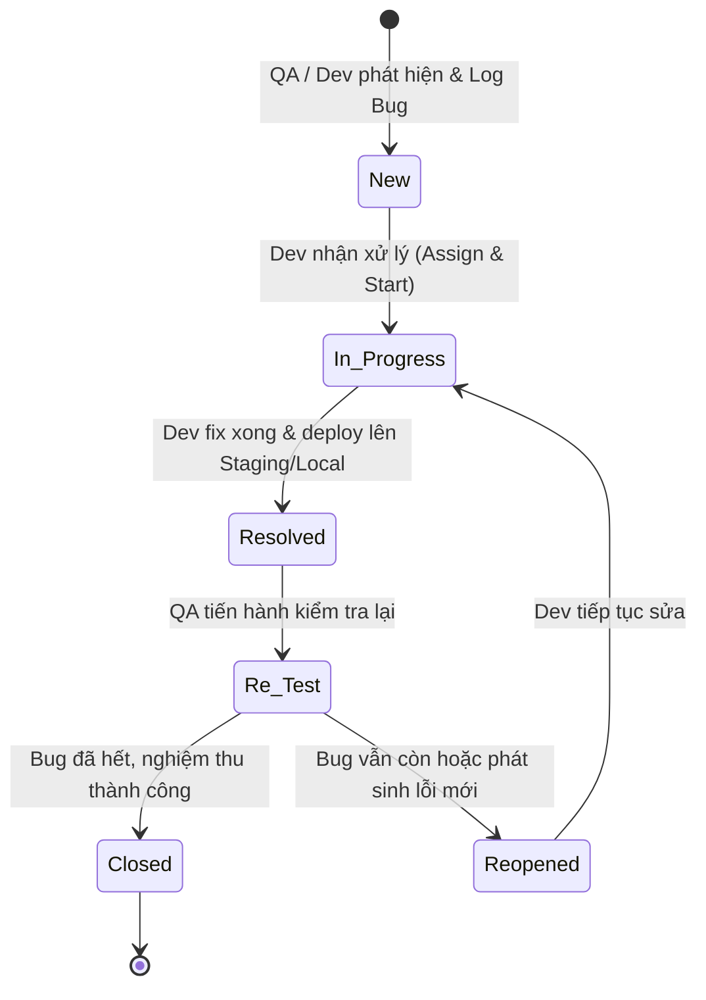

# TÀI LIỆU QUY TRÌNH KIỂM THỬ CHẤT LƯỢNG (QA PROCESS) & CHUẨN HÓA JIRA
*(Dự án: Hệ thống quản lý lịch họp doanh nghiệp - TTCS_T926_K16C2_N3)*

---

## 📑 MỤC LỤC
1. [Mục Tiêu & Phạm Vi Áp Dụng](#1-mục-tiêu--phạm-vi-áp-dụng)
2. [Biểu Mẫu Viết Test Case Chuẩn (Test Case Template)](#2-biểu-mẫu-viết-test-case-chuẩn-test-case-template)
   - [2.1. Cấu trúc 10 cột chuẩn](#21-cấu-trúc-10-cột-chuẩn)
   - [2.2. Bảng Test Cases mẫu thực tế dự án](#22-bảng-test-cases-mẫu-thực-tế-dự-án)
   - [2.3. Hướng dẫn nhập vào Google Sheets / Excel](#23-hướng-dẫn-nhập-vào-google-sheets--excel)
3. [Thiết Lập Quản Lý Bug Trên Jira (Bug Tracking Board)](#3-thiết-lập-quản-lý-bug-trên-jira-bug-tracking-board)
   - [3.1. Issue Type & Board Configuration](#31-issue-type--board-configuration)
   - [3.2. Sơ đồ Vòng đời Bug (Bug Lifecycle Workflow)](#32-sơ-đồ-vòng-đời-bug-bug-lifecycle-workflow)
   - [3.3. Ma trận Mức độ nghiêm trọng (Severity) & Mức độ ưu tiên (Priority)](#33-ma-trận-mức-độ-nghiêm-trọng-severity--mức-độ-ưu-tiên-priority)
4. [Định Nghĩa Mẫu Báo Cáo Bug Chuẩn (Bug Report Template)](#4-định-nghĩa-mẫu-báo-cáo-bug-chuẩn-bug-report-template)
   - [4.1. Khung mẫu chuẩn copy-paste](#41-khung-mẫu-chuẩn-copy-paste)
   - [4.2. Hướng dẫn đính kèm bằng chứng (Logs, Screenshots, Payloads)](#42-hướng-dẫn-đính-kèm-bằng-chứng-logs-screenshots-payloads)
5. [Các Bài Viết Mẫu (Sample Bugs) Sát Sườn Dự Án](#5-các-bài-viết-mẫu-sample-bugs-sát-sườn-dự-án)
   - [5.1. Sample Bug 1 (Backend / API - Lỗi Concurrency / Race Condition)](#51-sample-bug-1-backend--api---lỗi-concurrency--race-condition)
   - [5.2. Sample Bug 2 (Frontend / UI - Lỗi Modal & Validation Form)](#52-sample-bug-2-frontend--ui---lỗi-modal--validation-form)
6. [Quy Trình Phối Hợp Đội Ngũ (Dev - QA Handover Protocol)](#6-quy-trình-phối-hợp-đội-ngũ-dev---qa-handover-protocol)
   - [6.1. Ma trận trách nhiệm RACI (SM, QA, FE Dev, BE Dev)](#61-ma-trận-trách-nhiệm-raci-sm-qa-fe-dev-be-dev)
   - [6.2. Các quy tắc vàng khi log và xử lý bug](#62-các-quy-tắc-vàng-khi-log-và-xử-lý-bug)
7. [Tiêu Chí Nghiệm Thu (Acceptance Criteria Checklist)](#7-tiêu-chí-nghiệm-thu-acceptance-criteria-checklist)

---

## 1. Mục Tiêu & Phạm Vi Áp Dụng

- **Mục tiêu**: Chuẩn hóa toàn bộ quy trình kiểm thử chất lượng (QA Process) và quản lý lỗi (Bug Tracking) cho dự án `TTCS_T926_K16C2_N3`. Giúp đội ngũ (Frontend, Backend, Tester, Scrum Master) có tiếng nói chung, phát hiện lỗi sớm, bàn giao mượt mà và không bị sót lỗi trước khi bàn giao sản phẩm.
- **Phạm vi**: 
  - Toàn bộ các API Backend (Node.js/Express, MySQL).
  - Giao diện Client (HTML5, Bootstrap 5, JavaScript).
  - Tích hợp và đồng bộ trạng thái trên Jira Software / Jira Work Management.

---

## 2. Biểu Mẫu Viết Test Case Chuẩn (Test Case Template)

### 2.1. Cấu trúc 10 cột chuẩn

| STT | Tên cột (Header) | Ý nghĩa & Quy chuẩn | Ví dụ dữ liệu |
| :---: | :--- | :--- | :--- |
| **1** | **Test Case ID** | Định danh duy nhất cho từng test case. Đặt theo cú pháp: `TC_[MODULE]_[STT 3 số]`. | `TC_MEET_001`, `TC_AUTH_002` |
| **2** | **Module / Feature** | Phân hệ hoặc tính năng chức năng đang được kiểm thử. | `Meeting / Booking`, `Room Management` |
| **3** | **Tiêu đề kịch bản** | Mô tả ngắn gọn mục tiêu của kịch bản kiểm thử. | `Tạo cuộc họp và đặt phòng thành công` |
| **4** | **Pre-conditions** | Các điều kiện bắt buộc phải thỏa mãn trước khi bắt đầu test. | `User đã login, Phòng ID=1 đang Active` |
| **5** | **Test Steps** | Các bước thực hiện tuần tự được đánh số rõ ràng (1, 2, 3...). | `1. Bấm "+ Thêm cuộc họp"<br>2. Chọn phòng ID=1...` |
| **6** | **Test Data** | Dữ liệu đầu vào cụ thể dùng để test (Payload, ID, Ngày giờ...). | `Title: "Họp Sprint", RoomID: 1, 09:00 - 10:00` |
| **7** | **Expected Result** | Kết quả mong đợi theo đúng tài liệu đặc tả chức năng. | `Trả về HTTP 201 Created, cập nhật lịch vào DB` |
| **8** | **Actual Result** | Kết quả thực tế quan sát được khi QA thực hiện test. | `Tạo thành công, toast xanh hiển thị` |
| **9** | **Status** | Trạng thái kiểm thử: `Pass` (Đạt), `Fail` (Không đạt), `Blocked` (Bị chặn), `Untested` (Chưa test). | `Pass` / `Fail` |
| **10**| **Ghi chú / Bug ID**| Link ticket bug trên Jira nếu Fail, hoặc ghi chú phụ. | `BUG-101`, `Cần kiểm tra thêm trên Firefox` |

---

### 2.2. Bảng Test Cases mẫu thực tế dự án

Dự án đã có sẵn file mẫu dữ liệu chuẩn hóa tại: [test_case_template.csv](file:///Users/user/Library/CloudStorage/GoogleDrive-hvkhuyen@ictu.vn/My%20Drive/Hoc%20tap/2026-2027%20%20%20%20%28nam%203%29/ky%201-N3%20%28k23%29/Code%20du%20an%20thuc%20tap/TTCS_T926_K16C2_N3/docs/test_case_template.csv). Dưới đây là bảng trích xuất 10 kịch bản cốt lõi:

| Test Case ID | Module / Feature | Tiêu đề kịch bản | Pre-conditions | Test Steps | Expected Result | Status |
| :--- | :--- | :--- | :--- | :--- | :--- | :---: |
| **TC_MEET_001** | Meeting / Booking | Tạo cuộc họp & đặt phòng hợp lệ | Phòng ID=1 trạng thái `Active`, khung giờ trống | 1. Mở modal thêm cuộc họp<br>2. Nhập tiêu đề, phòng ID=1, ngày mai 09:00-10:00<br>3. Bấm "Lưu" | HTTP 201 Created, lưu DB, hiện trên bảng lịch | **Pass** |
| **TC_MEET_002** | Meeting / Concurrency | Chặn trùng lịch phòng (Overlap) | Phòng ID=1 đã có lịch 09:00 - 10:00 | 1. Đặt tiếp phòng ID=1 khung giờ 09:30 - 10:30<br>2. Bấm "Lưu" | HTTP 409 Conflict: "Phòng đã có lịch họp trùng khung giờ" | **Pass** |
| **TC_MEET_003** | Meeting / Room Validation | Chặn phòng đang bảo trì (Maintenance) | Phòng ID=2 có `Status = Maintenance` | 1. Chọn phòng ID=2<br>2. Bấm "Lưu" | HTTP 400 Bad Request: "Phòng đang bảo trì hoặc ngừng hoạt động" | **Pass** |
| **TC_MEET_004** | Meeting / Date Validation | Chặn đặt lịch trong quá khứ | Đang ở form đặt phòng | 1. Chọn thời gian bắt đầu ở thời điểm quá khứ<br>2. Bấm "Lưu" | Chặn submit, báo lỗi HTTP 400: "Thời gian bắt đầu không thể ở quá khứ" | **Pass** |
| **TC_MEET_005** | Meeting / Date Validation | Chặn giờ kết thúc trước giờ bắt đầu | Đang ở form đặt phòng | 1. Chọn Start: 10:00, End: 09:00<br>2. Bấm "Lưu" | Báo lỗi validation: "Thời gian kết thúc phải sau thời gian bắt đầu" | **Pass** |
| **TC_MEET_006** | Meeting / FK Validation | Người tổ chức (OrganizerID) không tồn tại | Không có user ID=99999 | 1. Gửi request tạo với OrganizerID=99999 | HTTP 404 Not Found: "Không tìm thấy Người tổ chức". Server không sập | **Pass** |
| **TC_MEET_007** | Meeting / Relationships | Thêm Người tham gia & Thiết bị | Có User 1,2,3 và Thiết bị 1,2 | 1. Chọn User 2,3 và Thiết bị 1,2<br>2. Bấm "Lưu" | HTTP 201 Created, bản ghi ghi đúng vào 2 bảng liên kết con | **Pass** |
| **TC_MEET_008** | UI / Form Meeting | Validate trường rỗng (Title bắt buộc) | Đang mở modal đặt phòng | 1. Để trống Tiêu đề<br>2. Bấm "Lưu" | Form không submit, focus và viền đỏ trường tiêu đề | **Pass** |
| **TC_MEET_009** | UI / Modal | Đóng modal (Nút X, click ngoài overlay) | Modal đang mở | 1. Bấm nút X hoặc click ra ngoài | Modal đóng, reset dữ liệu form sạch sẽ | **Pass** |
| **TC_MEET_010** | Error Handling | Xử lý khi CSDL ngắt kết nối | Tắt MySQL tạm thời | 1. Thao tác đặt phòng từ web | Toast báo lỗi thân thiện: "Không thể kết nối máy chủ", Node.js không crash | **Pass** |

---

### 2.3. Hướng dẫn nhập vào Google Sheets / Excel

1. **Mở file trên Excel trực tiếp**: File `docs/test_case_template.csv` được lưu chuẩn **UTF-8 with BOM**, người dùng Windows và macOS mở bằng Microsoft Excel sẽ hiển thị đúng 100% tiếng Việt có dấu.
2. **Import lên Google Sheets**:
   - Truy cập **Google Drive** -> Nhấn **Mới (+)** -> **Google Trang tính (Google Sheets)**.
   - Chọn menu **Tệp (File)** ➔ **Nhập (Import)** ➔ Tab **Tải lên (Upload)** ➔ Chọn file `test_case_template.csv`.
   - Loại dấu phân tách: Chọn **Tự động phát hiện** hoặc **Dấu phẩy (Comma)**.
   - Bấm **Nhập dữ liệu**.
3. **Cấu hình định dạng có điều kiện (Conditional Formatting) trên Sheets**:
   - Cột `Status`: 
     - Text is exactly `Pass` ➔ Nền xanh lá nhạt (`#D4EDDA`), Chữ xanh đậm (`#155724`).
     - Text is exactly `Fail` ➔ Nền đỏ nhạt (`#F8D7DA`), Chữ đỏ đậm (`#721C24`).
     - Text is exactly `Blocked` ➔ Nền vàng nhạt (`#FFF3CD`), Chữ nâu đậm (`#856404`).
4. **Chia sẻ**: Bấm nút **Chia sẻ (Share)** ở góc trên bên phải ➔ Chọn *"Bất kỳ ai có đường liên kết đều có thể xem/chỉnh sửa"* ➔ Gắn link vào tài liệu dự án và Jira Board Description.

---

## 3. Thiết Lập Quản Lý Bug Trên Jira (Bug Tracking Board)

### 3.1. Issue Type & Board Configuration

- **Tên Board**: `TTCS_MEETING_BUG_BOARD` (hoặc gắn chung vào Kanban/Scrum Board của Sprint).
- **Issue Type chuẩn**: **`Bug`** (Biểu tượng chấm tròn màu đỏ).
- **Các trường bắt buộc (Mandatory Fields)** khi tạo Bug:
  1. `Summary` (Tiêu đề lỗi theo format quy định).
  2. `Description` (Nội dung chi tiết theo Bug Report Template).
  3. `Issue Type`: Bug.
  4. `Severity` (Mức độ nghiêm trọng).
  5. `Priority` (Mức độ ưu tiên).
  6. `Component / Label`: `Frontend` (FE), `Backend` (BE), `Database` (DB), `UI/UX`.
  7. `Assignee`: Phân công cho Dev phụ trách (hoặc để Unassigned cho Tech Lead/SM phân công).

---

### 3.2. Sơ đồ Vòng đời Bug (Bug Lifecycle Workflow)



#### Bảng ánh xạ Trạng thái & Thao tác trên Jira:

| Trạng thái (Status) | Cột tương ứng trên Board | Ý nghĩa | Người phụ trách chính |
| :--- | :--- | :--- | :--- |
| **New** | `To Do / Backlog` | Bug vừa được tạo, chờ Dev review hoặc SM phân bổ. | QA / SM / Dev Lead |
| **In Progress** | `In Progress` | Dev đã nhận bug, đang tiến hành debug và sửa code. | Dev (BE / FE) |
| **Resolved / Ready for QA** | `Ready for QA` | Dev đã sửa xong, merge code và đẩy lên môi trường test. | Dev bàn giao sang QA |
| **Re-test** | `In Review / Testing` | QA đang thực hiện lại các bước tái hiện để kiểm tra. | QA |
| **Closed** | `Done` | Lỗi đã được khắc phục hoàn toàn, đóng ticket. | QA |
| **Reopened** | `To Do / Reopened` | Lỗi vẫn chưa hết. QA comment bằng chứng và mở lại. | Dev tiếp tục xử lý |

---

### 3.3. Ma trận Mức độ nghiêm trọng (Severity) & Mức độ ưu tiên (Priority)

| Mức độ (Severity) | Tiêu chí nhận diện | Ví dụ thực tế dự án | SLA xử lý (Khuyến nghị) | Priority tương ứng |
| :--- | :--- | :--- | :---: | :---: |
| 🔴 **Blocker** | Hệ thống sập hoàn toàn (Crash/Freeze), chức năng sống còn bị tê liệt, không có giải pháp thay thế tạm thời. | - Server Node.js bị crash không khởi động lại được.<br>- Mất kết nối CSDL hàng loạt.<br>- Không thể mở trang web hay tạo bất kỳ cuộc họp nào. | **<= 4 giờ** | Highest |
| 🟠 **Critical** | Chức năng chính bị hỏng nặng, sai lệch dữ liệu nghiêm trọng, nhưng vẫn còn luồng đi thay thế (workaround). | - Tính năng chống trùng lịch (Race Condition) bị vô hiệu hóa, 2 người cùng đặt 1 phòng.<br>- Xóa cuộc họp làm mất luôn dữ liệu trong bảng `rooms`. | **<= 24 giờ** | High |
| 🟡 **Major** | Lỗi chức năng quan trọng nhưng không ảnh hưởng tính toàn vẹn dữ liệu, hoặc luồng phụ bị lỗi. | - Không gửi được email mời họp.<br>- Chọn danh sách thiết bị không lưu được vào bảng `booking_equipments`.<br>- Validate sai định dạng ngày tháng nhưng server vẫn chặn được. | **Trong Sprint** (2 - 3 ngày) | Medium |
| 🟢 **Minor** | Lỗi giao diện người dùng (UI/UX), sai lệch chính tả, icon lệch hàng, CSS hiển thị chưa mượt trên mobile. | - Nút "Lưu cuộc họp" bị tràn chữ trên màn hình nhỏ.<br>- Sai chính tả thông báo toast.<br>- Icon lịch họp hiển thị lệch 2px. | **Backlog** (Khi rảnh / Sprint sau) | Low |

---

## 4. Định Nghĩa Mẫu Báo Cáo Bug Chuẩn (Bug Report Template)

### 4.1. Khung mẫu chuẩn copy-paste

Khi tạo Issue type **Bug** trên Jira, thành viên bắt buộc điền tiêu đề và mô tả theo đúng mẫu sau:

#### Quy ước Tiêu đề (Summary):
```text
[Tên Module/API/Màn hình] [Mô tả ngắn gọn lỗi xảy ra]
```
*Ví dụ*: `[API / Meeting] Trả về HTTP 500 khi ngày bắt đầu lớn hơn ngày kết thúc`

#### Nội dung chi tiết (Description Template):

```markdown
h3. 1. Môi trường kiểm thử (Environment)
* *Môi trường:* Local / Staging (http://localhost:3000)
* *Trình duyệt:* Google Chrome v128+ / Firefox v129+
* *Hệ điều hành:* Windows 11 / macOS Sonoma
* *Nhánh mã nguồn:* main / develop (Commit: `abcdef1`)

h3. 2. Tiền điều kiện (Pre-conditions)
* Đã chạy database seed, có sẵn phòng họp ID = 1 (Active).
* Người dùng đã đăng nhập hoặc có quyền tạo cuộc họp.

h3. 3. Các bước tái hiện (Steps to Reproduce)
# Truy cập trang Quản lý cuộc họp (`/client/index.html`).
# Bấm nút "+ Thêm cuộc họp" để mở modal.
# Nhập tiêu đề: "Họp khẩn".
# Chọn Phòng: ID = 1.
# Chọn khung giờ: 09:00 đến 10:00 ngày 26/09/2026.
# Bấm nút "Lưu cuộc họp".

h3. 4. Kết quả thực tế (Actual Result)
* Server trả về mã lỗi HTTP 500 Internal Server Error.
* Console log báo lỗi: `UnhandledPromiseRejection: Cannot read properties of undefined`.
* Giao diện bị treo trạng thái loading, modal không đóng.

h3. 5. Kết quả mong đợi (Expected Result)
* Hệ thống tạo cuộc họp thành công, trả về HTTP 201 Created.
* Hiển thị thông báo thành công xanh lá (Toast), đóng modal và cập nhật danh sách.

h3. 6. Bằng chứng đính kèm (Attachments & Logs)
* *Ảnh chụp màn hình / Video:* !screenshot_bug_001.png!
* *Console Log:* Xem chi tiết log đính kèm.
* *API Payload:*
{
  "title": "Họp khẩn",
  "roomId": 1,
  "startTime": "2026-09-26 09:00:00",
  "endTime": "2026-09-26 10:00:00",
  "organizerId": 1
}
```

---

### 4.2. Hướng dẫn đính kèm bằng chứng (Logs, Screenshots, Payloads)

1. **Ảnh chụp màn hình**: Chụp rõ toàn bộ cửa sổ gồm thanh địa chỉ URL, form thao tác và cửa sổ Developer Tools (Tab **Console** hoặc tab **Network**).
2. **Network Response**: Mở `F12` ➔ Tab `Network` ➔ Chọn request bị lỗi màu đỏ ➔ Chụp tab `Headers`, `Payload` và `Response`.
3. **Server Log**: Copy toàn bộ stack trace trên Terminal của Node.js dán vào block `{code:javascript}...{code}` trên Jira.

---

## 5. Các Bài Viết Mẫu (Sample Bugs) Sát Sườn Dự Án

### 5.1. Sample Bug 1 (Backend / API - Lỗi Concurrency / Race Condition)

- **Issue Key trên Jira**: `TTCS-BUG-001`
- **Summary**: `[API - Booking] Trả về HTTP 500 Unhandled Promise thay vì HTTP 409 khi có 2 request đặt trùng phòng đồng thời`
- **Component**: `Backend`, `Database`
- **Severity**: 🔴 `Critical`
- **Priority**: `High`
- **Mô tả (Description)**:
  > **1. Môi trường kiểm thử:**
  > - Node.js v20.x, MySQL 8.0, Postman v10.2
  > - URL: `POST http://localhost:3000/api/meetings`
  > 
  > **2. Tiền điều kiện:**
  > - Phòng họp ID = 1 trạng thái `Active`.
  > - Đã có sẵn 1 cuộc họp từ 08:00 đến 09:30 ngày 26/09/2026.
  > 
  > **3. Các bước tái hiện:**
  > 1. Mở Postman Runner hoặc script gửi 2 request song song.
  > 2. Gửi request đặt phòng ID = 1 vào khung giờ 09:00 đến 10:00 (chồng lấn 30 phút).
  > 3. Quan sát phản hồi API.
  > 
  > **4. Kết quả thực tế:**
  > - API văng lỗi `HTTP 500 Internal Server Error`.
  > - Server Terminal ghi log: `Error: ER_LOCK_DEADLOCK: Deadlock found when trying to get lock`.
  > 
  > **5. Kết quả mong đợi:**
  > - Controller bắt ngoại lệ mượt mà, trả về mã chuẩn RESTful `HTTP 409 Conflict`.
  > - JSON trả về: `{"success": false, "message": "Phòng đã có lịch họp trong khoảng thời gian này!"}`.
  > 
  > **6. Đính kèm:** File log server `server_crash_log.txt` và screenshot Postman HTTP 500.

---

### 5.2. Sample Bug 2 (Frontend / UI - Lỗi Modal & Validation Form)

- **Issue Key trên Jira**: `TTCS-BUG-002`
- **Summary**: `[UI - Meeting Form] Modal không reset trường nhập liệu sau khi đóng bằng nút X, dẫn tới lưu đè dữ liệu cũ`
- **Component**: `Frontend`
- **Severity**: 🟡 `Major`
- **Priority**: `Medium`
- **Mô tả (Description)**:
  > **1. Môi trường kiểm thử:**
  > - Chrome 128 trên Windows 11.
  > - URL: `http://localhost:3000/client/index.html#/meetings`
  > 
  > **2. Tiền điều kiện:**
  > - Người dùng đang ở màn hình danh sách cuộc họp.
  > 
  > **3. Các bước tái hiện:**
  > 1. Bấm nút "+ Thêm cuộc họp".
  > 2. Nhập tiêu đề: "Họp thử nghiệm chưa hoàn tất".
  > 3. Bấm nút "X" (góc trên bên phải modal) để hủy.
  > 4. Bấm lại nút "+ Thêm cuộc họp".
  > 
  > **4. Kết quả thực tế:**
  > - Form vẫn còn lưu giá trị "Họp thử nghiệm chưa hoàn tất" của lần nhập trước.
  > - Không gọi hàm `form.reset()`.
  > 
  > **5. Kết quả mong đợi:**
  > - Mỗi khi mở lại modal tạo mới, tất cả trường nhập liệu phải rỗng và các thông báo lỗi cũ biến mất hoàn toàn.
  > 
  > **6. Đính kèm:** Ảnh chụp màn hình `modal_not_reset.png`.

---

## 6. Quy Trình Phối Hợp Đội Ngũ (Dev - QA Handover Protocol)

### 6.1. Ma trận trách nhiệm RACI (SM, QA, FE Dev, BE Dev)

*(R = Responsible - Người làm chính, A = Accountable - Người chịu trách nhiệm phê duyệt, C = Consulted - Người được tham vấn, I = Informed - Người được thông báo)*

| Hoạt động (Activity) | QA / Tester | Backend Dev | Frontend Dev | Scrum Master / Lead |
| :--- | :---: | :---: | :---: | :---: |
| **Viết & cập nhật Test Case** | **R / A** | C | C | I |
| **Log Bug mới lên Jira** | **R** | I | I | A |
| **Tiếp nhận & Xác minh Bug (Verify)** | I | **R** | **R** | A |
| **Fix code & Cập nhật Unit Test** | I | **R (BE)** | **R (FE)** | I |
| **Deploy bản vá lỗi lên môi trường test** | I | **R** | **R** | A |
| **Re-test & Quyết định Đóng/Mở lại** | **R / A** | I | I | I |
| **Duyệt Release / Báo cáo chất lượng** | C | C | C | **R / A** |

---

### 6.2. Các quy tắc vàng khi log và xử lý bug

1. **Không log bug miệng / qua chat Zalo cá nhân**: Mọi lỗi bắt buộc phải có ticket trên Jira để đo lường tiến độ và tránh thất lạc.
2. **Kiểm tra trùng lặp (Duplicate Check)**: Trước khi tạo bug mới, QA tìm kiếm trên Jira xem lỗi này đã được ai log trước đó chưa.
3. **Mỗi Bug chỉ đại diện cho một lỗi duy nhất**: Không gom nhiều lỗi khác nhau vào chung một ticket.
4. **Dev sửa xong bắt buộc ghi chú giải pháp**: Khi chuyển sang `Resolved`, Dev để lại comment tóm tắt nguyên nhân lỗi và ID commit/PR tương ứng để QA biết đường khoanh vùng test lại.
5. **Tinh thần cộng tác**: QA không chỉ ra lỗi với thái độ phán xét; Dev không từ chối lỗi với câu *"Máy tôi chạy bình thường"* nếu chưa xem kỹ các bước tái hiện và môi trường của QA.

---

## 7. Tiêu Chí Nghiệm Thu (Acceptance Criteria Checklist)

- [x] **File mẫu Test Case đã được tạo**: Có sẵn file chuẩn hóa [test_case_template.csv](file:///Users/user/Library/CloudStorage/GoogleDrive-hvkhuyen@ictu.vn/My%20Drive/Hoc%20tap/2026-2027%20%20%20%20%28nam%203%29/ky%201-N3%20%28k23%29/Code%20du%20an%20thuc%20tap/TTCS_T926_K16C2_N3/docs/test_case_template.csv) với đầy đủ 10 cột tiêu chuẩn và 10 kịch bản mẫu của dự án.
- [x] **Tài liệu quy trình hoàn chỉnh**: File [QA_PROCESS_AND_JIRA_STANDARDS.md](file:///Users/user/Library/CloudStorage/GoogleDrive-hvkhuyen@ictu.vn/My%20Drive/Hoc%20tap/2026-2027%20%20%20%20%28nam%203%29/ky%201-N3%20%28k23%29/Code%20du%20an%20thuc%20tap/TTCS_T926_K16C2_N3/docs/QA_PROCESS_AND_JIRA_STANDARDS.md) đã bao quát toàn bộ quy trình, cấu hình board, vòng đời bug, mức độ nghiêm trọng và quy tắc bàn giao.
- [x] **Bài viết mẫu trên Jira**: Đã có 2 Sample Bugs chi tiết (Backend và Frontend) sát sườn nghiệp vụ đặt phòng họp của nhóm.
- [x] **Thống nhất biểu mẫu**: Toàn đội có thể copy trực tiếp Markdown Description Template vào Jira chỉ trong 5 giây.
