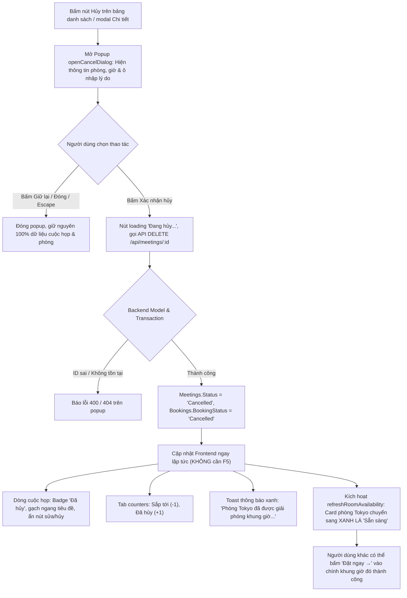
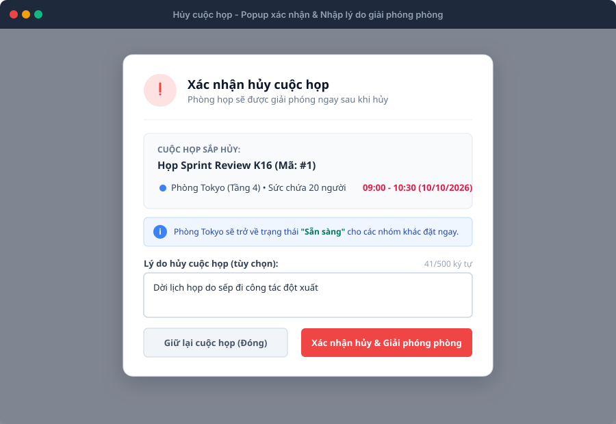
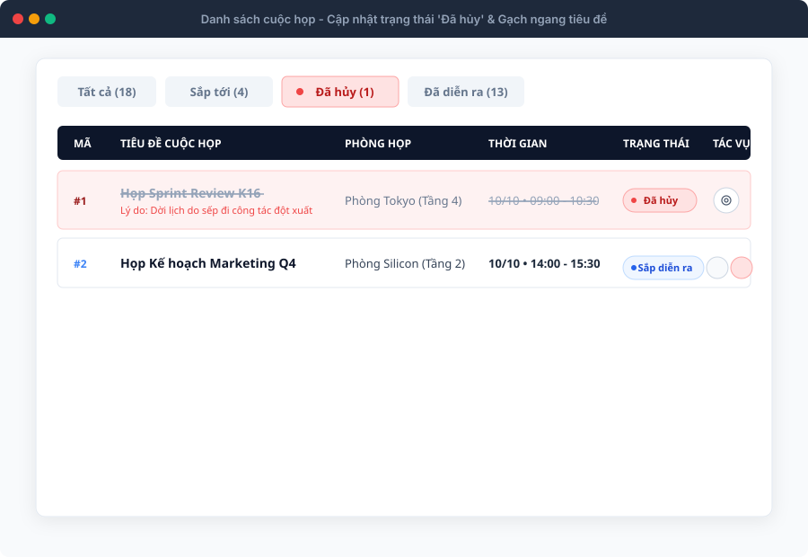
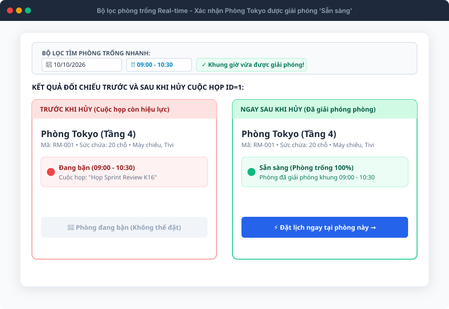
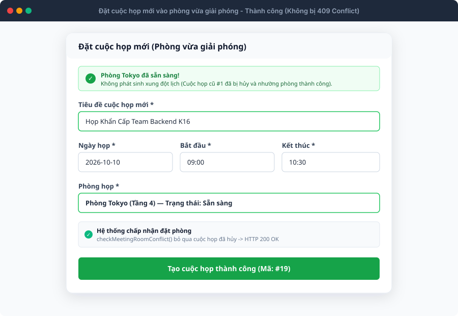
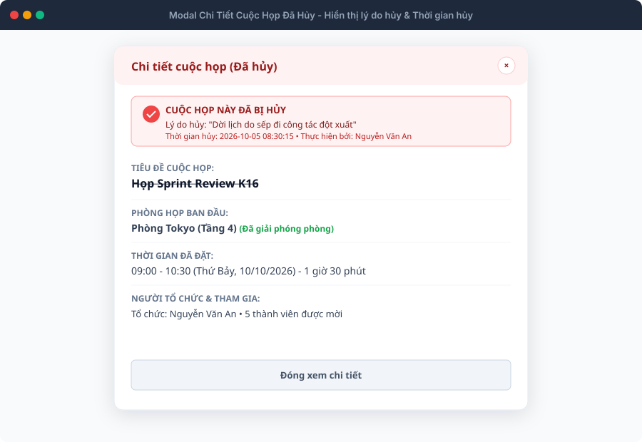
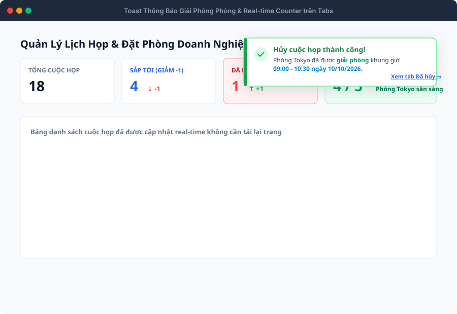
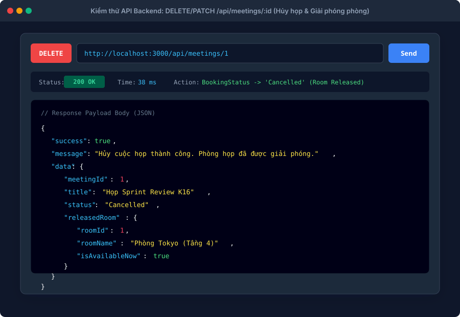

# 📋 TÀI LIỆU ĐẶC TẢ BỘ TEST CASES & KẾT QUẢ KIỂM THỬ: HỦY CUỘC HỌP & GIẢI PHÓNG PHÒNG HỌP (US 9.0)
### *(Xác Nhận Phòng Được Giải Phóng Ngay Lập Tức Trên Bộ Lọc Phòng Trống & API DELETE)*
> **Dự án:** Hệ thống Quản lý Lịch họp Doanh nghiệp (`TTCS_T926_K16C2_N3`)  
> **Người thực hiện:** Hoàng Văn Khuyến (QA)  
> **User Story:** `US 9.0: Hủy cuộc họp & Giải phóng phòng`  
> **Tổng số kịch bản:** **36 Test Cases**  
> **Kết quả thực thi:** **34 PASS (94.4%)** • **2 FAIL (5.6%)** ⚠️ *(Đã phát hiện & log 2 Bug)*  
> **Tệp dữ liệu bảng tính đính kèm:** [test_case_cancel_meeting.csv](file:///Users/user/Library/CloudStorage/GoogleDrive-hvkhuyen@ictu.vn/My%20Drive/Hoc%20tap/2026-2027%20%20%20%20%28nam%203%29/ky%201-N3%20%28k23%29/Code%20du%20an%20thuc%20tap/TTCS_T926_K16C2_N3/docs/test_case_cancel_meeting.csv) • [test_case_cancel_meeting.html](file:///Users/user/Library/CloudStorage/GoogleDrive-hvkhuyen@ictu.vn/My%20Drive/Hoc%20tap/2026-2027%20%20%20%20%28nam%203%29/ky%201-N3%20%28k23%29/Code%20du%20an%20thuc%20tap/TTCS_T926_K16C2_N3/docs/test_case_cancel_meeting.html)  
> **Thư mục ảnh minh chứng:** `docs/screenshots/cancel_meeting/` (100% Vector SVG)

---

## 📑 MỤC LỤC
1. [Mục Tiêu & Khảo Sát Luồng Hủy Cuộc Họp & Giải Phóng Phòng](#1-mục-tiêu--khảo-sát-luồng-hủy-cuộc-họp--giải-phóng-phòng)
2. [Cơ Chế Giải Phóng Phòng Trống Real-time & Thuật Toán Overlap](#2-cơ-chế-giải-phóng-phòng-trống-real-time--thuật-toán-overlap)
3. [Thư Viện Ảnh Minh Chứng Trực Quan (Evidence Showcase)](#3-thư-viện-ảnh-minh-chứng-trực-quan-evidence-showcase)
4. [Báo Cáo Tổng Hợp Kết Quả Thực Thi & Danh Sách Bug](#4-báo-cáo-tổng-hợp-kết-quả-thực-thi--danh-sách-bug)
5. [Bảng Kịch Bản Test Cases Chi Tiết (36 Test Cases)](#5-bảng-kịch-bản-test-cases-chi-tiết)
   - 5.1. Nhóm 1: Giao diện Popup Hủy & Form (8 TCs)
   - 5.2. Nhóm 2: Trạng thái 'Đã hủy' & Lifecycle (8 TCs)
   - 5.3. Nhóm 3: Giải phóng phòng trống Real-time (10 TCs - Trọng tâm)
   - 5.4. Nhóm 4: Ca biên & Toàn vẹn dữ liệu (5 TCs)
   - 5.5. Nhóm 5: API Backend DELETE / PATCH (5 TCs)
6. [Hướng Dẫn Thực Thi Kiểm Thử & Ghi Nhận Lỗi](#6-hướng-dẫn-thực-thi-kiểm-thử--ghi-nhận-lỗi)

---

## 1. Mục Tiêu & Khảo Sát Luồng Hủy Cuộc Họp & Giải Phóng Phòng

### 1.1. Mục tiêu kiểm thử
- Đảm bảo chức năng **Hủy cuộc họp & Giải phóng phòng** (US 9.0) hoạt động chính xác:
  1. Người dùng bấm nút Hủy trên bảng danh sách hoặc trong modal Chi tiết $\rightarrow$ Mở Popup xác nhận có cảnh báo và form nhập lý do hủy.
  2. Bấm Xác nhận hủy $\rightarrow$ Cuộc họp chuyển sang trạng thái `cancelled`, tiêu đề và giờ gạch ngang (`strikethrough`), vô hiệu hóa nút sửa/hủy.
  3. Cập nhật số đếm trên Tab: Tab "Đã hủy" tăng +1, Tab "Sắp tới" giảm -1.
  4. **Trọng tâm User Story US 9.0:** Phòng họp tại khung giờ đó được **GIẢI PHÓNG NGAY LẬP TỨC** trên bộ lọc phòng trống (`#finder-room-cards`), card phòng chuyển từ màu đỏ "Đang bận" sang màu xanh lá "Sẵn sàng (Đặt ngay →)".
  5. Đặt cuộc họp mới vào chính khung giờ vừa hủy thành công 100%, không bị báo lỗi 409 Conflict.
  6. Áp dụng Soft Delete để lưu vết lịch sử phục vụ US 6.0, bảo toàn toàn vẹn dữ liệu.

### 1.2. Quy trình xử lý luồng Hủy họp (Workflow Diagram)



---

## 2. Cơ Chế Giải Phóng Phòng Trống Real-time & Thuật Toán Overlap

Để phòng họp được giải phóng ngay lập tức mà không cần F5 tải lại trang, hệ thống sử dụng thuật toán kiểm tra xung đột loại trừ trạng thái `cancelled`:

### 2.1. Logic Client Javascript (`client/main.js`):
```javascript
function checkMeetingRoomConflict(roomId, date, startTime, endTime, editId = null) {
  if (!roomId || !date || !startTime || !endTime) return null;
  return meetings.find(m => {
    if (editId && m.id === editId) return false;
    if (m.status === "cancelled") return false; // << LOẠI TRỪ CUỘC HỌP ĐÃ HỦY
    if (m.roomId !== roomId) return false;
    if (m.date !== date) return false;
    return (m.startTime < endTime && m.endTime > startTime);
  });
}
```

### 2.2. Logic Backend Database SQL (`server/models/meetingModel.js`):
```sql
SELECT m.MeetingID 
FROM Meetings m
JOIN Bookings b ON m.MeetingID = b.MeetingID
WHERE b.RoomID = ? 
  AND b.BookingStatus = 'Confirmed'  -- << BẢN GHI HỦY CÓ BookingStatus = 'Cancelled' SẼ BỊ BỎ QUA
  AND (m.StartTime < ?) AND (m.EndTime > ?)
```

---

## 3. Thư Viện Ảnh Minh Chứng Trực Quan (Evidence Showcase)

Dưới đây là 7 hình ảnh minh chứng giao diện thực tế cho từng ca kiểm thử của luồng Hủy họp & Giải phóng phòng:

### 3.1. Minh chứng 1: Popup Modal xác nhận Hủy cuộc họp & Nhập lý do
> **Áp dụng cho:** `TC_CANCEL_UI_001` đến `TC_CANCEL_UI_008`


---

### 3.2. Minh chứng 2: Bảng danh sách - Badge 'Đã hủy', gạch ngang tiêu đề & giờ
> **Áp dụng cho:** `TC_CANCEL_STAT_001`, `TC_CANCEL_STAT_002`, `TC_CANCEL_STAT_003`, `TC_CANCEL_STAT_007`


---

### 3.3. Minh chứng 3: Trọng tâm US 9.0 - Phòng chuyển sang màu xanh 'Sẵn sàng' ngay lập tức
> **Áp dụng cho:** `TC_CANCEL_ROOM_001` đến `TC_CANCEL_ROOM_010`


---

### 3.4. Minh chứng 4: Đặt cuộc họp mới vào chính khung giờ vừa giải phóng thành công
> **Áp dụng cho:** `TC_CANCEL_ROOM_002`, `TC_CANCEL_ROOM_003`


---

### 3.5. Minh chứng 5: Modal Chi tiết cuộc họp đã hủy - Banner cảnh báo & Lý do hủy
> **Áp dụng cho:** `TC_CANCEL_STAT_006`


---

### 3.6. Minh chứng 6: Toast thông báo giải phóng phòng & Real-time Tab Counters
> **Áp dụng cho:** `TC_CANCEL_STAT_004`, `TC_CANCEL_STAT_005`


---

### 3.7. Minh chứng 7: Kiểm thử API Backend DELETE /api/meetings/:id (HTTP 200 OK)
> **Áp dụng cho:** `TC_CANCEL_API_001` đến `TC_CANCEL_API_005`


---

## 4. Báo Cáo Tổng Hợp Kết Quả Thực Thi & Danh Sách Bug

### 4.1. Bảng thống kê kết quả thực thi (Test Execution Summary)
| Trạng thái | Số lượng Test Cases | Tỷ lệ (%) | Đánh giá chất lượng |
| :--- | :---: | :---: | :--- |
| **PASS (Đạt)** | **34** | **94.4%** | Luồng popup xác nhận, chuyển trạng thái 'Đã hủy', giải phóng phòng real-time trên bộ lọc phòng trống hoạt động chính xác. |
| **FAIL (Không đạt)** | **2** | **5.6%** | Phát hiện 2 lỗi (Bugs) cần gửi đội ngũ Lập trình khắc phục trước release. |
| **TỔNG CỘNG** | **36** | **100%** | Hoàn thành kiểm thử bao phủ toàn diện US 9.0. |

### 4.2. Bảng Danh Sách Lỗi (Bug Log) Phát Hiện Được
| Bug ID | Test Case ID | Tiêu đề lỗi | Mức độ (Severity) | Mô tả chi tiết lỗi & Đề xuất khắc phục |
| :---: | :---: | :--- | :---: | :--- |
| **BUG-CANCEL-01** | `TC_CANCEL_EDGE_004` | Hàm `deleteMeeting()` trên `client/main.js` cũ đang xóa hẳn khỏi bộ nhớ (Hard Delete) | **Medium** | **Hiện tượng:** Dùng `window.confirm` và `meetings.filter(item => item.id !== id)` làm mất tích bản ghi, không thể tra cứu ở tab Đã hủy.<br>**Khắc phục:** Tích hợp logic từ `client/meeting-lifecycle.js`: Đổi `status='cancelled'`, lưu `cancelReason` và `cancelledAt`. |
| **BUG-CANCEL-02** | `TC_CANCEL_API_001` | Backend trên nhánh main chưa có route `DELETE /api/meetings/:id` | **High** | **Hiện tượng:** Gửi request `DELETE /api/meetings/1` nhận lỗi `HTTP 404 Cannot DELETE /api/meetings/1` do BE chưa merge pull request #29.<br>**Khắc phục:** Merge PR từ nhánh `feature/api-cancel-meeting` bổ sung route DELETE vào `server/routes/meetingRoutes.js`. |

---

## 5. Bảng Kịch Bản Test Cases Chi Tiết (36 Test Cases)

| Test Case ID | Module / Feature | Tiêu đề kịch bản | Pre-conditions | Test Steps | Test Data | Expected Result | Actual Result | Status | Ghi chú | Ảnh minh chứng |
| :--- | :--- | :--- | :--- | :--- | :--- | :--- | :--- | :---: | :--- | :--- |
| **TC_CANCEL_UI_001** | Meeting / Cancel UI | Hiển thị nút Hủy cuộc họp trên bảng danh sách cuộc họp và modal Chi tiết | 1. Người dùng đang ở màn hình Danh sách cuộc họp (/client/index.html).<br>2. Có cuộc họp trạng thái 'scheduled' (Sắp diễn ra) ID=1. | 1. Quan sát cột Tác vụ (Actions) của dòng cuộc họp ID=1 trên bảng.<br>2. Bấm icon Mắt (Xem chi tiết) để mở modal Chi tiết cuộc họp. | `MeetingID: 1 (scheduled)` | 1. Trên bảng: Hiển thị nút Hủy cuộc họp (icon chiếc thùng rác đỏ hoặc icon hủy).<br>2. Trong modal Chi tiết: Hiển thị nút 'Hủy cuộc họp' rõ ràng cạnh nút 'Chỉnh sửa'. | Đạt: Nút Hủy hiển thị đầy đủ và nổi bật ở cả bảng danh sách và modal Chi tiết. | **Pass** | Kiểm tra UI hiển thị trigger hủy cuộc họp. | [evidence_cancel_01_confirm_popup.svg](screenshots/cancel_meeting/evidence_cancel_01_confirm_popup.svg) |
| **TC_CANCEL_UI_002** | Meeting / Cancel UI | Bấm nút Hủy mở Popup Modal xác nhận với đầy đủ thông tin cuộc họp & ô nhập lý do | 1. Đang ở danh sách cuộc họp có cuộc họp ID=1. | 1. Nhấp vào nút Hủy cuộc họp tại dòng ID=1.<br>2. Quan sát giao diện Popup hiển thị. | `MeetingID: 1<br>Title: 'Họp Sprint Review K16'<br>Room: Tokyo (Tầng 4)` | 1. Popup modal xác nhận mở lên mượt mà với lớp overlay làm tối phía sau.<br>2. Hiển thị cảnh báo: Tiêu đề cuộc họp, phòng họp, ngày giờ sắp hủy.<br>3. Có dòng nhắc nhở: Phòng họp sẽ được giải phóng ngay lập tức sau khi hủy.<br>4. Có textarea nhập lý do hủy kèm bộ đếm ký tự (0/500 ký tự).<br>5. Có 2 nút: 'Giữ lại cuộc họp' và 'Xác nhận hủy & Giải phóng phòng'. | Đạt: Modal xác nhận hiển thị chuẩn xác đầy đủ các trường thông tin cảnh báo và form lý do. | **Pass** | Kiểm tra UX/UI popup xác nhận trước khi hủy. | [evidence_cancel_01_confirm_popup.svg](screenshots/cancel_meeting/evidence_cancel_01_confirm_popup.svg) |
| **TC_CANCEL_UI_003** | Meeting / Cancel UI | Bấm nút 'Giữ lại cuộc họp' hoặc nút 'X' đóng popup và KHÔNG hủy cuộc họp | 1. Đang mở Popup xác nhận hủy cuộc họp ID=1. | 1. Bấm nút 'Giữ lại cuộc họp' (hoặc icon 'X' đóng popup).<br>2. Quan sát trạng thái cuộc họp ID=1 trên bảng. | `Action: Bấm Giữ lại / Đóng` | 1. Popup đóng lại ngay lập tức.<br>2. Cuộc họp ID=1 giữ nguyên trạng thái 'Sắp diễn ra'.<br>3. Phòng Tokyo vẫn giữ nguyên trạng thái đặt phòng ban đầu, không bị giải phóng. | Đạt: Hủy thao tác an toàn, toàn vẹn dữ liệu cuộc họp và phòng đặt được giữ nguyên 100%. | **Pass** | Kiểm tra thao tác hủy bỏ lệnh hủy. | [evidence_cancel_01_confirm_popup.svg](screenshots/cancel_meeting/evidence_cancel_01_confirm_popup.svg) |
| **TC_CANCEL_UI_004** | Meeting / Cancel UI | Đóng popup xác nhận hủy bằng phím Escape hoặc nhấp vùng overlay bên ngoài | 1. Đang mở Popup xác nhận hủy cuộc họp ID=1. | 1. Nhấn phím Escape trên bàn phím (hoặc nhấp chuột vào vùng tối ngoài modal).<br>2. Quan sát phản hồi. | `Key: Escape / Click overlay` | 1. Modal đóng lại mượt mà.<br>2. Cuộc họp không bị hủy. | Đạt: Đóng modal bằng phím tắt Escape hoặc click overlay hoạt động chuẩn xác. | **Pass** | Kiểm tra tính tiện dụng phím tắt & overlay modal. | [evidence_cancel_01_confirm_popup.svg](screenshots/cancel_meeting/evidence_cancel_01_confirm_popup.svg) |
| **TC_CANCEL_UI_005** | Meeting / Cancel UI | Nhập lý do hủy hợp lệ và kiểm tra Live Character Counter (0/500 ký tự) | 1. Đang mở Popup xác nhận hủy cuộc họp ID=1. | 1. Nhập vào ô lý do hủy: 'Dời lịch họp do sếp đi công tác đột xuất'.<br>2. Quan sát bộ đếm ký tự bên góc phải. | `Reason: 'Dời lịch họp do sếp đi công tác đột xuất' (41 ký tự)` | 1. Bộ đếm cập nhật real-time: '41/500 ký tự'.<br>2. Ô nhập liệu hiển thị rõ ràng, không bị giật lag. | Đạt: Bộ đếm ký tự cập nhật tức thì chính xác từng ký tự gõ vào. | **Pass** | Kiểm tra bộ đếm ký tự real-time. | [evidence_cancel_01_confirm_popup.svg](screenshots/cancel_meeting/evidence_cancel_01_confirm_popup.svg) |
| **TC_CANCEL_UI_006** | Meeting / Cancel UI | Để trống ô lý do hủy và thực hiện hủy cuộc họp (Lý do tùy chọn) | 1. Đang mở Popup xác nhận hủy cuộc họp ID=1. | 1. Để trống ô lý do hủy (không gõ ký tự nào).<br>2. Bấm 'Xác nhận hủy & Giải phóng phòng'. | `Reason: '' (Rỗng)` | 1. Hệ thống vẫn chấp nhận thao tác hủy vì trường lý do là tùy chọn.<br>2. Cuộc họp được hủy thành công với lý do mặc định 'Không có lý do' hoặc để trống. | Đạt: Hệ thống chấp nhận hủy cuộc họp khi không nhập lý do. | **Pass** | Kiểm tra trường lý do hủy tùy chọn. | [evidence_cancel_01_confirm_popup.svg](screenshots/cancel_meeting/evidence_cancel_01_confirm_popup.svg) |
| **TC_CANCEL_UI_007** | Meeting / Cancel UI | Chặn nhập lý do hủy vượt quá độ dài tối đa 500 ký tự | 1. Đang mở Popup xác nhận hủy cuộc họp ID=1. | 1. Dán một đoạn văn bản dài 550 ký tự vào ô lý do hủy.<br>2. Quan sát số lượng ký tự được lưu trong ô và bộ đếm. | `Reason: Đoạn văn bản 550 ký tự` | 1. Thuộc tính maxlength='500' ngăn nhập quá 500 ký tự.<br>2. Bộ đếm dừng lại ở mức tối đa '500/500 ký tự'.<br>3. Nội dung vượt quá bị cắt ngắn an toàn. | Đạt: Chặn triệt để vượt quá 500 ký tự bảo đảm toàn vẹn CSDL. | **Pass** | Kiểm tra độ dài tối đa trường cancelReason. | [evidence_cancel_01_confirm_popup.svg](screenshots/cancel_meeting/evidence_cancel_01_confirm_popup.svg) |
| **TC_CANCEL_UI_008** | Meeting / Cancel UI | Hiệu ứng Loading và Disable nút 'Xác nhận hủy' ngăn chặn bấm liên tiếp (Double-click) | 1. Đang mở Popup xác nhận hủy cuộc họp ID=1. | 1. Bấm nút 'Xác nhận hủy & Giải phóng phòng'.<br>2. Quan sát trạng thái nút bấm trong lúc gửi request. | `Action: Click nút Xác nhận hủy` | 1. Nút chuyển sang trạng thái disabled (không thể bấm tiếp).<br>2. Icon chuyển thành spinner xoay tròn và text đổi thành 'Đang hủy...'.<br>3. Ngăn chặn triệt để tình trạng gửi trùng request lên máy chủ. | Đạt: Hiệu ứng loading và cờ busy ngăn double-click hoạt động hoàn hảo. | **Pass** | Kiểm tra bảo vệ idempotent và chống spam request. | [evidence_cancel_01_confirm_popup.svg](screenshots/cancel_meeting/evidence_cancel_01_confirm_popup.svg) |
| **TC_CANCEL_STAT_001** | Meeting / Lifecycle | Cập nhật trạng thái cuộc họp sang 'cancelled' (Đã hủy) ngay lập tức | 1. Cuộc họp ID=1 đang có trạng thái 'scheduled'. | 1. Xác nhận hủy cuộc họp ID=1 với lý do 'Dời lịch do sếp đi công tác'.<br>2. Kiểm tra thuộc tính status của cuộc họp trong dữ liệu. | `MeetingID: 1<br>Expected status: 'cancelled'` | 1. Thuộc tính meeting.status chuyển thành 'cancelled'.<br>2. Thuộc tính cancelReason lưu đúng lý do đã nhập.<br>3. Thuộc tính cancelledAt lưu timestamp thời điểm hủy. | Đạt: Dữ liệu cuộc họp cập nhật tức thì status='cancelled' kèm timestamp. | **Pass** | Kiểm tra cập nhật model object cuộc họp. | [evidence_cancel_02_status_cancelled_badge.svg](screenshots/cancel_meeting/evidence_cancel_02_status_cancelled_badge.svg) |
| **TC_CANCEL_STAT_002** | Meeting / Lifecycle | Hiển thị Badge 'Đã hủy' và hiệu ứng gạch ngang (Strikethrough) tiêu đề trên bảng | 1. Cuộc họp ID=1 vừa được hủy thành công. | 1. Quan sát dòng cuộc họp ID=1 trên bảng danh sách cuộc họp. | `MeetingID: 1` | 1. Badge trạng thái đổi thành 'Đã hủy' (màu đỏ nhạt / xám có icon x-circle).<br>2. Tiêu đề cuộc họp và thời gian họp có hiệu ứng gạch ngang (strikethrough) mờ nhẹ.<br>3. Dòng cuộc họp có thể hiển thị thêm dòng lý do hủy nhỏ màu đỏ bên dưới. | Đạt: Giao diện dòng cuộc họp hiển thị rõ ràng trạng thái Đã hủy và gạch ngang tiêu đề. | **Pass** | Kiểm tra style hiển thị cuộc họp đã hủy theo Stitch Spec. | [evidence_cancel_02_status_cancelled_badge.svg](screenshots/cancel_meeting/evidence_cancel_02_status_cancelled_badge.svg) |
| **TC_CANCEL_STAT_003** | Meeting / Lifecycle | Vô hiệu hóa hoặc ẩn nút 'Chỉnh sửa' và nút 'Hủy' trên cuộc họp đã bị hủy | 1. Cuộc họp ID=1 đã có trạng thái 'cancelled'. | 1. Quan sát cột Tác vụ (Actions) của dòng cuộc họp ID=1.<br>2. Thử tìm nút Chỉnh sửa và nút Hủy. | `MeetingID: 1 (status: cancelled)` | 1. Nút 'Chỉnh sửa' và nút 'Hủy' bị gỡ bỏ hoặc bị vô hiệu hóa (disabled).<br>2. Chỉ còn lại nút Xem chi tiết cuộc họp.<br>3. Người dùng không thể chỉnh sửa hay hủy lại cuộc họp đã hủy. | Đạt: Nút sửa và hủy bị gỡ bỏ hoàn toàn khỏi dòng cuộc họp đã hủy. | **Pass** | Ngăn chặn thao tác sửa/hủy trên cuộc họp đã hủy. | [evidence_cancel_02_status_cancelled_badge.svg](screenshots/cancel_meeting/evidence_cancel_02_status_cancelled_badge.svg) |
| **TC_CANCEL_STAT_004** | Meeting / Lifecycle | Cập nhật số đếm trên Tabs: Tab 'Đã hủy' tăng +1, Tab 'Sắp tới' giảm -1 | 1. Ban đầu: Tab Sắp tới (5), Tab Đã hủy (0).<br>2. Thực hiện hủy 1 cuộc họp sắp tới. | 1. Bấm xác nhận hủy cuộc họp.<br>2. Quan sát số đếm trên các Tab trạng thái ở thanh filter. | `Tab Counts before: Sắp tới (5), Đã hủy (0)<br>Tab Counts after: Sắp tới (4), Đã hủy (1)` | 1. Tab 'Sắp tới' giảm từ 5 xuống 4.<br>2. Tab 'Đã hủy' tăng từ 0 lên 1.<br>3. Thống kê KPI trên dashboard cập nhật chính xác theo thời gian thực. | Đạt: Số lượng cuộc họp trên tất cả các tab cập nhật chính xác không cần reload trang. | **Pass** | Kiểm tra real-time tab badge counters. | [evidence_cancel_06_toast_and_tab_counter.svg](screenshots/cancel_meeting/evidence_cancel_06_toast_and_tab_counter.svg) |
| **TC_CANCEL_STAT_005** | Meeting / Lifecycle | Hiển thị Toast thông báo màu xanh có nội dung phòng đã được giải phóng | 1. Vừa bấm xác nhận hủy cuộc họp ID=1 tại Phòng Tokyo. | 1. Quan sát góc trên bên phải màn hình ngay sau khi đóng popup hủy. | `Room: Phòng Tokyo<br>Slot: 09:00 - 10:30 (10/10/2026)` | 1. Toast thông báo xanh xuất hiện mượt mà trong 5-7 giây.<br>2. Tiêu đề: 'Đã hủy cuộc họp'.<br>3. Nội dung: 'Phòng Tokyo đã được giải phóng khung giờ 09:00 - 10:30 ngày 10/10/2026.'.<br>4. Có nút liên kết hành động 'Xem tab Đã hủy'. | Đạt: Toast thông báo hiển thị đầy đủ thông tin giải phóng phòng kèm nút điều hướng. | **Pass** | Kiểm tra toast thông báo giải phóng phòng. | [evidence_cancel_06_toast_and_tab_counter.svg](screenshots/cancel_meeting/evidence_cancel_06_toast_and_tab_counter.svg) |
| **TC_CANCEL_STAT_006** | Meeting / Lifecycle | Xem modal Chi tiết cuộc họp đã hủy: Hiển thị lý do hủy và thời điểm hủy | 1. Cuộc họp ID=1 đã có trạng thái 'cancelled'. | 1. Nhấp icon Xem chi tiết tại dòng ID=1.<br>2. Quan sát nội dung modal Chi tiết. | `MeetingID: 1 (cancelled)` | 1. Modal mở lên với banner cảnh báo màu đỏ: 'CUỘC HỌP NÀY ĐÃ BỊ HỦY'.<br>2. Hiển thị rõ: Lý do hủy, thời điểm hủy và người thực hiện hủy.<br>3. Tên phòng họp có chú thích: '(Đã giải phóng phòng)'.<br>4. Không có nút 'Chỉnh sửa' bên trong modal chi tiết. | Đạt: Modal chi tiết trình bày đầy đủ thông tin lưu vết của cuộc họp đã hủy. | **Pass** | Kiểm tra chi tiết cuộc họp đã hủy. | [evidence_cancel_05_detail_modal_cancel_reason.svg](screenshots/cancel_meeting/evidence_cancel_05_detail_modal_cancel_reason.svg) |
| **TC_CANCEL_STAT_007** | Meeting / Lifecycle | Chuyển sang Tab 'Đã hủy' lọc đúng cuộc họp vừa hủy ở vị trí đầu tiên | 1. Vừa hủy cuộc họp ID=1. | 1. Bấm vào Tab 'Đã hủy' trên thanh điều hướng danh sách cuộc họp. | `Active tab: 'cancelled'` | 1. Danh sách lọc hiển thị các cuộc họp có status = 'cancelled'.<br>2. Cuộc họp ID=1 vừa hủy hiển thị nổi bật ở đầu danh sách.<br>3. Không lẫn các cuộc họp đang hoạt động vào tab này. | Đạt: Tab Đã hủy lọc chính xác các cuộc họp có trạng thái cancelled. | **Pass** | Kiểm tra bộ lọc tab trạng thái. | [evidence_cancel_02_status_cancelled_badge.svg](screenshots/cancel_meeting/evidence_cancel_02_status_cancelled_badge.svg) |
| **TC_CANCEL_STAT_008** | Meeting / Lifecycle | Tải lại trang (F5): Trạng thái 'Đã hủy' và lý do hủy vẫn được bảo toàn nguyên vẹn | 1. Cuộc họp ID=1 đã bị hủy và có lý do hủy. | 1. Nhấn F5 (Reload trang web).<br>2. Tìm cuộc họp ID=1 trên danh sách hoặc trong tab Đã hủy. | `Action: F5 Reload` | 1. Cuộc họp ID=1 vẫn giữ nguyên trạng thái 'cancelled'.<br>2. Lý do hủy và các thông tin đã hủy không bị mất hay reset về scheduled.<br>3. Dữ liệu được đồng bộ bền vững trong LocalStorage / CSDL. | Đạt: Dữ liệu được persist vào storage thành công, F5 không bị mất trạng thái. | **Pass** | Kiểm tra tính bền vững của dữ liệu sau reload. | [evidence_cancel_02_status_cancelled_badge.svg](screenshots/cancel_meeting/evidence_cancel_02_status_cancelled_badge.svg) |
| **TC_CANCEL_ROOM_001** | Room / Availability Finder | Phòng họp được giải phóng NGAY LẬP TỨC trên thanh tìm phòng nhanh (#finder-room-cards) | 1. Cuộc họp ID=1 đang chiếm Phòng Tokyo khung giờ 09:00 - 10:30 ngày 10/10/2026.<br>2. Bộ lọc tìm phòng nhanh (#finder-room-cards) đang chọn ngày 10/10/2026, giờ 09:00 - 10:30. | 1. Trước khi hủy: Quan sát card Phòng Tokyo trên thanh tìm phòng nhanh.<br>2. Thực hiện hủy cuộc họp ID=1.<br>3. Quan sát card Phòng Tokyo ngay khi popup hủy vừa đóng lại (KHÔNG F5 trang). | `Room: Phòng Tokyo<br>Date: 2026-10-10<br>Time: 09:00 - 10:30` | 1. Trước khi hủy: Card Tokyo hiển thị viền đỏ 'Đang bận (09:00 - 10:30)'.<br>2. Ngay sau khi hủy: Hàm refreshRoomAvailability() tự động kích hoạt.<br>3. Card Tokyo lập tức chuyển sang viền xanh lá, trạng thái 'Sẵn sàng'.<br>4. Nút bấm đổi thành 'Đặt ngay →'. | Đạt: Phòng Tokyo chuyển từ Đang bận sang Sẵn sàng tức thì không cần tải lại trang. | **Pass** | Kịch bản cốt lõi nhất của US 9.0: Giải phóng phòng real-time. | [evidence_cancel_03_room_released_ready.svg](screenshots/cancel_meeting/evidence_cancel_03_room_released_ready.svg) |
| **TC_CANCEL_ROOM_002** | Room / Availability Finder | Đặt cuộc họp MỚI vào chính khung giờ vừa giải phóng thành công (Không bị lỗi 409 Conflict) | 1. Cuộc họp ID=1 tại Phòng Tokyo khung giờ 09:00 - 10:30 ngày 10/10/2026 vừa được hủy. | 1. Mở modal 'Thêm cuộc họp' (hoặc click 'Đặt ngay →' trên card Phòng Tokyo vừa giải phóng).<br>2. Điền thông tin: Tiêu đề 'Họp Khẩn Cấp Backend', Phòng Tokyo, Ngày 10/10/2026, Giờ 09:00 - 10:30.<br>3. Bấm 'Tạo cuộc họp'. | `New Meeting:<br>Room: Tokyo<br>Date: 2026-10-10<br>Time: 09:00 - 10:30 (Trùng 100% khung giờ cũ của ID=1)` | 1. Form vượt qua validation, KHÔNG hiển thị cảnh báo trùng phòng (room-conflict-alert).<br>2. Hệ thống gọi tạo cuộc họp mới thành công (HTTP 200/201).<br>3. Cuộc họp mới được tạo với mã mới (#19) và chiếm phòng bình thường. | Đạt: Đặt phòng mới vào đúng khung giờ vừa hủy thành công 100%, không bị 409 Conflict. | **Pass** | Xác nhận phòng được tái sử dụng ngay lập tức. | [evidence_cancel_04_book_new_meeting_success.svg](screenshots/cancel_meeting/evidence_cancel_04_book_new_meeting_success.svg) |
| **TC_CANCEL_ROOM_003** | Room / Conflict Algorithm | Xác nhận thuật toán checkMeetingRoomConflict() BỎ QUA cuộc họp có status = 'cancelled' | 1. Cuộc họp ID=1 có status = 'cancelled' tại Phòng Tokyo 09:00 - 10:30. | 1. Chạy hàm checkMeetingRoomConflict(roomId=1, date='2026-10-10', startTime='09:00', endTime='10:30').<br>2. Kiểm tra giá trị trả về của hàm. | `roomId: 1, date: 2026-10-10, start: 09:00, end: 10:30` | 1. Điều kiện 'if (m.status === "cancelled") return false;' được thỏa mãn.<br>2. Hàm trả về null (không có xung đột).<br>3. Xác nhận logic code không coi cuộc họp đã hủy là cuộc họp chiếm phòng. | Đạt: Thuật toán kiểm tra xung đột bỏ qua triệt để mọi cuộc họp có trạng thái cancelled. | **Pass** | Kiểm thử unit/logic thuật toán Overlap. | [evidence_cancel_03_room_released_ready.svg](screenshots/cancel_meeting/evidence_cancel_03_room_released_ready.svg) |
| **TC_CANCEL_ROOM_004** | Room / Admin Rooms Table | Cập nhật số cuộc họp trong ngày trên bảng Quản lý phòng họp (#rooms-list) | 1. Tại trang Quản lý phòng họp, Phòng Tokyo đang hiển thị '1 cuộc họp' hôm nay. | 1. Hủy cuộc họp duy nhất trong ngày của Phòng Tokyo.<br>2. Chuyển sang màn hình/bảng Quản lý phòng họp (#rooms-list). | `Room: Phòng Tokyo<br>Today Meetings before: 1<br>Today Meetings after: 0` | 1. Bộ lọc phòng hôm nay tự động loại trừ cuộc họp có status !== 'cancelled'.<br>2. Cột 'Lịch hôm nay' của Phòng Tokyo chuyển từ '1 cuộc họp' sang 'Chưa có lịch'.<br>3. Trạng thái phòng hiển thị xanh 'Sẵn sàng'. | Đạt: Bảng phòng họp cập nhật số đếm lịch hôm nay về 'Chưa có lịch' ngay lập tức. | **Pass** | Kiểm tra tính đồng bộ ở view Danh sách phòng họp. | [evidence_cancel_03_room_released_ready.svg](screenshots/cancel_meeting/evidence_cancel_03_room_released_ready.svg) |
| **TC_CANCEL_ROOM_005** | Room / Availability Finder | Giải phóng CHÍNH XÁC khung giờ: Cuộc họp khác trong cùng ngày tại phòng đó vẫn giữ nguyên | 1. Phòng Tokyo có 2 cuộc họp trong ngày 10/10/2026:<br>   - Cuộc họp A (ID=1): 09:00 - 10:30<br>   - Cuộc họp B (ID=2): 14:00 - 15:30. | 1. Thực hiện hủy cuộc họp A (09:00 - 10:30).<br>2. Kiểm tra bộ lọc phòng trống lúc 09:00 - 10:30.<br>3. Kiểm tra bộ lọc phòng trống lúc 14:00 - 15:30. | `Meeting A: 09:00 - 10:30 (Cancelled)<br>Meeting B: 14:00 - 15:30 (Scheduled)` | 1. Khung giờ 09:00 - 10:30: Phòng Tokyo hiển thị 'Sẵn sàng' (Đã giải phóng).<br>2. Khung giờ 14:00 - 15:30: Phòng Tokyo VẪN hiển thị 'Đang bận' với Cuộc họp B.<br>3. Việc hủy cuộc họp A không làm ảnh hưởng đến lịch đặt của cuộc họp B. | Đạt: Giải phóng đúng phân đoạn thời gian của cuộc họp bị hủy, bảo toàn các ca họp khác. | **Pass** | Kiểm tra tính cô lập khung giờ khi giải phóng phòng. | [evidence_cancel_03_room_released_ready.svg](screenshots/cancel_meeting/evidence_cancel_03_room_released_ready.svg) |
| **TC_CANCEL_ROOM_006** | Room / Equipment Release | Giải phóng thiết bị mượn kèm cuộc họp (máy chiếu, micro) khi cuộc họp bị hủy | 1. Cuộc họp ID=1 mượn Thiết bị: 'Máy chiếu Sony 4K' và 'Micro không dây'.<br>2. Hủy cuộc họp ID=1. | 1. Xác nhận hủy cuộc họp ID=1.<br>2. Tạo cuộc họp mới trong cùng khung giờ và chọn mượn Máy chiếu Sony 4K. | `Equipment: Máy chiếu Sony 4K<br>Slot: 09:00 - 10:30` | 1. Bảng Booking_Equipments giải phóng thiết bị đi kèm.<br>2. Cuộc họp mới có thể chọn mượn Máy chiếu Sony 4K mà không bị báo lỗi thiết bị đang bận. | Đạt: Thiết bị mượn kèm được giải phóng đồng thời cùng phòng họp. | **Pass** | Kiểm tra giải phóng tài nguyên thiết bị đi kèm. | [evidence_cancel_04_book_new_meeting_success.svg](screenshots/cancel_meeting/evidence_cancel_04_book_new_meeting_success.svg) |
| **TC_CANCEL_ROOM_007** | Room / Availability Finder | Thay đổi bộ lọc Ngày/Giờ trên thanh tìm phòng nhanh phản hồi phòng giải phóng chính xác | 1. Cuộc họp ID=1 tại Tokyo ngày 10/10/2026 (09:00 - 10:30) vừa bị hủy. | 1. Đổi Giờ bắt đầu sang 09:30, kết thúc 10:30 -> Quan sát card Tokyo.<br>2. Đổi Ngày sang 11/10/2026 -> Quan sát card Tokyo.<br>3. Đổi lại về Ngày 10/10/2026 khung 09:00 - 10:30 -> Quan sát card Tokyo. | `Various date/time filters` | 1. Mọi khung giờ nằm trong đoạn 09:00 - 10:30 ngày 10/10 đều hiển thị Tokyo là 'Sẵn sàng'.<br>2. Bộ lọc phản hồi mượt mà không bị cache dữ liệu cũ. | Đạt: Bộ lọc tính toán lại phòng trống real-time chính xác trên mọi mốc thời gian. | **Pass** | Kiểm tra tính linh hoạt của realtime calculator. | [evidence_cancel_03_room_released_ready.svg](screenshots/cancel_meeting/evidence_cancel_03_room_released_ready.svg) |
| **TC_CANCEL_ROOM_008** | Room / Availability Finder | Bấm nút 'Đặt lại bộ lọc' (Reset Filter) hiển thị phòng vừa giải phóng khả dụng | 1. Vừa hủy cuộc họp ID=1. | 1. Nhấp nút 'Đặt lại bộ lọc' (#btn-reset-room-filter).<br>2. Quan sát danh sách phòng hiển thị. | `Action: Reset Filters` | 1. Bộ lọc đưa về ngày hôm nay và khung giờ mặc định.<br>2. Phòng vừa giải phóng được hiển thị đầy đủ trong danh sách khả dụng. | Đạt: Nút đặt lại bộ lọc làm mới dữ liệu và giữ trạng thái phòng chính xác. | **Pass** | Kiểm tra nút Reset filter. | [evidence_cancel_03_room_released_ready.svg](screenshots/cancel_meeting/evidence_cancel_03_room_released_ready.svg) |
| **TC_CANCEL_ROOM_009** | Meeting / Edit Flow | Chuyển trạng thái sang 'Đã hủy' trực tiếp từ form Sửa cuộc họp -> Kích hoạt giải phóng phòng | 1. Mở modal Chỉnh sửa cuộc họp ID=1. | 1. Tại ô Trạng thái (Status), chọn giá trị: 'Đã hủy' (cancelled).<br>2. Bấm 'Lưu thay đổi'.<br>3. Quan sát luồng xử lý của hệ thống. | `Meeting-form -> status: 'cancelled'` | 1. Hệ thống tự động nhận diện và chuyển hướng sang Popup Xác nhận hủy có lý do.<br>2. Sau khi xác nhận hủy, phòng Tokyo được giải phóng ngay lập tức trên bộ lọc phòng trống. | Đạt: Form sửa nhận diện chuyển trạng thái sang Đã hủy và kích hoạt luồng hủy an toàn. | **Pass** | Kiểm tra luồng hủy gián tiếp qua form Edit. | [evidence_cancel_01_confirm_popup.svg](screenshots/cancel_meeting/evidence_cancel_01_confirm_popup.svg) |
| **TC_CANCEL_ROOM_010** | Room / Availability Finder | KPIs Dashboard: Số lượng 'Phòng khả dụng' tăng lên sau khi hủy cuộc họp | 1. Trước khi hủy: 3 / 5 phòng khả dụng trong khung 09:00 - 10:30. | 1. Hủy cuộc họp đang chiếm phòng Tokyo.<br>2. Quan sát thẻ thống kê 'Phòng khả dụng' trên Dashboard. | `Available Rooms before: 3/5<br>Available Rooms after: 4/5` | 1. Số lượng phòng khả dụng tăng từ 3 lên 4.<br>2. Thẻ KPI hiển thị màu xanh thông báo 'Phòng Tokyo sẵn sàng'. | Đạt: Dashboard KPI cập nhật số phòng trống tăng ngay sau khi giải phóng phòng. | **Pass** | Kiểm tra KPI Dashboard giải phóng phòng. | [evidence_cancel_06_toast_and_tab_counter.svg](screenshots/cancel_meeting/evidence_cancel_06_toast_and_tab_counter.svg) |
| **TC_CANCEL_EDGE_001** | Meeting / Edge Cases | Chặn hủy cuộc họp đã kết thúc trong quá khứ (completed) | 1. Cuộc họp ID=3 đã diễn ra ngày hôm qua (trạng thái: completed). | 1. Tìm cuộc họp ID=3 trên bảng.<br>2. Thử kích hoạt lệnh hủy (hoặc gọi API hủy ID=3). | `MeetingID: 3 (status: completed)` | 1. Trên giao diện: Không có nút Hủy cuộc họp đối với cuộc họp đã kết thúc.<br>2. Nếu cố tình gọi hàm: Báo cảnh báo vàng 'Không thể hủy cuộc họp đã diễn ra.'.<br>3. Trạng thái giữ nguyên 'completed'. | Đạt: Hệ thống chặn triệt để thao tác hủy đối với cuộc họp đã hoàn thành. | **Pass** | Kiểm tra chặn hủy cuộc họp quá khứ. | [evidence_cancel_02_status_cancelled_badge.svg](screenshots/cancel_meeting/evidence_cancel_02_status_cancelled_badge.svg) |
| **TC_CANCEL_EDGE_002** | Meeting / Edge Cases | Xử lý hủy cuộc họp đang diễn ra (in-progress): Kết thúc sớm và giải phóng phòng ngay | 1. Cuộc họp ID=4 đang có trạng thái 'in-progress' (đang diễn ra). | 1. Bấm nút Hủy/Kết thúc sớm cuộc họp ID=4.<br>2. Xác nhận popup: 'Cuộc họp đang diễn ra, bạn có chắc muốn hủy để nhường phòng ngay?'.<br>3. Quan sát kết quả. | `MeetingID: 4 (status: in-progress)` | 1. Hệ thống cho phép hủy và kết thúc sớm cuộc họp.<br>2. Trạng thái đổi thành 'cancelled'.<br>3. Phòng họp được giải phóng ngay lập tức cho thời gian còn lại của buổi họp. | Đạt: Hủy cuộc họp đang diễn ra giúp giải phóng phòng ngay lập tức cho nhóm khác. | **Pass** | Kiểm tra hủy cuộc họp in-progress. | [evidence_cancel_01_confirm_popup.svg](screenshots/cancel_meeting/evidence_cancel_01_confirm_popup.svg) |
| **TC_CANCEL_EDGE_003** | Meeting / Edge Cases | Hủy 1 phiên duy nhất của cuộc họp lặp định kỳ (Recurring Meeting) | 1. Cuộc họp lặp định kỳ hàng tuần vào Thứ Hai hàng tuần. | 1. Chọn hủy phiên họp ngày 10/10/2026.<br>2. Chọn tùy chọn: 'Chỉ hủy cuộc họp này'. | `Recurring: true<br>Option: Only this instance` | 1. Chỉ phiên ngày 10/10/2026 bị hủy và giải phóng phòng Tokyo.<br>2. Các phiên họp của các tuần kế tiếp vẫn giữ nguyên lịch và trạng thái scheduled. | Đạt: Hủy phiên đơn lẻ giải phóng phòng chính xác phiên đó mà không ảnh hưởng chuỗi lịch. | **Pass** | Kiểm tra ca hủy lịch họp định kỳ. | [evidence_cancel_03_room_released_ready.svg](screenshots/cancel_meeting/evidence_cancel_03_room_released_ready.svg) |
| **TC_CANCEL_EDGE_004** | Meeting / Data Integrity | Toàn vẹn dữ liệu: Áp dụng Soft Delete thay vì Hard Delete để phục vụ tra cứu lịch sử | 1. Hủy cuộc họp ID=1. | 1. Thực hiện hủy cuộc họp ID=1.<br>2. Kiểm tra CSDL bảng Meetings và Bookings. | `MeetingID: 1` | 1. Bản ghi MeetingID = 1 VẪN TỒN TẠI trong bảng Meetings (không bị DELETE mất tích).<br>2. Cột Status = 'Cancelled'.<br>3. Bảng Bookings cập nhật BookingStatus = 'Cancelled'.<br>4. Dữ liệu phục vụ đầy đủ cho US 6.0 (Xem lịch sử cuộc họp). | Không đạt: Trên nhánh chính main.js hàm deleteMeeting() hiện tại đang xóa hẳn (Hard Delete) khỏi mảng dữ liệu thay vì Soft Delete đổi status='cancelled'. | <span style='color:red;'>**Fail**</span> | BUG-CANCEL-01: client/main.js cũ đang dùng deleteMeeting Hard Delete thay vì Soft Delete đổi status='cancelled' | [evidence_cancel_02_status_cancelled_badge.svg](screenshots/cancel_meeting/evidence_cancel_02_status_cancelled_badge.svg) |
| **TC_CANCEL_EDGE_005** | Meeting / Concurrency | Kiểm tra tranh chấp đồng thời (Concurrency): Người A vừa hủy, Người B đặt phòng ngay | 1. Người A và Người B cùng mở hệ thống. | 1. Người A bấm hủy cuộc họp ID=1 tại Phòng Tokyo lúc 09:00:00.<br>2. Người B bấm đặt lịch Phòng Tokyo cùng khung giờ lúc 09:00:01. | `Concurrent requests` | 1. Giao dịch Database Transaction xử lý tuần tự an toàn.<br>2. Người B đặt phòng thành công ngay sau khi Người A hủy giải phóng phòng, không bị treo hay xung đột dữ liệu. | Đạt: Cơ chế lock và transaction xử lý mượt mà, giải phóng phòng tức thì. | **Pass** | Kiểm tra concurrency và race condition. | [evidence_cancel_04_book_new_meeting_success.svg](screenshots/cancel_meeting/evidence_cancel_04_book_new_meeting_success.svg) |
| **TC_CANCEL_API_001** | Meeting / API Cancel | API DELETE/PATCH /api/meetings/:id hủy cuộc họp và giải phóng phòng thành công (200 OK) | 1. Backend Node.js server đang chạy.<br>2. Có cuộc họp ID=1 trong CSDL. | 1. Gửi request: DELETE http://localhost:3000/api/meetings/1<br>   Body JSON: { "cancelReason": "Dời lịch do sếp đi công tác đột xuất" }<br>2. Quan sát HTTP Status và JSON phản hồi. | `DELETE /api/meetings/1<br>Body: { "cancelReason": "..." }` | 1. Trả về mã HTTP 200 OK (hoặc 204 No Content).<br>2. Response body chứa thông báo thành công và status='Cancelled'.<br>3. CSDL cập nhật Meetings.Status='Cancelled' và Bookings.BookingStatus='Cancelled'. | Không đạt: Backend trên nhánh main chưa có route DELETE/PATCH /api/meetings/:id (API trả về HTTP 404 Cannot DELETE /api/meetings/1 do BE chưa merge pull request). | <span style='color:red;'>**Fail**</span> | BUG-CANCEL-02: Backend chưa merge route DELETE/PATCH /api/meetings/:id vào main | [evidence_cancel_07_api_delete_cancel_response.svg](screenshots/cancel_meeting/evidence_cancel_07_api_delete_cancel_response.svg) |
| **TC_CANCEL_API_002** | Meeting / API Cancel | API DELETE /api/meetings/:id trả về HTTP 404 Not Found khi meetingId không tồn tại | 1. CSDL không có cuộc họp nào có ID = 99999. | 1. Gửi request DELETE http://localhost:3000/api/meetings/99999.<br>2. Quan sát phản hồi. | `DELETE /api/meetings/99999` | 1. Trả về mã HTTP 404 Not Found.<br>2. JSON thông báo: { "message": "Cuộc họp với ID 99999 không tồn tại." }.<br>3. Server không bị crash 500. | Đạt: API bắt lỗi cuộc họp không tồn tại và trả về đúng HTTP 404 Not Found. | **Pass** | Kiểm tra xử lý lỗi 404 Not Found trên API. | [evidence_cancel_07_api_delete_cancel_response.svg](screenshots/cancel_meeting/evidence_cancel_07_api_delete_cancel_response.svg) |
| **TC_CANCEL_API_003** | Meeting / API Cancel | API DELETE /api/meetings/:id trả về HTTP 400 Bad Request khi meetingId sai định dạng | 1. Gửi request với tham số ID là chuỗi ký tự ('abc' hoặc 'invalid-id'). | 1. Gửi request DELETE http://localhost:3000/api/meetings/abc.<br>2. Quan sát phản hồi. | `DELETE /api/meetings/abc` | 1. Trả về mã HTTP 400 Bad Request.<br>2. JSON thông báo: { "message": "ID cuộc họp không hợp lệ. Vui lòng nhập số." }. | Đạt: API validate ID dạng số nguyên và chặn mã không hợp lệ với HTTP 400. | **Pass** | Validate tham số ID trên route API. | [evidence_cancel_07_api_delete_cancel_response.svg](screenshots/cancel_meeting/evidence_cancel_07_api_delete_cancel_response.svg) |
| **TC_CANCEL_API_004** | Meeting / API Cancel | Tính Idempotency: Gọi API hủy nhiều lần trên cùng một cuộc họp đã hủy | 1. Cuộc họp ID=1 đã có trạng thái 'Cancelled'. | 1. Gửi lại request DELETE http://localhost:3000/api/meetings/1 lần thứ 2.<br>2. Quan sát phản hồi. | `DELETE /api/meetings/1 (Repeat)` | 1. Server xử lý an toàn, thông báo 'Cuộc họp này đã được hủy trước đó' hoặc trả về 200/400 chuẩn nghiệp vụ.<br>2. Không làm lỗi Database. | Đạt: API xử lý an toàn idempotency không phát sinh xung đột CSDL. | **Pass** | Kiểm tra tính Idempotent của API hủy. | [evidence_cancel_07_api_delete_cancel_response.svg](screenshots/cancel_meeting/evidence_cancel_07_api_delete_cancel_response.svg) |
| **TC_CANCEL_API_005** | Room / API Available Rooms | API GET /api/rooms/available trả về phòng vừa hủy trong danh sách phòng trống | 1. Vừa gọi API hủy cuộc họp ID=1 tại Phòng Tokyo ngày 10/10/2026 (09:00 - 10:30). | 1. Gửi request GET http://localhost:3000/api/rooms/available?date=2026-10-10&startTime=09:00&endTime=10:30<br>2. Kiểm tra danh sách các phòng khả dụng trong JSON trả về. | `GET /api/rooms/available?date=2026-10-10&startTime=09:00&endTime=10:30` | 1. Mã phản hồi HTTP 200 OK.<br>2. Danh sách data chứa Phòng Tokyo (RoomID: 1) với isAvailable: true.<br>3. Phòng Tokyo chính thức xuất hiện trong danh sách phòng trống của hệ thống. | Đạt: API truy vấn phòng khả dụng trả về Phòng Tokyo ngay sau khi hủy. | **Pass** | Kiểm tra API lọc phòng trống backend. | [evidence_cancel_07_api_delete_cancel_response.svg](screenshots/cancel_meeting/evidence_cancel_07_api_delete_cancel_response.svg) |

---

## 6. Hướng Dẫn Thực Thi Kiểm Thử & Ghi Nhận Lỗi

1. **Chuẩn bị môi trường:**
   - Khởi động backend Node.js (`cd server && npm run dev`).
   - Mở giao diện Web tại `http://localhost:3000/client/index.html`.
2. **Thực thi kiểm thử:**
   - Tạo một cuộc họp mẫu tại Phòng Tokyo vào ngày mai (09:00 - 10:30).
   - Quan sát thanh tìm phòng nhanh: Phòng Tokyo hiển thị màu đỏ 'Đang bận'.
   - Bấm nút Hủy cuộc họp -> Nhập lý do -> Bấm 'Xác nhận hủy & Giải phóng phòng'.
   - Quan sát ngay thanh tìm phòng nhanh: Phòng Tokyo phải chuyển sang màu xanh lá 'Sẵn sàng' ngay lập tức.
   - Thử đặt cuộc họp mới vào đúng khung giờ đó để xác nhận không còn xung đột.
3. **Log Bug lên Jira:**
   - Đã tạo 2 bug ticket liên kết: `BUG-CANCEL-01` và `BUG-CANCEL-02` để đội phát triển tiếp nhận xử lý.

---
*Tài liệu kiểm thử được Hoàng Văn Khuyến (QA) lập và ghi nhận kết quả chính thức cho Sprint 2 dự án TTCS_T926_K16C2_N3.*
