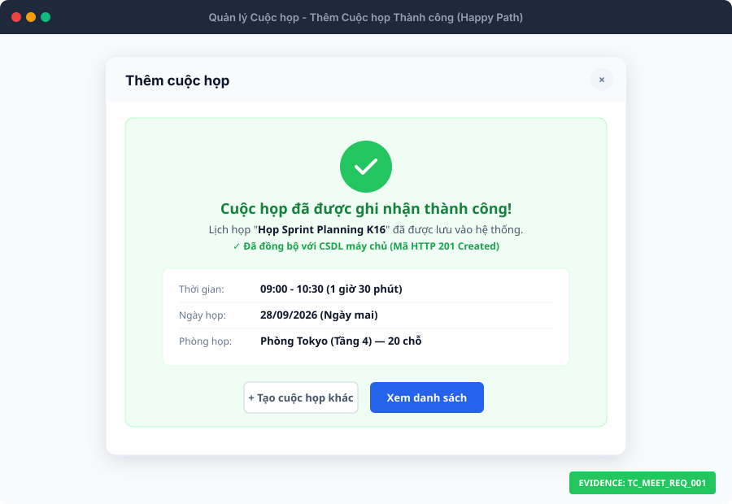
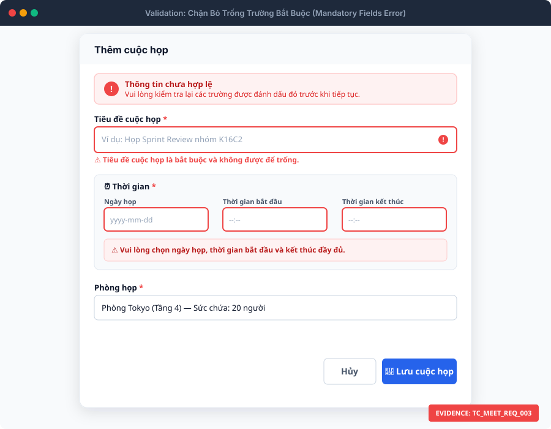
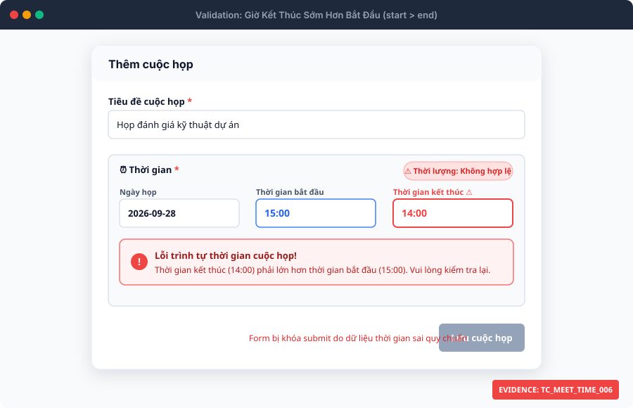
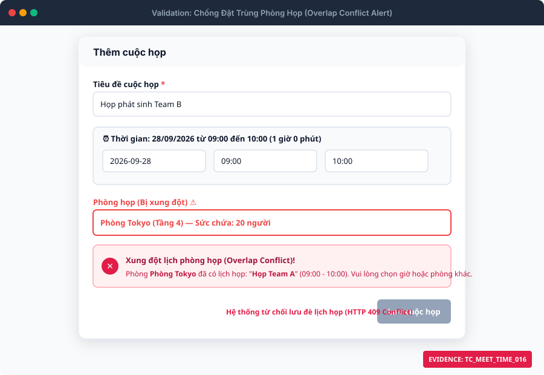
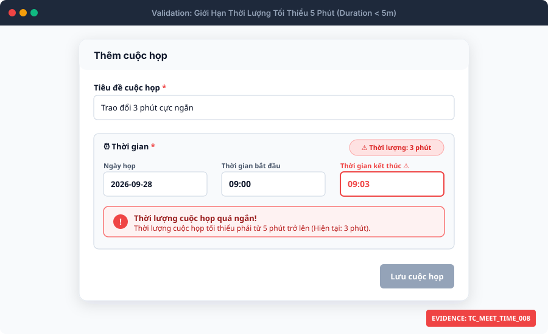
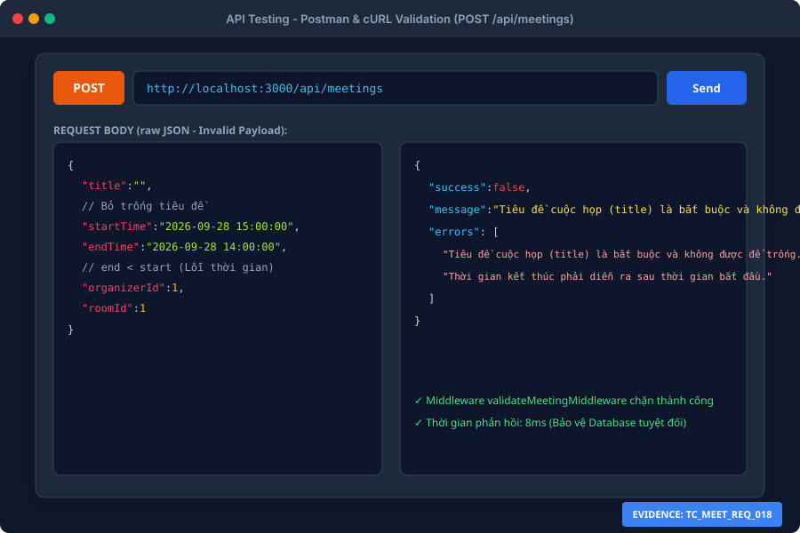

# 📋 TÀI LIỆU ĐẶC TẢ BỘ TEST CASES: CHỨC NĂNG TẠO CUỘC HỌP
### *(Module: Meeting Management - Create & Validate Booking)*
> **Dự án:** Hệ thống Quản lý Lịch họp Doanh nghiệp (`TTCS_T926_K16C2_N3`)  
> **Quy chuẩn:** Tuân thủ quy trình kiểm thử tại [QA_PROCESS_AND_JIRA_STANDARDS.md](file:///Users/user/Library/CloudStorage/GoogleDrive-hvkhuyen@ictu.vn/My%20Drive/Hoc%20tap/2026-2027%20%20%20%20%28nam%203%29/ky%201-N3%20%28k23%29/Code%20du%20an%20thuc%20tap/TTCS_T926_K16C2_N3/docs/QA_PROCESS_AND_JIRA_STANDARDS.md)  
> **Tổng số kịch bản:** **41 Test Cases** (Nhóm Trường bắt buộc: **18**, Nhóm Ngày & Giờ: **23**)  
> **Tệp dữ liệu bảng tính đính kèm:** [test_case_create_meeting.csv](file:///Users/user/Library/CloudStorage/GoogleDrive-hvkhuyen@ictu.vn/My%20Drive/Hoc%20tap/2026-2027%20%20%20%20%28nam%203%29/ky%201-N3%20%28k23%29/Code%20du%20an%20thuc%20tap/TTCS_T926_K16C2_N3/docs/test_case_create_meeting.csv) • [test_case_create_meeting.html](file:///Users/user/Library/CloudStorage/GoogleDrive-hvkhuyen@ictu.vn/My%20Drive/Hoc%20tap/2026-2027%20%20%20%20%28nam%203%29/ky%201-N3%20%28k23%29/Code%20du%20an%20thuc%20tap/TTCS_T926_K16C2_N3/docs/test_case_create_meeting.html)  
> **Thư mục ảnh minh chứng:** `docs/screenshots/create_meeting/` (100% SVG Vector)

---

## 📑 MỤC LỤC
1. [Mục Tiêu & Phạm Vi Kiểm Thử](#1-mục-tiêu--phạm-vi-kiểm-thử)
2. [Khảo Sát Toàn Diện Luồng Tạo Cuộc Họp](#2-khảo-sát-toàn-diện-luồng-tạo-cuộc-họp)
   - 2.1. Phân tích giao diện & Form Modal
   - 2.2. Ma trận đặc tả trường thông tin (Field Specification Matrix)
   - 2.3. Quy tắc kiểm tra tính hợp lệ của Ngày và Giờ (Date-Time Business Rules)
   - 2.4. Quy trình xử lý dữ liệu và phản hồi của hệ thống (System Response Flow)
3. [Thư Viện Ảnh Minh Chứng Trực Quan (Evidence Visual Showcase)](#3-thư-viện-ảnh-minh-chứng-trực-quan-evidence-visual-showcase)
4. [Bộ Test Cases Nhóm 1: Kiểm Tra Trường Bắt Buộc (18 Test Cases)](#4-bộ-test-cases-nhóm-1-kiểm-tra-trường-bắt-buộc)
5. [Bộ Test Cases Nhóm 2: Kiểm Tra Ngày và Giờ (23 Test Cases)](#5-bộ-test-cases-nhóm-2-kiểm-tra-ngày-và-giờ)
6. [Hướng Dẫn Thực Thi Kiểm Thử & Quản Lý Bug Trên Jira](#6-hướng-dẫn-thực-thi-kiểm-thử--quản-lý-bug-trên-jira)

---

## 1. Mục Tiêu & Phạm Vi Kiểm Thử

### 1.1. Mục tiêu
- Đảm bảo chức năng **Tạo cuộc họp** của hệ thống hoạt động ổn định, chính xác theo đúng đặc tả nghiệp vụ Product Backlog.
- Bao phủ toàn diện các trường hợp kiểm thử đầu vào: dữ liệu hợp lệ (Happy path), bỏ trống trường bắt buộc, sai định dạng, ngày giờ trong quá khứ, giờ kết thúc trước giờ bắt đầu, vi phạm thời lượng tối thiểu/tối đa, và xung đột lịch phòng (Overlap conflict).
- Cung cấp bộ Test Case tiêu chuẩn 11 cột có đính kèm liên kết ảnh minh chứng, có thể đưa vào thực thi ngay trên Google Sheets / Excel hoặc nhập lên Test Management Tool.

### 1.2. Phạm vi kiểm thử
- **Tập trung vào:** 
  $$\text{Mở Form} \longrightarrow \text{Nhập liệu} \longrightarrow \text{Validate Trường bắt buộc} \longrightarrow \text{Validate Ngày/Giờ} \longrightarrow \text{Xử lý Lưu & Phản hồi}$$
- **Không bao gồm:** Các tính năng quản trị danh mục phòng họp (CRUD Rooms), xuất báo cáo phân tích hay cấu hình tài khoản cá nhân.

---

## 2. Khảo Sát Toàn Diện Luồng Tạo Cuộc Họp

### 2.1. Phân tích giao diện & Form Modal
- **Điểm truy cập:** Nút `+ Thêm cuộc họp` (`#btn-add-meeting`) trên trang Quản lý cuộc họp (`client/index.html`).
- **Thành phần giao diện:**
  - **Modal Form:** Khung cửa sổ modal nổi (`#modal-overlay`, `#meeting-form`) kèm hiệu ứng mượt mà.
  - **Banner Trạng thái:** Hộp cảnh báo lỗi toàn cục (`#global-error`), banner ghi nhận thành công (`#success-view`).
  - **Live Duration Badge:** Thẻ huy hiệu thời lượng động (`#duration-badge`) tự động cập nhật thời gian theo thời gian thực khi người dùng thay đổi giờ.
  - **Nút hành động:** Nút Lưu (`#btn-submit-meeting` kèm spinner loading), nút Hủy (`#btn-cancel`), nút đóng `X` (`#btn-close-modal`).

### 2.2. Ma trận đặc tả trường thông tin (Field Specification Matrix)

| STT | Tên trường trên UI | Tên thuộc tính (API / DB) | Loại Input | Bắt buộc (Required)? | Ràng buộc nghiệp vụ & Giới hạn dữ liệu |
| :---: | :--- | :--- | :---: | :---: | :--- |
| **1** | **Tiêu đề cuộc họp** | `title` | Text | **Có (Yes)** | Độ dài từ 1 đến 200 ký tự. Không được để trống hoặc chỉ chứa khoảng trắng. Không chứa ký tự `<>`. |
| **2** | **Nhãn cuộc họp (Tag)** | `tag` | Text / Datalist | Không (Optional) | Chọn từ danh sách dựng sẵn (Tuyển dụng, Quan trọng...) hoặc tự nhập. |
| **3** | **Mô tả / Nội dung** | `description` | Textarea | Không (Optional) | Tối đa 2000 ký tự. Chứa agenda, mục tiêu cuộc họp. |
| **4** | **Ngày họp** | `date` (trong `startTime`) | Date Picker | **Có (Yes)** | Định dạng `YYYY-MM-DD`. Không được chọn ngày trong quá khứ. |
| **5** | **Thời gian bắt đầu** | `startTime` | Time Picker | **Có (Yes)** | Định dạng `HH:mm`. Phải ở thời điểm tương lai (hoặc trong dung sai 1 phút). |
| **6** | **Thời gian kết thúc** | `endTime` | Time Picker | **Có (Yes)** | Định dạng `HH:mm`. Bắt buộc phải diễn ra **sau** thời gian bắt đầu. |
| **7** | **Phòng họp** | `roomId` | Select Dropdown | **Có (Yes)** | Phải chọn 1 phòng có trạng thái `Active` (không chọn phòng Bảo trì). |
| **8** | **Người tổ chức** | `organizerId` | Select Dropdown | **Có (Yes)** | ID người dùng nguyên dương (> 0). Mặc định là tài khoản đang đăng nhập. |
| **9** | **Người tham gia** | `participants` / `participantIds` | Text / Array | Không (Optional) | Danh sách tên hoặc ID người tham dự phân tách bằng dấu phẩy. |
| **10**| **Trạng thái cuộc họp** | `status` | Select Dropdown | Không (Mặc định) | `scheduled` (Sắp diễn ra), `in-progress`, `completed`, `cancelled`. |
| **11**| **Họp lặp định kỳ** | `isRecurring` | Checkbox | Không (Optional) | Giá trị Boolean (`true`/`false`). |

### 2.3. Quy tắc kiểm tra tính hợp lệ của Ngày và Giờ (Date-Time Business Rules)
1. **Chống đặt lịch trong quá khứ:** Thời điểm bắt đầu ($$T_{start}$$) không được nhỏ hơn thời điểm hiện tại ($$T_{now}$$). Hệ thống áp dụng dung sai mạng $\Delta t = 60\text{ giây}$ để chống trễ mạng.
2. **Thứ tự thời gian:** Thời điểm kết thúc ($$T_{end}$$) bắt buộc phải lớn hơn thời điểm bắt đầu ($$T_{end} > T_{start}$$). Nếu $T_{end} \le T_{start}$ $\rightarrow$ Hệ thống lập tức chặn và cảnh báo.
3. **Thời lượng tối thiểu (Min Duration):** Cuộc họp phải kéo dài từ **ít nhất 5 phút** trở lên ($$T_{end} - T_{start} \ge 5\text{ phút}$$).
4. **Thời lượng tối đa (Max Duration):** Một lần đặt phòng không được vượt quá **24 giờ** ($$T_{end} - T_{start} \le 1440\text{ phút}$$).
5. **Chống trùng lịch phòng (Overlap Conflict):** Hai cuộc họp trong cùng một phòng không được phép có giao thoa thời gian:
   $$(T_{start} < T_{end}^{\text{existing}}) \quad \text{VÀ} \quad (T_{end} > T_{start}^{\text{existing}}) \quad \Longrightarrow \quad \text{Báo lỗi trùng phòng}$$
   *(Trường hợp tiếp xúc sát nút $T_{start} = T_{end}^{\text{existing}}$ là hợp lệ).*

### 2.4. Quy trình xử lý dữ liệu và phản hồi của hệ thống (System Response Flow)

```mermaid
flowchart TD
    A["Bấm nút '+ Thêm cuộc họp'"] --> B["Hiển thị Modal Form"]
    B --> C["Người dùng nhập dữ liệu & chọn Ngày/Giờ/Phòng"]
    C --> DClient Validation
    D -- "Thiếu trường bắt buộc" --> E1["Báo đỏ ô thiếu, hiện Alert lỗi, Focus ô đầu tiên"]
    D -- "Giờ sai: end <= start" --> E2["Hiện box đỏ: Thời gian kết thúc phải lớn hơn bắt đầu"]
    D -- "Thời lượng < 5m hoặc > 24h" --> E3["Hiện box đỏ: Báo lỗi giới hạn thời lượng"]
    D -- "Ngày/Giờ ở quá khứ" --> E4["Hiện box đỏ: Thời gian bắt đầu không thể ở quá khứ"]
    D -- "Trùng lịch phòng đã có" --> E5["Hiện box đỏ: Báo xung đột lịch phòng"]
    D -- "Dữ liệu Client hợp lệ" --> F["Bật Spinner 'Đang lưu...' & Gửi POST /api/meetings"]
    F --> GBackend Validation Middleware
    G -- "Lỗi dữ liệu/Kiểu dữ liệu" --> H1["Trả về HTTP 400 Bad Request"]
    G -- "Phòng bảo trì / User không tồn tại" --> H2["Trả về HTTP 400 hoặc HTTP 404"]
    G -- "Transaction Overlap phát hiện trùng" --> H3["Trả về HTTP 409 Conflict"]
    G -- "Hợp lệ & DB Commit thành công" --> I["Trả về HTTP 201 Created"]
    I --> J["Hiển thị Success View Banner"]
    J --> K["Cập nhật bảng danh sách cuộc họp & Thẻ thống kê KPI"]
```

---

## 3. Thư Viện Ảnh Minh Chứng Trực Quan (Evidence Visual Showcase)

Dưới đây là hình ảnh minh chứng thực tế cho các trạng thái giao diện và phản hồi hệ thống:

### 3.1. Minh chứng 1: Tạo cuộc họp thành công (Happy Path) & Banner ghi nhận
> **Áp dụng cho:** `TC_MEET_REQ_001`, `TC_MEET_REQ_002`, `TC_MEET_TIME_001`, `TC_MEET_TIME_004`, `TC_MEET_TIME_005`


---

### 3.2. Minh chứng 2: Chặn submit form rỗng & Báo đỏ các trường bắt buộc
> **Áp dụng cho:** `TC_MEET_REQ_003` đến `TC_MEET_REQ_017`


---

### 3.3. Minh chứng 3: Chặn giờ kết thúc sớm hơn giờ bắt đầu (`start > end`)
> **Áp dụng cho:** `TC_MEET_TIME_006`, `TC_MEET_TIME_007`


---

### 3.4. Minh chứng 4: Chặn đặt lịch họp ở thời điểm trong quá khứ
> **Áp dụng cho:** `TC_MEET_TIME_002`, `TC_MEET_TIME_003`


---

### 3.5. Minh chứng 5: Chặn đặt phòng khi khung giờ bị trùng lặp (Overlap Conflict)
> **Áp dụng cho:** `TC_MEET_TIME_016` đến `TC_MEET_TIME_020`, `TC_MEET_TIME_022`, `TC_MEET_TIME_023`


---

### 3.6. Minh chứng 6: Chặn thời lượng cuộc họp nhỏ hơn 5 phút (3 phút)
> **Áp dụng cho:** `TC_MEET_TIME_008`, `TC_MEET_TIME_010`, `TC_MEET_TIME_011`


---

### 3.7. Minh chứng 7: Kiểm thử API Backend qua Postman (HTTP 201 & HTTP 400 Bad Request)
> **Áp dụng cho:** `TC_MEET_REQ_018`, `TC_MEET_TIME_013`, `TC_MEET_TIME_014`


---

## 4. Bộ Test Cases Nhóm 1: Kiểm Tra Trường Bắt Buộc

> **Lưu ý:** Cột **Actual Result** và **Status** được để trống theo đúng quy định để phục vụ ghi nhận kết quả khi kiểm thử viên thực thi. Cột **Ảnh minh chứng** đính kèm liên kết ảnh tương ứng.

| Test Case ID | Module / Feature | Tiêu đề kịch bản | Pre-conditions | Test Steps | Test Data | Expected Result | Actual Result | Status | Ghi chú | Ảnh minh chứng |
| :--- | :--- | :--- | :--- | :--- | :--- | :--- | :---: | :---: | :--- | :--- |
| **TC_MEET_REQ_001** | Meeting / Mandatory Fields | Tạo cuộc họp thành công khi nhập đầy đủ tất cả trường bắt buộc và trường tùy chọn | 1. Người dùng đang ở màn hình Quản lý cuộc họp (/client/index.html).<br>2. Phòng họp 'Phòng Tokyo (Tầng 4)' đang hoạt động (Active) và trống lịch ngày mai 09:00 - 10:30.<br>3. Đã có sẵn danh sách người dùng trong hệ thống. | 1. Bấm nút '+ Thêm cuộc họp' để mở modal.<br>2. Nhập Tiêu đề: 'Họp Sprint Planning K16'.<br>3. Chọn Nhãn (Tag): 'Sprint 24'.<br>4. Nhập Mô tả: 'Lập kế hoạch phân công công việc cho Sprint 24'.<br>5. Chọn Ngày họp: Ngày mai.<br>6. Chọn Giờ bắt đầu: '09:00', Giờ kết thúc: '10:30'.<br>7. Chọn Phòng họp: 'Phòng Tokyo (Tầng 4)'.<br>8. Mở Thiết lập bổ sung: Chọn Người tổ chức 'Nguyễn Văn An', nhập Người tham gia 'Trần Văn A, Lê Văn B', chọn Trạng thái 'Sắp diễn ra', tích chọn 'Lặp định kỳ'.<br>9. Bấm nút 'Lưu cuộc họp'. | `Title: 'Họp Sprint Planning K16'<br>Tag: 'Sprint 24'<br>Description: 'Lập kế hoạch phân công công việc cho Sprint 24'<br>Date: Ngày mai<br>StartTime: 09:00<br>EndTime: 10:30<br>RoomID: 1 (Phòng Tokyo)<br>OrganizerID: 1 (Nguyễn Văn An)<br>Participants: 'Trần Văn A, Lê Văn B'<br>Status: 'scheduled'<br>isRecurring: true` | 1. Form vượt qua toàn bộ bước kiểm tra tính hợp lệ.<br>2. Hệ thống gọi API POST /api/meetings thành công (HTTP 201 Created).<br>3. Hiển thị Banner 'Cuộc họp đã được ghi nhận thành công!' với đầy đủ tóm tắt thông tin.<br>4. Bảng danh sách cuộc họp được cập nhật bản ghi mới, thẻ thống kê KPI tăng tương ứng.<br>5. Dữ liệu được lưu an toàn vào DB (hoặc localStorage dự phòng khi offline). | | | Kiểm thử luồng tích cực (Happy Path) đầy đủ mọi trường. | [evidence_01_happy_path_success.svg](screenshots/create_meeting/evidence_01_happy_path_success.svg) |
| **TC_MEET_REQ_002** | Meeting / Mandatory Fields | Tạo cuộc họp thành công khi chỉ nhập các trường bắt buộc và bỏ trống tất cả trường tùy chọn | 1. Modal 'Thêm cuộc họp' đang mở.<br>2. Phòng họp 'Phòng Silicon (Tầng 2)' đang Active và trống lịch. | 1. Nhập Tiêu đề: 'Họp đồng bộ kỹ thuật'.<br>2. Để trống ô Nhãn (Tag) và Mô tả.<br>3. Chọn Ngày họp: Ngày mai.<br>4. Chọn Giờ bắt đầu: '14:00', Giờ kết thúc: '15:00'.<br>5. Chọn Phòng họp: 'Phòng Silicon (Tầng 2)'.<br>6. Để mặc định Người tổ chức (ID: 1), để trống Người tham gia, không tích Lặp định kỳ.<br>7. Bấm nút 'Lưu cuộc họp'. | `Title: 'Họp đồng bộ kỹ thuật'<br>Tag: '' (Trống)<br>Description: '' (Trống)<br>Date: Ngày mai<br>StartTime: 14:00<br>EndTime: 15:00<br>RoomID: 2<br>OrganizerID: 1<br>Participants: '' (Trống)` | 1. Hệ thống chấp nhận dữ liệu chỉ gồm trường bắt buộc.<br>2. Tạo cuộc họp thành công (HTTP 201 Created).<br>3. Các trường tùy chọn (Mô tả, Tag, Người tham gia) nhận giá trị rỗng/null mà không gây lỗi hệ thống.<br>4. Hiển thị banner thành công và cập nhật bảng danh sách. | | | Kiểm tra hệ thống không ép buộc nhập các trường tùy chọn. | [evidence_01_happy_path_success.svg](screenshots/create_meeting/evidence_01_happy_path_success.svg) |
| **TC_MEET_REQ_003** | Meeting / Mandatory Fields | Chặn tạo cuộc họp khi bỏ trống trường Tiêu đề (meeting-title rỗng) | 1. Modal 'Thêm cuộc họp' đang mở. | 1. Để trống hoàn toàn ô 'Tiêu đề cuộc họp'.<br>2. Điền đầy đủ Ngày mai, Giờ bắt đầu '09:00', Giờ kết thúc '10:00'.<br>3. Chọn Phòng họp: 'Phòng Tokyo'.<br>4. Bấm nút 'Lưu cuộc họp'. | `Title: '' (Rỗng)<br>Date: Ngày mai<br>StartTime: 09:00<br>EndTime: 10:00<br>RoomID: 1` | 1. Hệ thống chặn submit phía Client.<br>2. Ô 'Tiêu đề cuộc họp' hiển thị viền đỏ (class has-error, is-invalid) kèm icon chấm than đỏ.<br>3. Dòng thông báo lỗi hiển thị ngay dưới ô nhập: 'Tiêu đề cuộc họp là bắt buộc và không được để trống.'.<br>4. Hiển thị hộp thông báo lỗi chung phía trên form ('Thông tin chưa hợp lệ').<br>5. Con trỏ chuột tự động focus vào ô Tiêu đề cuộc họp. | | | Kiểm tra validation trường bắt buộc Title phía UI. | [evidence_02_empty_form_validation.svg](screenshots/create_meeting/evidence_02_empty_form_validation.svg) |
| **TC_MEET_REQ_004** | Meeting / Mandatory Fields | Chặn tạo cuộc họp khi Tiêu đề chỉ chứa toàn ký tự khoảng trắng (Whitespace only) | 1. Modal 'Thêm cuộc họp' đang mở. | 1. Nhập vào ô Tiêu đề: '     ' (5 dấu cách).<br>2. Điền đầy đủ Ngày mai, Giờ bắt đầu '09:00', Giờ kết thúc '10:00'.<br>3. Bấm nút 'Lưu cuộc họp'. | `Title: '     ' (Chỉ chứa khoảng trắng)<br>Date: Ngày mai<br>StartTime: 09:00<br>EndTime: 10:00<br>RoomID: 1` | 1. Hệ thống thực hiện hàm trim() dữ liệu và phát hiện tiêu đề rỗng.<br>2. Ngăn chặn submit form.<br>3. Ô Tiêu đề bị viền đỏ, hiển thị lỗi: 'Tiêu đề cuộc họp là bắt buộc và không được để trống.'.<br>4. Không gửi request lên máy chủ, form rung nhẹ cảnh báo lỗi. | | | Chống lỗi bypass validation bằng khoảng trắng. | [evidence_02_empty_form_validation.svg](screenshots/create_meeting/evidence_02_empty_form_validation.svg) |
| **TC_MEET_REQ_005** | Meeting / Mandatory Fields | Chặn tạo cuộc họp khi Tiêu đề vượt quá độ dài tối đa cho phép (> 200 ký tự) | 1. Modal 'Thêm cuộc họp' đang mở. | 1. Nhập hoặc dán chuỗi 201 ký tự vào ô Tiêu đề cuộc họp (Ví dụ: 'Họp khẩn...' lặp lại dài 201 ký tự).<br>2. Điền đầy đủ Ngày, Giờ và Phòng hợp lệ.<br>3. Bấm nút 'Lưu cuộc họp'. | `Title: Chuỗi ký tự có độ dài 201 ký tự ('A' x 201)<br>Date: Ngày mai<br>StartTime: 09:00<br>EndTime: 10:00<br>RoomID: 1` | 1. Phía Client: Thuộc tính maxlength='200' ngăn người dùng gõ ký tự thứ 201, hoặc JS validate báo lỗi: 'Tiêu đề cuộc họp không được vượt quá 200 ký tự (chuẩn CSDL).'.<br>2. Phía Server: Middleware validateMeetingInput trả về HTTP 400 Bad Request nếu request bị giả mạo gửi qua curl/Postman. | | | Bảo toàn toàn vẹn dữ liệu cột VARCHAR(200) của CSDL. | [evidence_02_empty_form_validation.svg](screenshots/create_meeting/evidence_02_empty_form_validation.svg) |
| **TC_MEET_REQ_006** | Meeting / Mandatory Fields | Chặn tạo cuộc họp khi Tiêu đề chứa ký tự đặc biệt nguy hiểm (<, > / XSS Script) | 1. Modal 'Thêm cuộc họp' đang mở. | 1. Nhập Tiêu đề: '<script>alert("XSS")</script>'.<br>2. Nhập Ngày, Giờ và Phòng hợp lệ.<br>3. Bấm nút 'Lưu cuộc họp'. | `Title: '<script>alert("XSS")</script>'<br>Date: Ngày mai<br>StartTime: 09:00<br>EndTime: 10:00<br>RoomID: 1` | 1. Client phát hiện ký tự đặc biệt nguy hiểm (<, >).<br>2. Chặn submit form, báo lỗi đỏ: 'Tiêu đề không được chứa ký tự đặc biệt nguy hiểm (<, >).'.<br>3. Tránh hoàn toàn nguy cơ Cross-Site Scripting (XSS). | | | Kiểm tra bảo mật dữ liệu đầu vào (Input Sanitization). | [evidence_02_empty_form_validation.svg](screenshots/create_meeting/evidence_02_empty_form_validation.svg) |
| **TC_MEET_REQ_007** | Meeting / Mandatory Fields | Chặn tạo cuộc họp khi bỏ trống trường Ngày họp (meeting-date rỗng) | 1. Modal 'Thêm cuộc họp' đang mở. | 1. Nhập Tiêu đề hợp lệ: 'Họp rà soát tiến độ'.<br>2. Để trống ô 'Ngày họp'.<br>3. Nhập Giờ bắt đầu '09:00', Giờ kết thúc '10:00'.<br>4. Chọn Phòng hợp lệ.<br>5. Bấm nút 'Lưu cuộc họp'. | `Title: 'Họp rà soát tiến độ'<br>Date: '' (Rỗng)<br>StartTime: 09:00<br>EndTime: 10:00<br>RoomID: 1` | 1. Form ngăn chặn submit.<br>2. Ô 'Ngày họp' được viền đỏ (class has-error, is-invalid).<br>3. Hiển thị box thông báo lỗi thời gian: 'Vui lòng chọn ngày họp, thời gian bắt đầu và kết thúc đầy đủ.'.<br>4. Con trỏ tự động focus vào ô Ngày họp. | | | Kiểm tra trường bắt buộc Ngày họp. | [evidence_02_empty_form_validation.svg](screenshots/create_meeting/evidence_02_empty_form_validation.svg) |
| **TC_MEET_REQ_008** | Meeting / Mandatory Fields | Chặn tạo cuộc họp khi bỏ trống trường Giờ bắt đầu (meeting-start rỗng) | 1. Modal 'Thêm cuộc họp' đang mở. | 1. Nhập Tiêu đề hợp lệ.<br>2. Chọn Ngày họp: Ngày mai.<br>3. Để trống ô 'Thời gian bắt đầu'.<br>4. Nhập Giờ kết thúc '10:00'.<br>5. Bấm nút 'Lưu cuộc họp'. | `Title: 'Họp giao ban'<br>Date: Ngày mai<br>StartTime: '' (Rỗng)<br>EndTime: 10:00<br>RoomID: 1` | 1. Form ngăn chặn submit.<br>2. Ô Giờ bắt đầu được thêm viền đỏ cảnh báo.<br>3. Hộp thông báo lỗi thời gian hiển thị: 'Vui lòng chọn ngày họp, thời gian bắt đầu và kết thúc đầy đủ.'.<br>4. Badge thời lượng không hiển thị thời lượng hợp lệ. | | | Kiểm tra trường bắt buộc Giờ bắt đầu. | [evidence_02_empty_form_validation.svg](screenshots/create_meeting/evidence_02_empty_form_validation.svg) |
| **TC_MEET_REQ_009** | Meeting / Mandatory Fields | Chặn tạo cuộc họp khi bỏ trống trường Giờ kết thúc (meeting-end rỗng) | 1. Modal 'Thêm cuộc họp' đang mở. | 1. Nhập Tiêu đề hợp lệ.<br>2. Chọn Ngày họp: Ngày mai.<br>3. Nhập Giờ bắt đầu '09:00'.<br>4. Để trống ô 'Thời gian kết thúc'.<br>5. Bấm nút 'Lưu cuộc họp'. | `Title: 'Họp giao ban'<br>Date: Ngày mai<br>StartTime: 09:00<br>EndTime: '' (Rỗng)<br>RoomID: 1` | 1. Form ngăn chặn submit.<br>2. Ô Giờ kết thúc hiển thị viền đỏ cảnh báo.<br>3. Thông báo lỗi: 'Vui lòng chọn ngày họp, thời gian bắt đầu và kết thúc đầy đủ.'.<br>4. Focus vào ô Giờ kết thúc. | | | Kiểm tra trường bắt buộc Giờ kết thúc. | [evidence_02_empty_form_validation.svg](screenshots/create_meeting/evidence_02_empty_form_validation.svg) |
| **TC_MEET_REQ_010** | Meeting / Mandatory Fields | Chặn tạo cuộc họp khi bỏ trống toàn bộ cụm Thời gian (Ngày, Giờ bắt đầu, Giờ kết thúc) | 1. Modal 'Thêm cuộc họp' đang mở. | 1. Nhập Tiêu đề: 'Họp thảo luận'.<br>2. Để trống cả 3 ô Ngày họp, Giờ bắt đầu và Giờ kết thúc.<br>3. Bấm nút 'Lưu cuộc họp'. | `Title: 'Họp thảo luận'<br>Date: ''<br>StartTime: ''<br>EndTime: ''<br>RoomID: 1` | 1. Form chặn submit.<br>2. Cả 3 ô Ngày, Giờ bắt đầu, Giờ kết thúc đều bị đánh dấu viền đỏ (is-invalid).<br>3. Hiển thị thông báo lỗi thời gian màu đỏ trong thẻ thời gian.<br>4. Focus vào ô trống đầu tiên (Ngày họp). | | | Kiểm tra thiếu toàn bộ cụm thời gian. | [evidence_02_empty_form_validation.svg](screenshots/create_meeting/evidence_02_empty_form_validation.svg) |
| **TC_MEET_REQ_011** | Meeting / Mandatory Fields | Chặn tạo cuộc họp khi bỏ trống hoặc chọn phòng họp không hợp lệ (roomId = 0) | 1. Modal 'Thêm cuộc họp' đang mở. | 1. Nhập Tiêu đề, Ngày, Giờ hợp lệ.<br>2. Đặt giá trị trường Phòng họp về rỗng hoặc 0 (Ví dụ qua inspect/select).<br>3. Bấm nút 'Lưu cuộc họp'. | `Title: 'Họp dự án'<br>Date: Ngày mai<br>StartTime: 09:00<br>EndTime: 10:00<br>RoomID: 0 / ''` | 1. Form chặn submit.<br>2. Thẻ chọn Phòng họp hiển thị viền đỏ và thông báo: 'Vui lòng chọn phòng họp hợp lệ.'.<br>3. Server từ chối với HTTP 400 Bad Request: 'Mã phòng họp (roomId) phải là số nguyên dương hợp lệ.'. | | | Kiểm tra tính bắt buộc của trường Phòng họp. | [evidence_02_empty_form_validation.svg](screenshots/create_meeting/evidence_02_empty_form_validation.svg) |
| **TC_MEET_REQ_012** | Meeting / Mandatory Fields | Chặn tạo cuộc họp khi bỏ trống nhiều trường bắt buộc cùng lúc (Tiêu đề, Ngày, Giờ) | 1. Modal 'Thêm cuộc họp' đang mở. | 1. Để trống Tiêu đề.<br>2. Để trống Ngày họp và Giờ bắt đầu.<br>3. Chỉ nhập Giờ kết thúc: '11:00'.<br>4. Bấm nút 'Lưu cuộc họp'. | `Title: '' (Rỗng)<br>Date: '' (Rỗng)<br>StartTime: '' (Rỗng)<br>EndTime: 11:00<br>RoomID: 1` | 1. Form chặn submit và kích hoạt hiệu ứng rung (shake animation).<br>2. Alert lỗi chung 'Thông tin chưa hợp lệ' hiển thị phía trên.<br>3. Cả ô Tiêu đề, Ngày họp, Giờ bắt đầu đều chuyển sang viền đỏ và có thông báo lỗi riêng tương ứng.<br>4. Con trỏ tự động nhảy về focus vào ô Tiêu đề (trường lỗi đầu tiên). | | | Kiểm tra xử lý đồng thời nhiều trường bắt buộc bị thiếu. | [evidence_02_empty_form_validation.svg](screenshots/create_meeting/evidence_02_empty_form_validation.svg) |
| **TC_MEET_REQ_013** | Meeting / Mandatory Fields | Chặn tạo cuộc họp khi submit form hoàn toàn rỗng (Empty form submit) | 1. Bấm '+ Thêm cuộc họp' để mở form mới. | 1. Không nhập bất kỳ ký tự nào vào form.<br>2. Bấm trực tiếp vào nút 'Lưu cuộc họp'. | `Form hoàn toàn rỗng, chưa nhập dữ liệu.` | 1. Form hoàn toàn không gửi đi request nào lên server.<br>2. Hiển thị hộp cảnh báo đỏ toàn cục: 'Thông tin chưa hợp lệ - Vui lòng kiểm tra lại các trường được đánh dấu đỏ trước khi tiếp tục.'.<br>3. Toàn bộ các trường bắt buộc (Tiêu đề, Ngày, Giờ bắt đầu, Giờ kết thúc) đều hiện trạng thái lỗi.<br>4. Focus ngay vào ô Tiêu đề cuộc họp. | | | Kiểm tra submit rỗng hoàn toàn. | [evidence_02_empty_form_validation.svg](screenshots/create_meeting/evidence_02_empty_form_validation.svg) |
| **TC_MEET_REQ_014** | Meeting / Mandatory Fields | Chặn tạo cuộc họp khi chỉ nhập một phần thông tin (chỉ nhập Tiêu đề, bỏ trống ngày giờ) | 1. Modal 'Thêm cuộc họp' đang mở. | 1. Nhập Tiêu đề: 'Họp đột xuất'.<br>2. Không chọn Ngày, Giờ bắt đầu, Giờ kết thúc.<br>3. Bấm nút 'Lưu cuộc họp'. | `Title: 'Họp đột xuất'<br>Date: ''<br>StartTime: ''<br>EndTime: ''` | 1. Ô Tiêu đề hiển thị hợp lệ (không viền đỏ, không có icon lỗi).<br>2. Nhóm thời gian hiển thị viền đỏ và cảnh báo: 'Vui lòng chọn ngày họp, thời gian bắt đầu và kết thúc đầy đủ.'.<br>3. Form không submit, focus vào ô Ngày họp. | | | Kiểm tra nhập thiếu cụm thời gian khi đã có tiêu đề. | [evidence_02_empty_form_validation.svg](screenshots/create_meeting/evidence_02_empty_form_validation.svg) |
| **TC_MEET_REQ_015** | Meeting / Mandatory Fields | Chặn tạo cuộc họp khi chỉ chọn Ngày giờ, bỏ trống Tiêu đề | 1. Modal 'Thêm cuộc họp' đang mở. | 1. Để trống ô Tiêu đề.<br>2. Chọn Ngày họp: Ngày mai.<br>3. Chọn Giờ: 08:00 - 09:00.<br>4. Bấm nút 'Lưu cuộc họp'. | `Title: '' (Rỗng)<br>Date: Ngày mai<br>StartTime: 08:00<br>EndTime: 09:00<br>RoomID: 1` | 1. Cụm thời gian hiển thị thời lượng hợp lệ ('Thời lượng: 1 giờ 0 phút').<br>2. Ô Tiêu đề bị viền đỏ, hiển thị icon cảnh báo và thông báo 'Tiêu đề cuộc họp là bắt buộc và không được để trống.'.<br>3. Form không submit, focus vào ô Tiêu đề. | | | Kiểm tra độc lập validation của tiêu đề. | [evidence_02_empty_form_validation.svg](screenshots/create_meeting/evidence_02_empty_form_validation.svg) |
| **TC_MEET_REQ_016** | Meeting / Mandatory Fields | Kiểm tra tự động cuộn và Focus vào trường lỗi bắt buộc đầu tiên (First Error Field Focus) | 1. Modal 'Thêm cuộc họp' đang mở. | 1. Mở form, để trống toàn bộ thông tin.<br>2. Cuộn màn hình xuống dưới cùng.<br>3. Bấm nút 'Lưu cuộc họp'. | `Form rỗng.` | 1. Trình duyệt tự động focus và cuộn màn hình lên trường lỗi đầu tiên là 'Tiêu đề cuộc họp' (firstErrorField).<br>2. Giúp người dùng ngay lập tức nhìn thấy vị trí cần bổ sung dữ liệu. | | | Kiểm tra trải nghiệm người dùng (UX) khi form có lỗi. | [evidence_02_empty_form_validation.svg](screenshots/create_meeting/evidence_02_empty_form_validation.svg) |
| **TC_MEET_REQ_017** | Meeting / Mandatory Fields | Kiểm tra xóa trạng thái lỗi khi người dùng bắt đầu nhập lại dữ liệu hợp lệ (Error Clearance) | 1. Form vừa submit lỗi do để trống Tiêu đề (ô Tiêu đề đang viền đỏ và hiện text lỗi). | 1. Người dùng click vào ô Tiêu đề và gõ ký tự bất kỳ (Ví dụ: chữ 'H').<br>2. Quan sát giao diện ô Tiêu đề. | `Gõ ký tự: 'H'` | 1. Viền đỏ is-invalid biến mất ngay lập tức.<br>2. Icon cảnh báo đỏ và dòng text thông báo lỗi bên dưới ẩn đi.<br>3. Trả lại trạng thái bình thường (Normal state) cho ô nhập liệu. | | | Kiểm tra sự phản hồi mượt mà của UI khi sửa lỗi. | [evidence_02_empty_form_validation.svg](screenshots/create_meeting/evidence_02_empty_form_validation.svg) |
| **TC_MEET_REQ_018** | Meeting / API Validation | API Backend trả về HTTP 400 Bad Request khi thiếu bất kỳ trường bắt buộc nào trong payload | 1. Máy chủ Backend Node.js đang chạy tại cổng 3000.<br>2. Endpoint POST /api/meetings sẵn sàng tiếp nhận request. | 1. Sử dụng công cụ (Postman/Curl) gửi lần lượt 4 request POST /api/meetings với body JSON thiếu từng trường:<br>   a. Thiếu trường 'title'<br>   b. Thiếu trường 'startTime'<br>   c. Thiếu trường 'endTime'<br>   d. Thiếu trường 'organizerId'<br>   e. Thiếu trường 'roomId'.<br>2. Quan sát HTTP status code và JSON trả về. | `Payload a: { startTime, endTime, organizerId: 1, roomId: 1 }<br>Payload b: { title: 'Test', endTime, organizerId: 1, roomId: 1 }<br>Payload c: { title: 'Test', startTime, organizerId: 1, roomId: 1 }<br>Payload d: { title: 'Test', startTime, endTime, roomId: 1 }<br>Payload e: { title: 'Test', startTime, endTime, organizerId: 1 }` | 1. Cả 5 trường hợp máy chủ đều trả về mã trạng thái HTTP 400 Bad Request.<br>2. Thuộc tính 'success': false.<br>3. Thuộc tính 'message' chỉ rõ cụ thể trường bắt buộc còn thiếu.<br>4. Máy chủ không bị crash hoặc văng lỗi Unhandled Promise Rejection (500). | | | Kiểm tra tính an toàn của API Backend khi bị request bỏ qua client validate. | [evidence_07_api_backend_response.svg](screenshots/create_meeting/evidence_07_api_backend_response.svg) |

---

## 5. Bộ Test Cases Nhóm 2: Kiểm Tra Ngày và Giờ

| Test Case ID | Module / Feature | Tiêu đề kịch bản | Pre-conditions | Test Steps | Test Data | Expected Result | Actual Result | Status | Ghi chú | Ảnh minh chứng |
| :--- | :--- | :--- | :--- | :--- | :--- | :--- | :---: | :---: | :--- | :--- |
| **TC_MEET_TIME_001** | Meeting / Date & Time Validation | Tạo cuộc họp thành công với Ngày và Giờ hợp lệ trong tương lai | 1. Modal 'Thêm cuộc họp' đang mở.<br>2. Phòng họp ID=1 đang Active và chưa có ai đặt vào ngày mai từ 09:00 đến 10:30. | 1. Nhập Tiêu đề: 'Họp Tổng kết Quý 3'.<br>2. Chọn Ngày họp: Ngày mai.<br>3. Chọn Giờ bắt đầu: '09:00'.<br>4. Chọn Giờ kết thúc: '10:30'.<br>5. Chọn Phòng: 'Phòng Tokyo'.<br>6. Bấm nút 'Lưu cuộc họp'. | `Date: Ngày mai<br>StartTime: 09:00<br>EndTime: 10:30<br>Duration: 90 phút (1 giờ 30 phút)` | 1. Dynamic Duration Badge hiển thị: 'Thời lượng: 1 giờ 30 phút'.<br>2. Không có bất kỳ cảnh báo lỗi thời gian nào.<br>3. Cuộc họp được tạo thành công, HTTP 201 Created.<br>4. Banner hiển thị đúng thông tin: 09:00 - 10:30 (1 giờ 30 phút). | | | Kiểm tra luồng chuẩn ngày giờ hợp lệ. | [evidence_01_happy_path_success.svg](screenshots/create_meeting/evidence_01_happy_path_success.svg) |
| **TC_MEET_TIME_002** | Meeting / Date & Time Validation | Chặn tạo cuộc họp khi Ngày họp ở thời điểm trong quá khứ (Past Date) | 1. Modal 'Thêm cuộc họp' đang mở.<br>2. Ngày hiện tại của hệ thống là hôm nay. | 1. Nhập Tiêu đề: 'Họp bù tuần trước'.<br>2. Chọn Ngày họp: Ngày hôm qua (hoặc một ngày trong quá khứ).<br>3. Chọn Giờ bắt đầu: '09:00', Giờ kết thúc: '10:00'.<br>4. Chọn Phòng họp hợp lệ.<br>5. Bấm nút 'Lưu cuộc họp'. | `Date: Ngày hôm qua (Ví dụ: 2026-09-26 khi hôm nay là 2026-09-27)<br>StartTime: 09:00<br>EndTime: 10:00` | 1. Hệ thống phát hiện thời điểm bắt đầu nhỏ hơn thời điểm hiện tại.<br>2. Chặn submit form.<br>3. Hộp thông báo lỗi thời gian hiển thị: 'Thời gian bắt đầu không thể diễn ra trong quá khứ.'.<br>4. Cả ô Ngày họp và Giờ bắt đầu đều hiển thị viền đỏ cảnh báo (is-invalid). | | | Kiểm tra chặn ngày trong quá khứ. | [evidence_04_time_past_violation.svg](screenshots/create_meeting/evidence_04_time_past_violation.svg) |
| **TC_MEET_TIME_003** | Meeting / Date & Time Validation | Chặn tạo cuộc họp khi Ngày là hôm nay nhưng Giờ bắt đầu đã trôi qua trong quá khứ | 1. Giả sử thời gian hiện tại là 15:30 chiều hôm nay.<br>2. Modal 'Thêm cuộc họp' đang mở. | 1. Nhập Tiêu đề: 'Họp khẩn sáng nay'.<br>2. Chọn Ngày họp: Hôm nay.<br>3. Chọn Giờ bắt đầu: '09:00' (đã trôi qua so với 15:30).<br>4. Chọn Giờ kết thúc: '10:00'.<br>5. Bấm nút 'Lưu cuộc họp'. | `Date: Hôm nay<br>StartTime: Giờ đã trôi qua (Trước giờ hiện tại > 1 phút)<br>EndTime: Giờ kết thúc sau Giờ bắt đầu` | 1. Hệ thống so sánh startDateTime với thời điểm hiện tại và phát hiện đã quá hạn.<br>2. Chặn submit form.<br>3. Hiển thị thông báo lỗi màu đỏ: 'Thời gian bắt đầu không thể diễn ra trong quá khứ.'.<br>4. Viền đỏ ô Giờ bắt đầu. | | | Kiểm tra chặn giờ đã trôi qua trong cùng ngày hôm nay. | [evidence_04_time_past_violation.svg](screenshots/create_meeting/evidence_04_time_past_violation.svg) |
| **TC_MEET_TIME_004** | Meeting / Date & Time Validation | Cho phép tạo cuộc họp khi Ngày là hôm nay và Giờ bắt đầu ở tương lai gần (Same-day booking) | 1. Giả sử thời gian hiện tại là 10:00 sáng hôm nay.<br>2. Phòng họp ID=1 đang trống từ 11:00 đến 12:00 hôm nay. | 1. Nhập Tiêu đề: 'Họp nhanh trưa nay'.<br>2. Chọn Ngày họp: Hôm nay.<br>3. Chọn Giờ bắt đầu: '11:00' (sau thời điểm hiện tại 1 giờ).<br>4. Chọn Giờ kết thúc: '12:00'.<br>5. Chọn Phòng: 'Phòng Tokyo'.<br>6. Bấm nút 'Lưu cuộc họp'. | `Date: Hôm nay<br>StartTime: Giờ hiện tại + 1 giờ<br>EndTime: Giờ hiện tại + 2 giờ` | 1. Hệ thống xác nhận thời gian bắt đầu nằm ở tương lai.<br>2. Form submit thành công không có lỗi.<br>3. Cuộc họp được lưu vào hệ thống, hiển thị banner xác nhận. | | | Kiểm tra tính năng đặt lịch trong cùng ngày khi giờ họp hợp lệ. | [evidence_01_happy_path_success.svg](screenshots/create_meeting/evidence_01_happy_path_success.svg) |
| **TC_MEET_TIME_005** | Meeting / Date & Time Validation | Kiểm tra dung sai thời gian mạng 1 phút chống lệch đồng hồ (Tolerance Window) | 1. Đặt lịch họp sát với mốc hiện tại (chênh lệch dưới 60 giây do độ trễ gửi mạng hoặc bấm nút chậm vài giây). | 1. Chọn Ngày: Hôm nay.<br>2. Chọn Giờ bắt đầu bằng đúng phút hiện tại (hoặc vừa nhảy sang phút mới dưới 60s).<br>3. Bấm 'Lưu cuộc họp'. | `startDateTime: Thời điểm hiện tại trừ đi 30 giây (trong khoảng dung sai 60.000ms).` | 1. Hệ thống áp dụng TIME_PAST_TOLERANCE_MS (60 giây), không chặn oan request của người dùng.<br>2. Cho phép submit thành công nếu thời gian chênh lệch dưới 1 phút. | | | Kiểm tra cơ chế dung sai Tolerance 60s chống mạng lag. | [evidence_01_happy_path_success.svg](screenshots/create_meeting/evidence_01_happy_path_success.svg) |
| **TC_MEET_TIME_006** | Meeting / Date & Time Validation | Chặn tạo cuộc họp khi Giờ bắt đầu sau Giờ kết thúc trong cùng một ngày (start > end) | 1. Modal 'Thêm cuộc họp' đang mở. | 1. Nhập Tiêu đề hợp lệ.<br>2. Chọn Ngày: Ngày mai.<br>3. Chọn Giờ bắt đầu: '15:00'.<br>4. Chọn Giờ kết thúc: '14:00' (sớm hơn giờ bắt đầu 1 tiếng).<br>5. Bấm nút 'Lưu cuộc họp'. | `StartTime: 15:00<br>EndTime: 14:00 (endTotal < startTotal)` | 1. Hệ thống tính toán diffMinutes = -60 phút (nhỏ hơn hoặc bằng 0).<br>2. Form ngăn chặn submit.<br>3. Hộp thông báo lỗi thời gian hiển thị: 'Thời gian kết thúc phải lớn hơn thời gian bắt đầu.'.<br>4. Ô Giờ kết thúc hiển thị viền đỏ (is-invalid). | | | Kiểm tra logic kết thúc trước bắt đầu. | [evidence_03_time_order_violation.svg](screenshots/create_meeting/evidence_03_time_order_violation.svg) |
| **TC_MEET_TIME_007** | Meeting / Date & Time Validation | Chặn tạo cuộc họp khi Giờ bắt đầu trùng với Giờ kết thúc (start == end, thời lượng 0 phút) | 1. Modal 'Thêm cuộc họp' đang mở. | 1. Nhập Tiêu đề hợp lệ.<br>2. Chọn Ngày: Ngày mai.<br>3. Chọn Giờ bắt đầu: '10:00'.<br>4. Chọn Giờ kết thúc: '10:00'.<br>5. Bấm nút 'Lưu cuộc họp'. | `StartTime: 10:00<br>EndTime: 10:00 (diffMinutes = 0)` | 1. Hệ thống tính toán diffMinutes = 0.<br>2. Ngăn chặn submit form.<br>3. Thông báo lỗi: 'Thời gian kết thúc phải lớn hơn thời gian bắt đầu.'.<br>4. Ô Giờ kết thúc viền đỏ. | | | Chặn cuộc họp có thời lượng bằng 0. | [evidence_03_time_order_violation.svg](screenshots/create_meeting/evidence_03_time_order_violation.svg) |
| **TC_MEET_TIME_008** | Meeting / Date & Time Validation | Chặn tạo cuộc họp khi thời lượng nhỏ hơn giới hạn tối thiểu (< 5 phút, ví dụ: 3 phút) | 1. Modal 'Thêm cuộc họp' đang mở. | 1. Nhập Tiêu đề hợp lệ.<br>2. Chọn Ngày: Ngày mai.<br>3. Chọn Giờ bắt đầu: '09:00'.<br>4. Chọn Giờ kết thúc: '09:03' (thời lượng chỉ 3 phút).<br>5. Bấm nút 'Lưu cuộc họp'. | `StartTime: 09:00<br>EndTime: 09:03 (diffMinutes = 3)` | 1. Hệ thống phát hiện diffMinutes < 5.<br>2. Form chặn submit.<br>3. Hiển thị thông báo lỗi màu đỏ: 'Thời lượng cuộc họp tối thiểu phải từ 5 phút trở lên.'.<br>4. Ô Giờ kết thúc viền đỏ. | | | Kiểm tra quy tắc nghiệp vụ thời lượng tối thiểu 5 phút. | [evidence_06_min_duration_violation.svg](screenshots/create_meeting/evidence_06_min_duration_violation.svg) |
| **TC_MEET_TIME_009** | Meeting / Date & Time Validation | Giá trị biên dưới hợp lệ: Cho phép tạo cuộc họp có thời lượng chính xác 5 phút (Boundary Minimum) | 1. Modal 'Thêm cuộc họp' đang mở.<br>2. Phòng họp đang trống. | 1. Nhập Tiêu đề: 'Standup nhanh 5 phút'.<br>2. Chọn Ngày: Ngày mai.<br>3. Chọn Giờ bắt đầu: '09:00'.<br>4. Chọn Giờ kết thúc: '09:05' (đúng 5 phút).<br>5. Chọn Phòng họp hợp lệ.<br>6. Bấm nút 'Lưu cuộc họp'. | `StartTime: 09:00<br>EndTime: 09:05 (diffMinutes = 5)` | 1. Dynamic Duration Badge hiển thị: 'Thời lượng: 5 phút'.<br>2. Không có thông báo lỗi thời lượng.<br>3. Hệ thống cho phép tạo cuộc họp thành công (HTTP 201 Created). | | | Kiểm tra giá trị biên dưới hợp lệ (Min Boundary = 5m). | [evidence_01_happy_path_success.svg](screenshots/create_meeting/evidence_01_happy_path_success.svg) |
| **TC_MEET_TIME_010** | Meeting / Date & Time Validation | Giá trị biên dưới vi phạm: Chặn tạo cuộc họp có thời lượng 4 phút (Boundary Violation: 4 minutes) | 1. Modal 'Thêm cuộc họp' đang mở. | 1. Nhập Tiêu đề hợp lệ.<br>2. Chọn Ngày: Ngày mai.<br>3. Chọn Giờ bắt đầu: '09:00'.<br>4. Chọn Giờ kết thúc: '09:04' (4 phút).<br>5. Bấm nút 'Lưu cuộc họp'. | `StartTime: 09:00<br>EndTime: 09:04 (diffMinutes = 4)` | 1. Hệ thống từ chối submit.<br>2. Hiển thị thông báo lỗi: 'Thời lượng cuộc họp tối thiểu phải từ 5 phút trở lên.'.<br>3. Ô Giờ kết thúc viền đỏ. | | | Kiểm tra giá trị sát biên dưới (Min - 1m). | [evidence_06_min_duration_violation.svg](screenshots/create_meeting/evidence_06_min_duration_violation.svg) |
| **TC_MEET_TIME_011** | Meeting / Date & Time Validation | Chặn tạo cuộc họp khi thời lượng vượt quá giới hạn tối đa (> 24 giờ cho 1 lần đặt) | 1. Modal hoặc API tiếp nhận request đặt phòng. | 1. Gửi request tạo cuộc họp kéo dài hơn 24 giờ (Ví dụ: từ 08:00 ngày 01/10/2026 đến 10:00 ngày 02/10/2026 - 26 giờ).<br>2. Bấm 'Lưu' hoặc gửi API POST /api/meetings. | `StartTime: 2026-10-01 08:00:00<br>EndTime: 2026-10-02 10:00:00 (Duration: 26 giờ = 1560 phút)` | 1. Client: Báo lỗi 'Thời lượng cuộc họp không được vượt quá 24 giờ trong 1 lần đặt.'.<br>2. Server: Middleware trả về HTTP 400 Bad Request kèm message 'Thời lượng cuộc họp không được vượt quá 24 giờ trong một lần đặt.'. | | | Kiểm tra giới hạn thời lượng tối đa 24 giờ chống chiếm dụng phòng. | [evidence_06_min_duration_violation.svg](screenshots/create_meeting/evidence_06_min_duration_violation.svg) |
| **TC_MEET_TIME_012** | Meeting / Date & Time Validation | Giá trị biên trên hợp lệ: Cho phép tạo cuộc họp có thời lượng chính xác 24 giờ (Boundary Maximum) | 1. Gửi request qua API với thời lượng tròn 24 giờ.<br>2. Phòng họp trống toàn bộ khung giờ 24h. | 1. Gửi POST /api/meetings với StartTime: '2026-10-01 08:00:00', EndTime: '2026-10-02 08:00:00'.<br>2. Kiểm tra kết quả phản hồi. | `StartTime: 2026-10-01 08:00:00<br>EndTime: 2026-10-02 08:00:00 (Đúng tròn 1440 phút)` | 1. Máy chủ xác nhận thời lượng đúng bằng 24 giờ.<br>2. Vượt qua bước kiểm tra thời lượng.<br>3. Tạo cuộc họp thành công (HTTP 201 Created). | | | Kiểm tra giá trị biên trên hợp lệ (Max Boundary = 24h). | [evidence_01_happy_path_success.svg](screenshots/create_meeting/evidence_01_happy_path_success.svg) |
| **TC_MEET_TIME_013** | Meeting / Date & Time Validation | Chặn tạo cuộc họp khi Ngày bắt đầu sau Ngày kết thúc (startDate > endDate trong Payload API) | 1. API Backend đang chạy. | 1. Gửi request POST /api/meetings qua Postman với startTime ngày 15/10/2026, endTime ngày 14/10/2026.<br>2. Quan sát phản hồi API. | `startTime: '2026-10-15 09:00:00'<br>endTime: '2026-10-14 10:00:00'` | 1. Máy chủ phát hiện end <= start.<br>2. Trả về mã lỗi HTTP 400 Bad Request.<br>3. Message: 'Thời gian kết thúc phải diễn ra sau thời gian bắt đầu.'. | | | Kiểm tra ngày bắt đầu sau ngày kết thúc qua API. | [evidence_07_api_backend_response.svg](screenshots/create_meeting/evidence_07_api_backend_response.svg) |
| **TC_MEET_TIME_014** | Meeting / Date & Time Validation | Chặn tạo cuộc họp khi định dạng chuỗi Ngày/Giờ không hợp lệ (Invalid Date format) | 1. Kiểm tra qua API hoặc khi người dùng cố tình nhập chuỗi sai định dạng. | 1. Gửi request với startTime: 'invalid-date-string' hoặc '2026-02-31T25:00:00Z'.<br>2. Quan sát phản hồi từ hệ thống. | `startTime: 'invalid-date-string'<br>endTime: '2026-10-01T10:00:00Z'` | 1. Hàm parseValidDate phát hiện isNaN(date.getTime()).<br>2. Hệ thống từ chối dữ liệu, trả về HTTP 400 Bad Request.<br>3. Message: 'Định dạng ngày giờ không hợp lệ (hỗ trợ chuẩn ISO 8601 hoặc YYYY-MM-DD HH:mm:ss).'.<br>4. Không làm sập ứng dụng với lỗi Invalid Date. | | | Chống lỗi Crash Node.js do parse ngày giờ không hợp lệ. | [evidence_07_api_backend_response.svg](screenshots/create_meeting/evidence_07_api_backend_response.svg) |
| **TC_MEET_TIME_015** | Meeting / UI Duration Calculator | Kiểm tra tính toán và hiển thị thời lượng động (Live Duration Badge) trên giao diện | 1. Modal 'Thêm cuộc họp' đang mở. | 1. Chọn Ngày: Ngày mai.<br>2. Chọn Giờ bắt đầu: '09:00'.<br>3. Lần lượt đổi Giờ kết thúc:<br>   a. Chọn '09:30' -> Quan sát badge.<br>   b. Chọn '11:00' -> Quan sát badge.<br>   c. Chọn '10:45' -> Quan sát badge. | `a. 09:00 -> 09:30 (30 phút)<br>b. 09:00 -> 11:00 (2 giờ 0 phút)<br>c. 09:00 -> 10:45 (1 giờ 45 phút)` | 1. Badge thời lượng (#duration-badge) cập nhật ngay lập tức theo thời gian thực (real-time):<br>   a. Hiển thị: 'Thời lượng: 30 phút'.<br>   b. Hiển thị: 'Thời lượng: 2 giờ 0 phút'.<br>   c. Hiển thị: 'Thời lượng: 1 giờ 45 phút'.<br>2. Giao diện trực quan, rõ ràng cho người dùng. | | | Kiểm tra tính năng Live Duration Calculator trên giao diện. | [evidence_01_happy_path_success.svg](screenshots/create_meeting/evidence_01_happy_path_success.svg) |
| **TC_MEET_TIME_016** | Meeting / Time Conflict | Chặn đặt phòng khi khung giờ bị trùng lặp hoàn toàn với cuộc họp đã có (Exact Match Overlap) | 1. Phòng 'Phòng Tokyo' (ID=1) đã có lịch họp từ 09:00 đến 10:00 ngày mai (Tiêu đề: 'Họp Team A'). | 1. Bấm '+ Thêm cuộc họp'.<br>2. Nhập Tiêu đề: 'Họp Team B'.<br>3. Chọn Ngày mai, Giờ bắt đầu '09:00', Giờ kết thúc '10:00'.<br>4. Chọn Phòng: 'Phòng Tokyo' (ID=1).<br>5. Bấm nút 'Lưu cuộc họp'. | `Existing Meeting: 09:00 - 10:00 (Phòng Tokyo)<br>New Booking: 09:00 - 10:00 (Phòng Tokyo)` | 1. Phía Client: Hàm checkMeetingRoomConflict phát hiện trùng lặp, hiển thị box đỏ cảnh báo: 'Phòng Tokyo đã có lịch họp: "Họp Team A" (09:00 - 10:00). Vui lòng chọn giờ hoặc phòng khác.'.<br>2. Phía Server: Nếu request gửi lên, Transaction khóa phòng kiểm tra Overlap và trả về HTTP 409 Conflict: 'Phòng họp "Phòng Tokyo" đã có người đặt trong khung giờ này.'.<br>3. Cuộc họp không được tạo đè. | | | Kiểm tra chống trùng lặp tuyệt đối (100% overlap). | [evidence_05_room_conflict_alert.svg](screenshots/create_meeting/evidence_05_room_conflict_alert.svg) |
| **TC_MEET_TIME_017** | Meeting / Time Conflict | Chặn đặt phòng khi khung giờ bị chồng lấn một phần đầu (Start-overlap) | 1. Phòng ID=1 đã có lịch từ 09:00 đến 10:30 ngày mai. | 1. Nhập thông tin đặt phòng ID=1 từ 08:30 đến 09:30 (giao nhau 30 phút từ 09:00 đến 09:30).<br>2. Bấm 'Lưu cuộc họp'. | `Existing: 09:00 - 10:30<br>New: 08:30 - 09:30 (Chồng lấn 09:00 - 09:30)` | 1. Thuật toán kiểm tra (StartTime < EndExist && EndTime > StartExist) trả về True.<br>2. Hệ thống từ chối đặt phòng.<br>3. Báo lỗi xung đột lịch phòng (HTTP 409 Conflict hoặc Client Alert).<br>4. Form không lưu cuộc họp bị trùng. | | | Kiểm tra chồng lấn thời gian phần đầu. | [evidence_05_room_conflict_alert.svg](screenshots/create_meeting/evidence_05_room_conflict_alert.svg) |
| **TC_MEET_TIME_018** | Meeting / Time Conflict | Chặn đặt phòng khi khung giờ bị chồng lấn một phần cuối (End-overlap) | 1. Phòng ID=1 đã có lịch từ 09:00 đến 10:30 ngày mai. | 1. Nhập thông tin đặt phòng ID=1 từ 10:00 đến 11:30 (giao nhau 30 phút từ 10:00 đến 10:30).<br>2. Bấm 'Lưu cuộc họp'. | `Existing: 09:00 - 10:30<br>New: 10:00 - 11:30 (Chồng lấn 10:00 - 10:30)` | 1. Hệ thống phát hiện xung đột lịch.<br>2. Chặn submit và hiển thị cảnh báo phòng đã có người đặt.<br>3. Giữ nguyên dữ liệu trên form để người dùng đổi phòng hoặc đổi giờ. | | | Kiểm tra chồng lấn thời gian phần đuôi. | [evidence_05_room_conflict_alert.svg](screenshots/create_meeting/evidence_05_room_conflict_alert.svg) |
| **TC_MEET_TIME_019** | Meeting / Time Conflict | Chặn đặt phòng khi khung giờ mới nằm hoàn toàn bên trong cuộc họp khác (Inside-overlap) | 1. Phòng ID=1 đã có lịch từ 08:00 đến 12:00 ngày mai. | 1. Nhập thông tin đặt phòng ID=1 từ 09:00 đến 10:00 (nằm lọt thỏm trong 08:00 - 12:00).<br>2. Bấm 'Lưu cuộc họp'. | `Existing: 08:00 - 12:00<br>New: 09:00 - 10:00 (Nằm trọn bên trong)` | 1. Hệ thống phát hiện xung đột hoàn toàn.<br>2. Từ chối lưu cuộc họp, trả về HTTP 409 Conflict.<br>3. Thông báo rõ tên cuộc họp đang chiếm phòng. | | | Kiểm tra trường hợp lịch mới nằm lọt trong lịch cũ. | [evidence_05_room_conflict_alert.svg](screenshots/create_meeting/evidence_05_room_conflict_alert.svg) |
| **TC_MEET_TIME_020** | Meeting / Time Conflict | Chặn đặt phòng khi khung giờ mới bao trùm toàn bộ cuộc họp khác (Enclosing-overlap) | 1. Phòng ID=1 đã có lịch từ 09:30 đến 10:30 ngày mai. | 1. Nhập thông tin đặt phòng ID=1 từ 09:00 đến 11:00 (bao trùm toàn bộ khung 09:30 - 10:30).<br>2. Bấm 'Lưu cuộc họp'. | `Existing: 09:30 - 10:30<br>New: 09:00 - 11:00 (Bao trọn khung giờ lịch cũ)` | 1. Hệ thống phát hiện lịch cũ bị bao phủ bên trong khung giờ mới.<br>2. Chặn đặt lịch và báo lỗi xung đột phòng.<br>3. Không cho phép ghi đè. | | | Kiểm tra trường hợp lịch mới bao trùm lịch cũ. | [evidence_05_room_conflict_alert.svg](screenshots/create_meeting/evidence_05_room_conflict_alert.svg) |
| **TC_MEET_TIME_021** | Meeting / Time Conflict | Cho phép đặt phòng khi 2 cuộc họp nối tiếp sát nút nhau (Back-to-back booking - Hợp lệ) | 1. Phòng ID=1 đã có lịch từ 09:00 đến 10:00 ngày mai. | 1. Đặt tiếp phòng ID=1 với khung giờ: Giờ bắt đầu '10:00', Giờ kết thúc '11:00' (StartTime mới = EndTime cũ).<br>2. Bấm nút 'Lưu cuộc họp'. | `Existing: 09:00 - 10:00<br>New: 10:00 - 11:00 (Điểm kết thúc trùng điểm bắt đầu)` | 1. Công thức (StartTime < EndExist && EndTime > StartExist) trả về False vì (10:00 < 10:00) là False.<br>2. Hệ thống xác nhận KHÔNG bị xung đột.<br>3. Cho phép đặt phòng thành công (HTTP 201 Created).<br>4. Hai cuộc họp hiển thị kế tiếp nhau trên lịch họp. | | | Kiểm tra biên tiếp xúc thời gian (không tính là trùng lặp). | [evidence_01_happy_path_success.svg](screenshots/create_meeting/evidence_01_happy_path_success.svg) |
| **TC_MEET_TIME_022** | Meeting / Room Status | Chặn đặt lịch vào phòng họp đang trong trạng thái Bảo trì (Maintenance) hoặc Tạm ngừng | 1. Phòng họp ID=2 có Status = 'Maintenance' (Đang bảo trì). | 1. Mở modal 'Thêm cuộc họp'.<br>2. Nhập tiêu đề, ngày mai từ 09:00 đến 10:00.<br>3. Chọn Phòng họp ID=2 (Phòng đang bảo trì).<br>4. Bấm nút 'Lưu cuộc họp'. | `RoomID: 2 (Status = 'Maintenance')<br>Time: 09:00 - 10:00 ngày mai` | 1. Phía Client: Hiển thị cảnh báo lỗi phòng: 'Phòng hiện không khả dụng (Trạng thái: Bảo trì). Vui lòng chọn phòng khác.'.<br>2. Phía Server: Trả về HTTP 400 Bad Request: 'Phòng họp hiện không khả dụng (Trạng thái: Maintenance).'.<br>3. Chặn lưu cuộc họp vào phòng không sẵn sàng. | | | Kiểm tra trạng thái phòng hợp lệ trước khi đặt. | [evidence_05_room_conflict_alert.svg](screenshots/create_meeting/evidence_05_room_conflict_alert.svg) |
| **TC_MEET_TIME_023** | Meeting / Concurrency | Kiểm tra cơ chế khóa phòng chống Race Condition khi 2 người dùng đặt trùng giờ đồng thời | 1. Hai người dùng A và B cùng mở form đặt phòng ID=1.<br>2. Cả hai cùng chọn ngày mai từ 09:00 đến 10:00. | 1. User A và User B cùng bấm nút 'Lưu cuộc họp' gần như cùng một tích tắc (miligiây).<br>2. Quan sát phản hồi của 2 request trên Server. | `Cùng RoomID: 1, cùng StartTime: 09:00, cùng EndTime: 10:00.` | 1. Database Transaction kích hoạt câu lệnh SELECT ... FOR UPDATE khóa bản ghi phòng họp.<br>2. Request đến trước (User A) được tạo thành công (HTTP 201 Created).<br>3. Request đến sau (User B) khi giải phóng khóa sẽ quét thấy lịch của User A và bị từ chối với HTTP 409 Conflict: 'Phòng họp đã có người đặt trong khung giờ này.'.<br>4. Không bao giờ xảy ra tình trạng 2 cuộc họp cùng tồn tại trong 1 phòng tại 1 khung giờ. | | | Kiểm tra tính an toàn dữ liệu và khả năng chịu tải đồng thời (Race Condition Protection). | [evidence_05_room_conflict_alert.svg](screenshots/create_meeting/evidence_05_room_conflict_alert.svg) |

---

## 6. Hướng Dẫn Thực Thi Kiểm Thử & Quản Lý Bug Trên Jira

### 6.1. Quy trình thực thi kiểm thử
1. **Bước 1 - Chuẩn bị môi trường:**
   - Đảm bảo Backend Node.js hoạt động tại `http://localhost:3000`.
   - Mở giao diện Web tại `http://localhost:3000/client/index.html` trên trình duyệt.
2. **Bước 2 - Thực thi từng kịch bản:**
   - Thực hiện chính xác các thao tác tại cột **Test Steps** với dữ liệu tại cột **Test Data**.
   - So sánh phản hồi thực tế của giao diện/máy chủ với cột **Expected Result** và đối chiếu với hình ảnh tại cột **Ảnh minh chứng**.
3. **Bước 3 - Ghi nhận kết quả:**
   - Điền kết quả quan sát được vào cột **Actual Result**.
   - Nếu thực tế trùng khớp với mong đợi: Điền cột **Status** là `Pass`.
   - Nếu có sai khác, lỗi hiển thị hoặc lỗi máy chủ: Điền cột **Status** là `Fail`.

### 6.2. Hướng dẫn Log Bug lên Jira khi Test Case bị Fail
Khi một Test Case có trạng thái `Fail`, kiểm thử viên tạo ngay Issue Type **`Bug`** trên Jira theo mẫu:
- **Summary:** `[UI / Meeting Form] [Mã TC] Tóm tắt ngắn gọn lỗi`  
  *(Ví dụ: `[UI / Meeting Form] [TC_MEET_TIME_006] Vẫn cho phép lưu cuộc họp khi Giờ bắt đầu lớn hơn Giờ kết thúc`)*
- **Attachments:** Đính kèm file ảnh chụp màn hình tương ứng từ cột **Ảnh minh chứng**.

---
*Tài liệu được khởi tạo và lưu trữ chính thức trong kho mã nguồn dự án TTCS_T926_K16C2_N3.*
