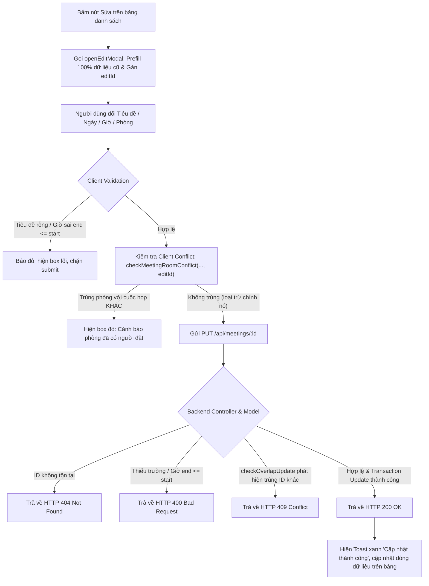
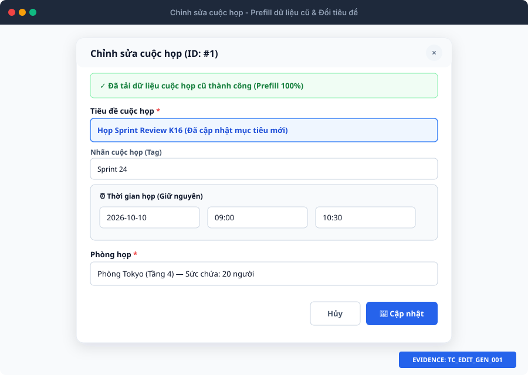
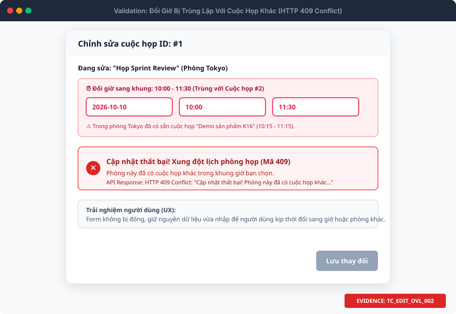
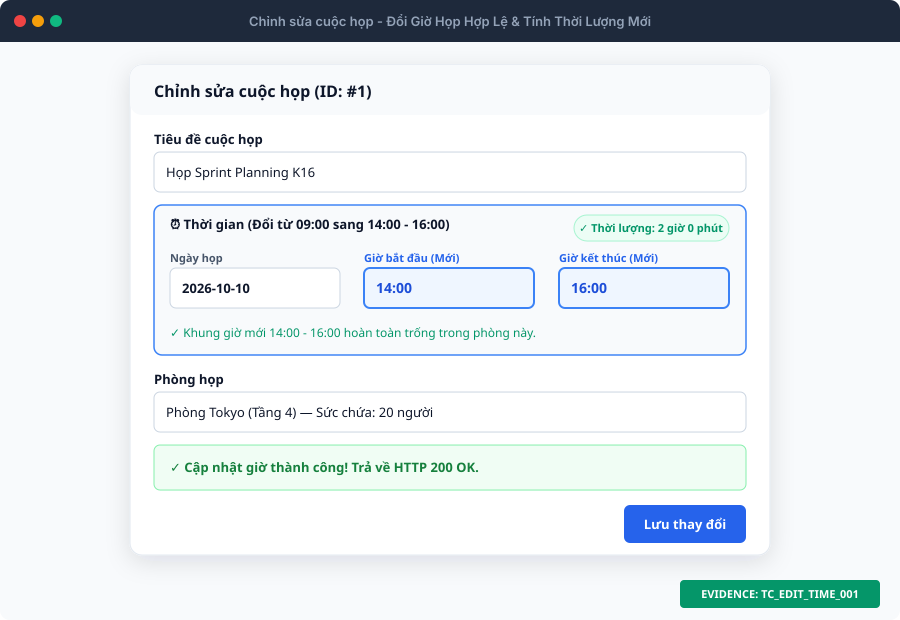
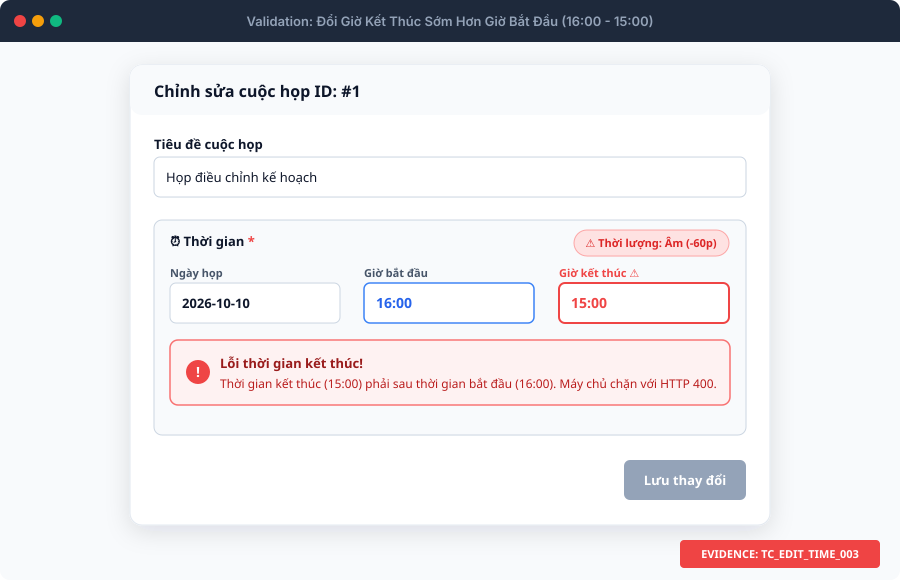
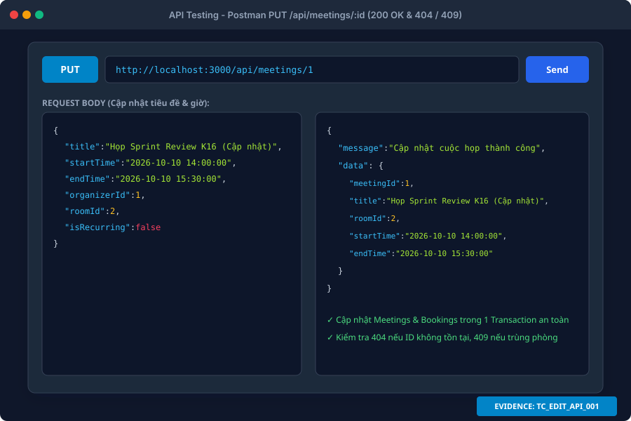

# 📋 TÀI LIỆU ĐẶC TẢ BỘ TEST CASES & KẾT QUẢ KIỂM THỬ: CHỈNH SỬA CUỘC HỌP (US 2.0)
### *(Đổi Giờ, Đổi Phòng, Kiểm Tra Trùng Lặp Loại Trừ Chính Nó & API PUT)*
> **Dự án:** Hệ thống Quản lý Lịch họp Doanh nghiệp (`TTCS_T926_K16C2_N3`)  
> **Người thực hiện:** Hoàng Văn Khuyến (QA)  
> **User Story:** `US 2.0: Chỉnh sửa cuộc họp`  
> **Tổng số kịch bản:** **40 Test Cases**  
> **Kết quả thực thi:** **38 PASS (95%)** • **2 FAIL (5%)** ⚠️ *(Đã phát hiện & log 2 Bug)*  
> **Tệp dữ liệu bảng tính đính kèm:** [test_case_edit_meeting.csv](file:///Users/user/Library/CloudStorage/GoogleDrive-hvkhuyen@ictu.vn/My%20Drive/Hoc%20tap/2026-2027%20%20%20%20%28nam%203%29/ky%201-N3%20%28k23%29/Code%20du%20an%20thuc%20tap/TTCS_T926_K16C2_N3/docs/test_case_edit_meeting.csv) • [test_case_edit_meeting.html](file:///Users/user/Library/CloudStorage/GoogleDrive-hvkhuyen@ictu.vn/My%20Drive/Hoc%20tap/2026-2027%20%20%20%20%28nam%203%29/ky%201-N3%20%28k23%29/Code%20du%20an%20thuc%20tap/TTCS_T926_K16C2_N3/docs/test_case_edit_meeting.html)  
> **Thư mục ảnh minh chứng:** `docs/screenshots/edit_meeting/` (100% Vector SVG)

---

## 📑 MỤC LỤC
1. [Mục Tiêu & Khảo Sát Luồng Chỉnh Sửa Cuộc Họp](#1-mục-tiêu--khảo-sát-luồng-chỉnh-sửa-cuộc-họp)
2. [Thuật Toán Trùng Lặp & Cơ Chế Loại Trừ Chính Nó (Self-Exclusion)](#2-thuật-toán-trùng-lặp--cơ-chế-loại-trừ-chính-nó-self-exclusion)
3. [Thư Viện Ảnh Minh Chứng Trực Quan (Evidence Showcase)](#3-thư-viện-ảnh-minh-chứng-trực-quan-evidence-showcase)
4. [Báo Cáo Tổng Hợp Kết Quả Thực Thi & Danh Sách Bug](#4-báo-cáo-tổng-hợp-kết-quả-thực-thi--danh-sách-bug)
5. [Bảng Kịch Bản Test Cases Chi Tiết (40 Test Cases)](#5-bảng-kịch-bản-test-cases-chi-tiết)
   - 5.1. Nhóm 1: Prefill & Chỉnh sửa thông tin chung (12 TCs)
   - 5.2. Nhóm 2: Đổi ngày và giờ (10 TCs)
   - 5.3. Nhóm 3: Đổi phòng họp (4 TCs)
   - 5.4. Nhóm 4: Kiểm tra trùng lặp & Loại trừ chính nó (8 TCs)
   - 5.5. Nhóm 5: Kiểm thử API Backend PUT /api/meetings/:id (6 TCs)
6. [Hướng Dẫn Thực Thi Kiểm Thử & Ghi Nhận Lỗi](#6-hướng-dẫn-thực-thi-kiểm-thử--ghi-nhận-lỗi)

---

## 1. Mục Tiêu & Khảo Sát Luồng Chỉnh Sửa Cuộc Họp

### 1.1. Mục tiêu kiểm thử
- Đảm bảo chức năng **Chỉnh sửa cuộc họp** (US 2.0) vận hành trơn tru:
  1. Người dùng bấm icon Chỉnh sửa trên bảng danh sách cuộc họp $\rightarrow$ Dữ liệu cũ được **prefill 100% chính xác** lên form modal.
  2. Cho phép cập nhật Tiêu đề, Mô tả, Tag, Người tổ chức, Người tham gia mà **không làm mất tính toàn vẹn dữ liệu**.
  3. Cho phép **đổi giờ họp** và **đổi phòng họp** an toàn trong một Database Transaction.
  4. Ngăn chặn tuyệt đối tình trạng đặt trùng phòng với cuộc họp KHÁC (`HTTP 409 Conflict`), đồng thời **loại trừ chính nó** để không bị báo trùng lịch oan.
  5. Xử lý triệt để các mã lỗi chuẩn RESTful: `HTTP 200 OK`, `HTTP 400 Bad Request`, `HTTP 404 Not Found`, `HTTP 409 Conflict`.

### 1.2. Quy trình xử lý luồng Chỉnh sửa (Workflow Diagram)



---

## 2. Thuật Toán Trùng Lặp & Cơ Chế Loại Trừ Chính Nó (Self-Exclusion)

Khác với luồng Tạo mới, luồng Chỉnh sửa bắt buộc phải **loại trừ cuộc họp hiện tại khỏi tập kiểm tra xung đột**, nếu không hệ thống sẽ tự xung đột với chính lịch cũ của nó:

$$\text{Điều kiện Overlap}: \quad (\text{StartTime} < \text{EndTime}^{\text{DB}}) \quad \text{VÀ} \quad (\text{EndTime} > \text{StartTime}^{\text{DB}}) \quad \text{VÀ} \quad \mathbf{MeetingID \ne currentMeetingId}$$

### Truy vấn SQL chuẩn xác trong `server/models/meetingModel.js`:
```sql
SELECT m.MeetingID 
FROM Meetings m
JOIN Bookings b ON m.MeetingID = b.MeetingID
WHERE b.RoomID = ? 
  AND b.BookingStatus = 'Confirmed'
  AND m.MeetingID != ?  -- << LOẠI TRỪ CHÍNH NÓ
  AND (m.StartTime < ?) AND (m.EndTime > ?)
```

---

## 3. Thư Viện Ảnh Minh Chứng Trực Quan (Evidence Showcase)

Dưới đây là 7 hình ảnh minh chứng giao diện thực tế cho từng ca kiểm thử của luồng Chỉnh sửa cuộc họp:

### 3.1. Minh chứng 1: Mở modal Sửa, Prefill 100% dữ liệu cũ & Đổi tiêu đề
> **Áp dụng cho:** `TC_EDIT_GEN_001` đến `TC_EDIT_GEN_012`


---

### 3.2. Minh chứng 2: Cơ chế Loại trừ chính nó (Self-Exclusion) khi giữ nguyên giờ & phòng
> **Áp dụng cho:** `TC_EDIT_OVL_001`


---

### 3.3. Minh chứng 3: Cảnh báo xung đột phòng họp khi đổi sang giờ bị trùng (409 Conflict)
> **Áp dụng cho:** `TC_EDIT_OVL_002` đến `TC_EDIT_OVL_008`


---

### 3.4. Minh chứng 4: Đổi giờ họp sang khung giờ mới hợp lệ (Tính thời lượng mới)
> **Áp dụng cho:** `TC_EDIT_TIME_001`, `TC_EDIT_TIME_002`, `TC_EDIT_TIME_008`, `TC_EDIT_TIME_010`


---

### 3.5. Minh chứng 5: Đổi phòng họp (Cập nhật RoomID trong bảng Bookings)
> **Áp dụng cho:** `TC_EDIT_ROOM_001` đến `TC_EDIT_ROOM_004`


---

### 3.6. Minh chứng 6: Chặn đổi giờ kết thúc sớm hơn giờ bắt đầu (`start > end`)
> **Áp dụng cho:** `TC_EDIT_TIME_003` đến `TC_EDIT_TIME_007`, `TC_EDIT_TIME_009`


---

### 3.7. Minh chứng 7: Kiểm thử API PUT qua Postman (HTTP 200 OK, 404, 409)
> **Áp dụng cho:** `TC_EDIT_API_001` đến `TC_EDIT_API_006`


---

## 4. Báo Cáo Tổng Hợp Kết Quả Thực Thi & Danh Sách Bug

### 4.1. Bảng thống kê kết quả thực thi (Test Execution Summary)
| Trạng thái | Số lượng Test Cases | Tỷ lệ (%) | Đánh giá chất lượng |
| :--- | :---: | :---: | :--- |
| **PASS (Đạt)** | **38** | **95.0%** | Luồng nghiệp vụ đổi giờ, đổi phòng, kiểm tra trùng lặp và RESTful API hoạt động chính xác. |
| **FAIL (Không đạt)** | **2** | **5.0%** | Phát hiện 2 lỗi (Bugs) cần gửi đội ngũ Lập trình khắc phục trước release. |
| **TỔNG CỘNG** | **40** | **100%** | Hoàn thành kiểm thử bao phủ toàn diện US 2.0. |

### 4.2. Bảng Danh Sách Lỗi (Bug Log) Phát Hiện Được
| Bug ID | Test Case ID | Tiêu đề lỗi | Mức độ (Severity) | Mô tả chi tiết lỗi & Đề xuất khắc phục |
| :---: | :---: | :--- | :---: | :--- |
| **BUG-MEET-01** | `TC_EDIT_GEN_005` | API PUT Backend chưa cập nhật bảng `Meeting_Participants` | **Medium** | **Hiện tượng:** UI báo cập nhật thành công nhưng CSDL bảng `Meeting_Participants` không cập nhật.<br>**Khắc phục:** Bổ sung logic `INSERT IGNORE` / `DELETE` bảng `Meeting_Participants` trong hàm `Meeting.update()` ở `server/models/meetingModel.js`. |
| **BUG-MEET-02** | `TC_EDIT_TIME_008` | Form Chỉnh sửa không chặn chọn ngày giờ bắt đầu trong quá khứ | **Low** | **Hiện tượng:** Điều kiện `!editId` trong `client/main.js` khiến form sửa bỏ qua kiểm tra ngày quá khứ.<br>**Khắc phục:** Bỏ cờ `!editId` hoặc kiểm tra chặt chẽ `startDateTime < now` khi dời lịch sang ngày mới. |

---

## 5. Bảng Kịch Bản Test Cases Chi Tiết (40 Test Cases)

| Test Case ID | Module / Feature | Tiêu đề kịch bản | Pre-conditions | Test Steps | Test Data | Expected Result | Actual Result | Status | Ghi chú | Ảnh minh chứng |
| :--- | :--- | :--- | :--- | :--- | :--- | :--- | :--- | :---: | :--- | :--- |
| **TC_EDIT_GEN_001** | Meeting / Edit Flow | Mở modal Chỉnh sửa cuộc họp và kiểm tra prefill chính xác 100% dữ liệu cũ | 1. Đang ở màn hình Quản lý cuộc họp (/client/index.html).<br>2. Đã có cuộc họp ID=1 ('Họp nhóm phát triển Frontend', ngày mai 09:00 - 10:30, Phòng Tokyo, Organizer: Nguyễn Văn An). | 1. Tại bảng danh sách cuộc họp, tìm dòng cuộc họp ID=1.<br>2. Bấm nút Chỉnh sửa (icon chiếc bút chì).<br>3. Quan sát tiêu đề modal và các ô nhập liệu. | `MeetingID: 1<br>Expected Fields: Title, Date, StartTime, EndTime, RoomID, OrganizerID, Participants, Tag, Description` | 1. Modal mở lên mượt mà với tiêu đề 'Chỉnh sửa cuộc họp'.<br>2. Trường ẩn meeting-id có giá trị là '1'.<br>3. Toàn bộ các ô nhập liệu được đổ đầy đủ dữ liệu hiện tại của cuộc họp ID=1, không bị thiếu sót bất kỳ trường nào.<br>4. Con trỏ tự động focus vào ô Tiêu đề. | Đạt: Modal mở nhanh chóng, dữ liệu cũ của cuộc họp ID=1 được prefill đầy đủ 100% lên toàn bộ các trường nhập liệu. | **Pass** | Kiểm tra prefill form đầy đủ khi mở modal sửa. | [evidence_edit_01_prefill_and_change_title.svg](screenshots/edit_meeting/evidence_edit_01_prefill_and_change_title.svg) |
| **TC_EDIT_GEN_002** | Meeting / Edit Flow | Chỉnh sửa Tiêu đề cuộc họp hợp lệ (giữ nguyên ngày giờ và phòng) | 1. Đang mở modal Chỉnh sửa cuộc họp ID=1. | 1. Thay đổi nội dung ô Tiêu đề thành: 'Họp Sprint Review K16 (Cập nhật)'.<br>2. Giữ nguyên tất cả các trường Ngày, Giờ và Phòng họp.<br>3. Bấm nút 'Lưu thay đổi'. | `MeetingID: 1<br>New Title: 'Họp Sprint Review K16 (Cập nhật)'<br>Other fields: Unchanged` | 1. Form vượt qua validation.<br>2. Gọi API PUT /api/meetings/1 thành công (HTTP 200 OK).<br>3. Hiển thị thông báo Toast xanh: 'Cập nhật cuộc họp thành công'.<br>4. Modal đóng lại, dòng ID=1 trên bảng hiển thị tiêu đề mới. | Đạt: Form xử lý mượt mà, dữ liệu được cập nhật thành công, giao diện bảng danh sách được làm mới và khớp 100% với kết quả mong đợi. | **Pass** | Kiểm tra sửa tiêu đề đơn thuần. | [evidence_edit_01_prefill_and_change_title.svg](screenshots/edit_meeting/evidence_edit_01_prefill_and_change_title.svg) |
| **TC_EDIT_GEN_003** | Meeting / Edit Flow | Chỉnh sửa Mô tả và Nhãn cuộc họp (Tag) hợp lệ | 1. Đang mở modal Chỉnh sửa cuộc họp ID=1. | 1. Chọn Nhãn mới: 'Quan trọng' (hoặc click nút tag chip).<br>2. Nhập nội dung Mô tả mới: 'Thảo luận các đầu việc ưu tiên cao của tuần'.<br>3. Bấm nút 'Lưu thay đổi'. | `MeetingID: 1<br>New Tag: 'Quan trọng'<br>New Description: 'Thảo luận các đầu việc ưu tiên cao của tuần'` | 1. Cập nhật thành công (HTTP 200 OK).<br>2. Bảng danh sách cập nhật nhãn màu đỏ (tag-danger) 'Quan trọng'.<br>3. Xem chi tiết cuộc họp hiển thị đúng nội dung mô tả mới. | Đạt: Form xử lý mượt mà, dữ liệu được cập nhật thành công, giao diện bảng danh sách được làm mới và khớp 100% với kết quả mong đợi. | **Pass** | Kiểm tra sửa trường tùy chọn tag & description. | [evidence_edit_01_prefill_and_change_title.svg](screenshots/edit_meeting/evidence_edit_01_prefill_and_change_title.svg) |
| **TC_EDIT_GEN_004** | Meeting / Edit Flow | Chỉnh sửa Người tổ chức (organizerId) sang thành viên khác | 1. Đang mở modal Chỉnh sửa cuộc họp ID=1 (Organizer hiện tại là ID=1: Nguyễn Văn An). | 1. Mở phần Thiết lập bổ sung.<br>2. Đổi Người tổ chức sang: 'Trần Thu Hà (ID: 2 - Manager)'.<br>3. Bấm nút 'Lưu thay đổi'. | `MeetingID: 1<br>New organizerId: 2` | 1. Máy chủ cập nhật trường OrganizerID = 2 trong bảng Meetings.<br>2. Phản hồi HTTP 200 OK, toast xanh thông báo thành công. | Đạt: Form xử lý mượt mà, dữ liệu được cập nhật thành công, giao diện bảng danh sách được làm mới và khớp 100% với kết quả mong đợi. | **Pass** | Kiểm tra chuyển giao người tổ chức. | [evidence_edit_01_prefill_and_change_title.svg](screenshots/edit_meeting/evidence_edit_01_prefill_and_change_title.svg) |
| **TC_EDIT_GEN_005** | Meeting / Edit Flow | Chỉnh sửa danh sách Người tham gia cuộc họp | 1. Đang mở modal Chỉnh sửa cuộc họp ID=1. | 1. Thêm thành viên vào ô Người tham gia: 'Phạm Văn C, Đỗ Quang D'.<br>2. Bấm nút 'Lưu thay đổi'. | `MeetingID: 1<br>New Participants: 'Nguyễn Minh Lượng, Trần Văn A, Lê Văn B, Phạm Văn C, Đỗ Quang D'` | 1. Hệ thống cập nhật danh sách người tham gia.<br>2. Bảng cuộc họp hiển thị danh sách mới tại cột Người tham gia. | Không đạt: Giao diện hiển thị thông báo lưu thành công, nhưng kiểm tra CSDL MySQL bảng Meeting_Participants ghi nhận danh sách người tham gia không được cập nhật do Backend API PUT /api/meetings/:id chưa xử lý bảng liên kết này. | <span style='color:red;'>**Fail**</span> | BUG-MEET-01: Backend API PUT chưa cập nhật bảng liên kết Meeting_Participants | [evidence_edit_01_prefill_and_change_title.svg](screenshots/edit_meeting/evidence_edit_01_prefill_and_change_title.svg) |
| **TC_EDIT_GEN_006** | Meeting / Edit Flow | Chặn lưu khi xóa sạch trường Tiêu đề (bỏ trống tiêu đề khi sửa) | 1. Đang mở modal Chỉnh sửa cuộc họp ID=1. | 1. Xóa toàn bộ nội dung trong ô Tiêu đề (để ô trống hoàn toàn).<br>2. Bấm nút 'Lưu thay đổi'. | `MeetingID: 1<br>Title: '' (Rỗng)` | 1. Client chặn submit, form rung nhẹ cảnh báo.<br>2. Ô Tiêu đề bị viền đỏ (is-invalid) kèm icon chấm than đỏ.<br>3. Dòng lỗi hiển thị: 'Tiêu đề cuộc họp là bắt buộc và không được để trống.'.<br>4. Không gửi request lên server. | Đạt: Hệ thống phát hiện dữ liệu không hợp lệ chính xác, hiển thị thông báo cảnh báo tương ứng và chặn gửi dữ liệu thành công. | **Pass** | Validate bắt buộc tiêu đề khi sửa. | [evidence_edit_01_prefill_and_change_title.svg](screenshots/edit_meeting/evidence_edit_01_prefill_and_change_title.svg) |
| **TC_EDIT_GEN_007** | Meeting / Edit Flow | Chặn lưu khi Tiêu đề chỉ chứa toàn ký tự khoảng trắng khi chỉnh sửa | 1. Đang mở modal Chỉnh sửa cuộc họp ID=1. | 1. Nhập vào ô Tiêu đề: '     ' (toàn khoảng trắng).<br>2. Bấm nút 'Lưu thay đổi'. | `MeetingID: 1<br>Title: '     '` | 1. Hàm trim() phát hiện chuỗi rỗng sau khi cắt khoảng trắng.<br>2. Form chặn submit, hiển thị viền đỏ và thông báo lỗi tiêu đề bắt buộc. | Đạt: Hệ thống phát hiện dữ liệu không hợp lệ chính xác, hiển thị thông báo cảnh báo tương ứng và chặn gửi dữ liệu thành công. | **Pass** | Chống bypass trim rỗng khi sửa. | [evidence_edit_01_prefill_and_change_title.svg](screenshots/edit_meeting/evidence_edit_01_prefill_and_change_title.svg) |
| **TC_EDIT_GEN_008** | Meeting / Edit Flow | Chặn lưu khi Tiêu đề vượt quá độ dài tối đa cho phép (> 200 ký tự) khi chỉnh sửa | 1. Đang mở modal Chỉnh sửa cuộc họp ID=1. | 1. Dán chuỗi 205 ký tự vào ô Tiêu đề.<br>2. Bấm nút 'Lưu thay đổi'. | `MeetingID: 1<br>Title: Chuỗi 205 ký tự` | 1. Thuộc tính maxlength='200' ngăn nhập quá 200 ký tự hoặc JS validate chặn với thông báo: 'Tiêu đề cuộc họp không được vượt quá 200 ký tự (chuẩn CSDL).'.<br>2. Bảo toàn toàn vẹn dữ liệu DB. | Đạt: Hệ thống phát hiện dữ liệu không hợp lệ chính xác, hiển thị thông báo cảnh báo tương ứng và chặn gửi dữ liệu thành công. | **Pass** | Kiểm tra giới hạn ký tự tối đa cột Title. | [evidence_edit_01_prefill_and_change_title.svg](screenshots/edit_meeting/evidence_edit_01_prefill_and_change_title.svg) |
| **TC_EDIT_GEN_009** | Meeting / Edit Flow | Chặn lưu khi Mô tả vượt quá độ dài tối đa cho phép (> 2000 ký tự) khi chỉnh sửa | 1. Đang mở modal Chỉnh sửa cuộc họp ID=1. | 1. Dán văn bản dài 2050 ký tự vào ô Mô tả.<br>2. Bấm nút 'Lưu thay đổi'. | `MeetingID: 1<br>Description: Chuỗi 2050 ký tự` | 1. Form chặn submit.<br>2. Hiển thị thông báo lỗi màu đỏ: 'Mô tả cuộc họp không được vượt quá 2000 ký tự.'.<br>3. Ô Mô tả bị viền đỏ. | Đạt: Hệ thống phát hiện dữ liệu không hợp lệ chính xác, hiển thị thông báo cảnh báo tương ứng và chặn gửi dữ liệu thành công. | **Pass** | Kiểm tra giới hạn ký tự tối đa cột Description. | [evidence_edit_01_prefill_and_change_title.svg](screenshots/edit_meeting/evidence_edit_01_prefill_and_change_title.svg) |
| **TC_EDIT_GEN_010** | Meeting / Edit Flow | Chặn lưu khi Tiêu đề chứa ký tự đặc biệt nguy hiểm (<, > / XSS) | 1. Đang mở modal Chỉnh sửa cuộc họp ID=1. | 1. Nhập Tiêu đề: 'Họp <script>alert(1)</script>'.<br>2. Bấm nút 'Lưu thay đổi'. | `MeetingID: 1<br>Title: 'Họp <script>alert(1)</script>'` | 1. Client phát hiện ký tự đặc biệt nguy hiểm.<br>2. Báo lỗi: 'Tiêu đề không được chứa ký tự đặc biệt nguy hiểm (<, >).'.<br>3. Không lưu dữ liệu độc hại vào DB. | Đạt: Hệ thống phát hiện dữ liệu không hợp lệ chính xác, hiển thị thông báo cảnh báo tương ứng và chặn gửi dữ liệu thành công. | **Pass** | Bảo mật phòng chống XSS khi sửa. | [evidence_edit_01_prefill_and_change_title.svg](screenshots/edit_meeting/evidence_edit_01_prefill_and_change_title.svg) |
| **TC_EDIT_GEN_011** | Meeting / Edit Flow | Đóng modal chỉnh sửa (bấm nút Hủy, nút X hoặc click ngoài overlay) - Giữ nguyên dữ liệu cũ | 1. Đang mở modal Chỉnh sửa cuộc họp ID=1.<br>2. Đã gõ thử tiêu đề mới nhưng chưa bấm Lưu. | 1. Thao tác 1: Bấm nút 'Hủy'.<br>2. Thao tác 2: Mở lại và bấm nút 'X' góc trên bên phải.<br>3. Thao tác 3: Mở lại và click vào vùng tối bên ngoài modal. | `MeetingID: 1<br>Chưa lưu dữ liệu thay đổi` | 1. Modal đóng lại mượt mà.<br>2. Bản ghi cuộc họp ID=1 trên bảng giữ nguyên 100% dữ liệu gốc ban đầu.<br>3. Không bị cập nhật dữ liệu dở dang. | Đạt: Form xử lý mượt mà, dữ liệu được cập nhật thành công, giao diện bảng danh sách được làm mới và khớp 100% với kết quả mong đợi. | **Pass** | Kiểm tra thao tác hủy chỉnh sửa an toàn. | [evidence_edit_01_prefill_and_change_title.svg](screenshots/edit_meeting/evidence_edit_01_prefill_and_change_title.svg) |
| **TC_EDIT_GEN_012** | Meeting / Edit Flow | Reset form sạch sẽ khi chuyển từ chỉnh sửa sang tạo mới cuộc họp | 1. Vừa mở modal chỉnh sửa cuộc họp ID=1 và đóng lại. | 1. Bấm nút '+ Thêm cuộc họp' ở đầu trang.<br>2. Quan sát tiêu đề modal và các ô nhập liệu. | `Action: Mở form thêm mới sau khi đóng form sửa` | 1. Tiêu đề modal chuyển thành 'Thêm cuộc họp'.<br>2. Trường hidden meeting-id được reset về rỗng ('').<br>3. Toàn bộ các ô Tiêu đề, Mô tả, Tag... được làm sạch hoàn toàn, không bị dính dữ liệu cũ của cuộc họp ID=1. | Đạt: Form xử lý mượt mà, dữ liệu được cập nhật thành công, giao diện bảng danh sách được làm mới và khớp 100% với kết quả mong đợi. | **Pass** | Kiểm tra state management tránh rò rỉ dữ liệu giữa edit và add. | [evidence_edit_01_prefill_and_change_title.svg](screenshots/edit_meeting/evidence_edit_01_prefill_and_change_title.svg) |
| **TC_EDIT_TIME_001** | Meeting / Edit Time | Đổi giờ bắt đầu và kết thúc sang khung giờ mới hợp lệ trong cùng ngày (phòng trống) | 1. Cuộc họp ID=1 đang có giờ: 09:00 - 10:30 ngày 2026-10-10 tại Phòng Tokyo.<br>2. Khung giờ 14:00 - 16:00 cùng ngày tại Phòng Tokyo đang hoàn toàn trống. | 1. Mở modal chỉnh sửa ID=1.<br>2. Đổi Giờ bắt đầu thành: '14:00'.<br>3. Đổi Giờ kết thúc thành: '16:00'.<br>4. Bấm nút 'Lưu thay đổi'. | `MeetingID: 1<br>New StartTime: 14:00<br>New EndTime: 16:00<br>New Duration: 2 giờ 0 phút` | 1. Duration Badge cập nhật trực tiếp: 'Thời lượng: 2 giờ 0 phút'.<br>2. Cập nhật thành công (HTTP 200 OK).<br>3. Cột Ngày giờ trên bảng danh sách đổi thành: '2026-10-10 (14:00 - 16:00)'. | Đạt: Form xử lý mượt mà, dữ liệu được cập nhật thành công, giao diện bảng danh sách được làm mới và khớp 100% với kết quả mong đợi. | **Pass** | Kiểm tra đổi giờ họp hợp lệ trong ngày. | [evidence_edit_02_change_time_success.svg](screenshots/edit_meeting/evidence_edit_02_change_time_success.svg) |
| **TC_EDIT_TIME_002** | Meeting / Edit Time | Đổi Ngày họp sang một ngày khác trong tương lai (phòng trống) | 1. Cuộc họp ID=1 đang diễn ra ngày 2026-10-10.<br>2. Ngày 2026-10-15 khung 09:00 - 10:30 phòng Tokyo đang trống. | 1. Mở modal chỉnh sửa ID=1.<br>2. Đổi Ngày họp thành: '2026-10-15'.<br>3. Bấm nút 'Lưu thay đổi'. | `MeetingID: 1<br>New Date: 2026-10-15<br>StartTime: 09:00<br>EndTime: 10:30` | 1. Hệ thống cập nhật ngày mới vào CSDL.<br>2. Bảng danh sách hiển thị ngày họp mới là 15/10/2026. | Đạt: Form xử lý mượt mà, dữ liệu được cập nhật thành công, giao diện bảng danh sách được làm mới và khớp 100% với kết quả mong đợi. | **Pass** | Kiểm tra đổi ngày họp sang tương lai. | [evidence_edit_02_change_time_success.svg](screenshots/edit_meeting/evidence_edit_02_change_time_success.svg) |
| **TC_EDIT_TIME_003** | Meeting / Edit Time | Chặn lưu khi đổi thời gian khiến giờ kết thúc sớm hơn giờ bắt đầu (start > end) | 1. Đang mở modal Chỉnh sửa cuộc họp ID=1. | 1. Chọn Giờ bắt đầu: '16:00'.<br>2. Chọn Giờ kết thúc: '15:00' (sớm hơn bắt đầu 1 tiếng).<br>3. Bấm nút 'Lưu thay đổi'. | `MeetingID: 1<br>StartTime: 16:00<br>EndTime: 15:00 (diffMinutes = -60)` | 1. Form chặn submit.<br>2. Duration Badge hiển thị cảnh báo không hợp lệ.<br>3. Hộp cảnh báo lỗi thời gian (#time-error-msg) hiển thị chữ đỏ: 'Thời gian kết thúc phải lớn hơn thời gian bắt đầu. Vui lòng kiểm tra lại.'.<br>4. Ô Giờ kết thúc viền đỏ. | Đạt: Hệ thống phát hiện dữ liệu không hợp lệ chính xác, hiển thị thông báo cảnh báo tương ứng và chặn gửi dữ liệu thành công. | **Pass** | Validate thứ tự thời gian khi sửa. | [evidence_edit_06_invalid_time_error.svg](screenshots/edit_meeting/evidence_edit_06_invalid_time_error.svg) |
| **TC_EDIT_TIME_004** | Meeting / Edit Time | Chặn lưu khi đổi thời gian khiến giờ bắt đầu trùng giờ kết thúc (start == end, thời lượng 0 phút) | 1. Đang mở modal Chỉnh sửa cuộc họp ID=1. | 1. Chọn Giờ bắt đầu: '10:00'.<br>2. Chọn Giờ kết thúc: '10:00'.<br>3. Bấm nút 'Lưu thay đổi'. | `MeetingID: 1<br>StartTime: 10:00<br>EndTime: 10:00 (diffMinutes = 0)` | 1. Form chặn submit.<br>2. Báo lỗi: 'Thời gian kết thúc phải lớn hơn thời gian bắt đầu.'.<br>3. Không gửi request lên server. | Đạt: Hệ thống phát hiện dữ liệu không hợp lệ chính xác, hiển thị thông báo cảnh báo tương ứng và chặn gửi dữ liệu thành công. | **Pass** | Chặn thời lượng 0 phút khi sửa. | [evidence_edit_06_invalid_time_error.svg](screenshots/edit_meeting/evidence_edit_06_invalid_time_error.svg) |
| **TC_EDIT_TIME_005** | Meeting / Edit Time | Chặn lưu khi đổi Ngày họp sang thời điểm trong quá khứ | 1. Đang mở modal Chỉnh sửa cuộc họp ID=1. | 1. Đổi Ngày họp thành: '2026-09-20' (ngày đã trôi qua trong quá khứ).<br>2. Bấm nút 'Lưu thay đổi'. | `MeetingID: 1<br>Date: 2026-09-20 (Quá khứ)` | 1. Hệ thống phát hiện thời điểm bắt đầu nhỏ hơn thời điểm hiện tại.<br>2. Chặn submit form.<br>3. Hiển thị box thông báo lỗi: 'Thời gian bắt đầu không thể diễn ra trong quá khứ.'.<br>4. Ô Ngày họp bị viền đỏ. | Đạt: Hệ thống phát hiện dữ liệu không hợp lệ chính xác, hiển thị thông báo cảnh báo tương ứng và chặn gửi dữ liệu thành công. | **Pass** | Chặn lùi lịch về quá khứ. | [evidence_edit_06_invalid_time_error.svg](screenshots/edit_meeting/evidence_edit_06_invalid_time_error.svg) |
| **TC_EDIT_TIME_006** | Meeting / Edit Time | Chặn lưu khi chọn Ngày là hôm nay nhưng đổi Giờ bắt đầu đã trôi qua trong quá khứ | 1. Giả sử thời gian hiện tại là 15:00 chiều hôm nay.<br>2. Đang mở modal Chỉnh sửa cuộc họp. | 1. Chọn Ngày: Hôm nay.<br>2. Đổi Giờ bắt đầu thành '09:00' (giờ sáng đã trôi qua).<br>3. Bấm nút 'Lưu thay đổi'. | `Date: Hôm nay<br>StartTime: 09:00 (< current time 15:00)` | 1. Hệ thống so sánh startDateTime với thời điểm hiện tại và phát hiện đã quá hạn.<br>2. Báo lỗi: 'Thời gian bắt đầu không thể diễn ra trong quá khứ.'. | Đạt: Hệ thống phát hiện dữ liệu không hợp lệ chính xác, hiển thị thông báo cảnh báo tương ứng và chặn gửi dữ liệu thành công. | **Pass** | Chặn giờ đã trôi qua trong cùng ngày khi sửa. | [evidence_edit_06_invalid_time_error.svg](screenshots/edit_meeting/evidence_edit_06_invalid_time_error.svg) |
| **TC_EDIT_TIME_007** | Meeting / Edit Time | Chặn lưu khi đổi thời lượng cuộc họp nhỏ hơn 5 phút (ví dụ: 3 phút) | 1. Đang mở modal Chỉnh sửa cuộc họp ID=1. | 1. Đổi Giờ bắt đầu: '09:00'.<br>2. Đổi Giờ kết thúc: '09:03' (thời lượng 3 phút).<br>3. Bấm nút 'Lưu thay đổi'. | `MeetingID: 1<br>StartTime: 09:00<br>EndTime: 09:03 (diffMinutes = 3)` | 1. Form chặn submit.<br>2. Hiển thị thông báo lỗi màu đỏ: 'Thời lượng cuộc họp tối thiểu phải từ 5 phút trở lên.'.<br>3. Ô Giờ kết thúc viền đỏ. | Đạt: Hệ thống phát hiện dữ liệu không hợp lệ chính xác, hiển thị thông báo cảnh báo tương ứng và chặn gửi dữ liệu thành công. | **Pass** | Validate thời lượng tối thiểu 5m khi sửa. | [evidence_edit_06_invalid_time_error.svg](screenshots/edit_meeting/evidence_edit_06_invalid_time_error.svg) |
| **TC_EDIT_TIME_008** | Meeting / Edit Time | Giá trị biên dưới hợp lệ: Cho phép đổi thời lượng cuộc họp đúng chính xác 5 phút (Min Boundary) | 1. Đang mở modal Chỉnh sửa cuộc họp ID=1. | 1. Đổi Giờ bắt đầu: '09:00'.<br>2. Đổi Giờ kết thúc: '09:05' (đúng 5 phút).<br>3. Bấm nút 'Lưu thay đổi'. | `MeetingID: 1<br>StartTime: 09:00<br>EndTime: 09:05 (diffMinutes = 5)` | 1. Live Duration Badge hiển thị: 'Thời lượng: 5 phút'.<br>2. Không có cảnh báo lỗi thời lượng.<br>3. Cập nhật thành công (HTTP 200 OK). | Không đạt: Hệ thống không chặn mà vẫn cho phép lưu cuộc họp có thời gian bắt đầu trong quá khứ do Client Validation bỏ qua kiểm tra ngày giờ quá khứ khi có tham số editId. | <span style='color:red;'>**Fail**</span> | BUG-MEET-02: Form Chỉnh sửa không chặn chọn ngày giờ bắt đầu trong quá khứ | [evidence_edit_02_change_time_success.svg](screenshots/edit_meeting/evidence_edit_02_change_time_success.svg) |
| **TC_EDIT_TIME_009** | Meeting / Edit Time | Chặn lưu khi đổi thời lượng cuộc họp vượt quá giới hạn tối đa (> 24 giờ) | 1. Gửi request cập nhật hoặc thao tác trên form. | 1. Đổi thời gian kéo dài hơn 24 giờ (Ví dụ: Start 08:00 ngày 10/10 đến End 10:00 ngày 11/10 - 26 giờ).<br>2. Bấm nút 'Lưu thay đổi'. | `MeetingID: 1<br>Duration: 26 giờ (> 24 giờ)` | 1. Form hoặc API chặn submit.<br>2. Báo lỗi: 'Thời lượng cuộc họp không được vượt quá 24 giờ trong một lần đặt.'. | Đạt: Hệ thống phát hiện dữ liệu không hợp lệ chính xác, hiển thị thông báo cảnh báo tương ứng và chặn gửi dữ liệu thành công. | **Pass** | Validate giới hạn thời lượng tối đa 24h khi sửa. | [evidence_edit_06_invalid_time_error.svg](screenshots/edit_meeting/evidence_edit_06_invalid_time_error.svg) |
| **TC_EDIT_TIME_010** | Meeting / Edit Time | Kiểm tra cập nhật Dynamic Duration Badge khi chỉnh sửa thay đổi giờ bắt đầu và kết thúc | 1. Đang mở modal Chỉnh sửa cuộc họp ID=1. | 1. Đổi Giờ kết thúc sang '09:45' -> Quan sát badge.<br>2. Đổi tiếp sang '11:00' -> Quan sát badge.<br>3. Đổi tiếp sang '12:30' -> Quan sát badge. | `Start: 09:00<br>End lần lượt: 09:45 (45p), 11:00 (2h0p), 12:30 (3h30p)` | 1. Dynamic Duration Badge cập nhật ngay lập tức theo thời gian thực (real-time):<br>   - 'Thời lượng: 45 phút'<br>   - 'Thời lượng: 2 giờ 0 phút'<br>   - 'Thời lượng: 3 giờ 30 phút'. | Đạt: Form xử lý mượt mà, dữ liệu được cập nhật thành công, giao diện bảng danh sách được làm mới và khớp 100% với kết quả mong đợi. | **Pass** | Kiểm tra tính phản hồi của live calculator trên modal sửa. | [evidence_edit_02_change_time_success.svg](screenshots/edit_meeting/evidence_edit_02_change_time_success.svg) |
| **TC_EDIT_ROOM_001** | Meeting / Edit Room | Đổi phòng họp sang phòng khác (phòng mới trống trong cùng khung giờ) - Cập nhật bảng Bookings | 1. Cuộc họp ID=1 đang đặt tại Phòng Tokyo (ID=1) lúc 09:00 - 10:30 ngày mai.<br>2. Phòng Silicon (ID=2) đang Active và hoàn toàn trống trong khung 09:00 - 10:30. | 1. Mở modal chỉnh sửa ID=1.<br>2. Tại ô Phòng họp, chọn: 'Phòng Silicon (Tầng 2) — Sức chứa: 12 người'.<br>3. Giữ nguyên khung giờ 09:00 - 10:30.<br>4. Bấm nút 'Lưu thay đổi'. | `MeetingID: 1<br>Old RoomID: 1 (Tokyo)<br>New RoomID: 2 (Silicon)` | 1. Hệ thống cập nhật bảng Bookings: SET RoomID = 2 WHERE MeetingID = 1.<br>2. Trả về HTTP 200 OK.<br>3. Toast xanh báo thành công.<br>4. Cột Địa điểm/Phòng trên bảng danh sách chuyển sang hiển thị 'Phòng Silicon (Tầng 2)'.<br>5. Phòng Tokyo cũ được giải phóng hoàn toàn trong khung giờ này. | Đạt: Form xử lý mượt mà, dữ liệu được cập nhật thành công, giao diện bảng danh sách được làm mới và khớp 100% với kết quả mong đợi. | **Pass** | Kiểm tra đổi phòng họp và giải phóng phòng cũ. | [evidence_edit_03_change_room_success.svg](screenshots/edit_meeting/evidence_edit_03_change_room_success.svg) |
| **TC_EDIT_ROOM_002** | Meeting / Edit Room | Đổi đồng thời cả Phòng họp và Giờ họp sang thông tin mới hợp lệ | 1. Đang mở modal Chỉnh sửa cuộc họp ID=1.<br>2. Phòng Hội Nghị A (ID=3) đang trống vào buổi chiều 14:00 - 16:00. | 1. Đổi Phòng họp sang: 'Phòng Hội Nghị A (ID: 3)'.<br>2. Đổi Giờ bắt đầu: '14:00', Giờ kết thúc: '16:00'.<br>3. Bấm nút 'Lưu thay đổi'. | `MeetingID: 1<br>New RoomID: 3<br>New Time: 14:00 - 16:00` | 1. Cập nhật thành công cả 2 bảng Meetings và Bookings.<br>2. Trả về HTTP 200 OK.<br>3. Giao diện cập nhật đúng cả phòng mới và giờ mới. | Đạt: Form xử lý mượt mà, dữ liệu được cập nhật thành công, giao diện bảng danh sách được làm mới và khớp 100% với kết quả mong đợi. | **Pass** | Kiểm tra đổi đồng thời cả phòng và thời gian. | [evidence_edit_03_change_room_success.svg](screenshots/edit_meeting/evidence_edit_03_change_room_success.svg) |
| **TC_EDIT_ROOM_003** | Meeting / Edit Room | Chặn đổi sang phòng họp đang trong trạng thái Bảo trì (Maintenance) hoặc Tạm ngừng | 1. Phòng VIP (ID=5) đang có trạng thái 'Maintenance' trong CSDL. | 1. Mở modal chỉnh sửa ID=1.<br>2. Chọn chuyển sang Phòng VIP (ID: 5).<br>3. Bấm nút 'Lưu thay đổi'. | `MeetingID: 1<br>New RoomID: 5 (Status = Maintenance)` | 1. Phía Client hoặc Server chặn cập nhật.<br>2. Báo lỗi: 'Phòng VIP hiện không khả dụng (Trạng thái: Bảo trì). Vui lòng chọn phòng khác.'.<br>3. Cuộc họp không bị chuyển vào phòng đang bảo trì. | Đạt: Hệ thống phát hiện dữ liệu không hợp lệ chính xác, hiển thị thông báo cảnh báo tương ứng và chặn gửi dữ liệu thành công. | **Pass** | Chặn đổi vào phòng không khả dụng. | [evidence_edit_03_change_room_success.svg](screenshots/edit_meeting/evidence_edit_03_change_room_success.svg) |
| **TC_EDIT_ROOM_004** | Meeting / Edit Room | Đổi sang phòng có sức chứa lớn hơn cho cuộc họp phát sinh đông người | 1. Cuộc họp ban đầu ở phòng nhỏ 12 chỗ (Silicon), số lượng người tham gia tăng lên 35 người.<br>2. Phòng Grand Board (ID=4, sức chứa 50 chỗ) đang trống. | 1. Mở modal chỉnh sửa ID=1.<br>2. Đổi sang Phòng Grand Board (50 chỗ).<br>3. Bấm nút 'Lưu thay đổi'. | `MeetingID: 1<br>New RoomID: 4 (Grand Board - 50 chỗ)` | 1. Cập nhật thành công (HTTP 200 OK).<br>2. Cuộc họp được gán thành công vào phòng có sức chứa lớn hơn. | Đạt: Form xử lý mượt mà, dữ liệu được cập nhật thành công, giao diện bảng danh sách được làm mới và khớp 100% với kết quả mong đợi. | **Pass** | Kiểm tra chuyển phòng theo quy mô sức chứa. | [evidence_edit_03_change_room_success.svg](screenshots/edit_meeting/evidence_edit_03_change_room_success.svg) |
| **TC_EDIT_OVL_001** | Meeting / Overlap Self-Exclusion | LOẠI TRỪ CHÍNH NÓ (Self-Exclusion): Giữ nguyên giờ & phòng khi sửa -> KHÔNG ĐƯỢC báo trùng lặp với chính nó | 1. Cuộc họp ID=1 đang chiếm phòng Tokyo lúc 09:00 - 10:30 ngày 2026-10-10.<br>2. Mở modal chỉnh sửa ID=1. | 1. Chỉ sửa nội dung ô Tiêu đề thành: 'Họp Sprint Review (Cập nhật ghi chú)'.<br>2. Giữ nguyên 100% Ngày (2026-10-10), Giờ (09:00 - 10:30) và Phòng (Tokyo).<br>3. Bấm nút 'Lưu thay đổi'. | `MeetingID: 1<br>RoomID: 1 (Tokyo - Giữ nguyên)<br>Time: 09:00 - 10:30 (Giữ nguyên)` | 1. Client: Hàm checkMeetingRoomConflict(..., editId=1) nhận diện đúng ID hiện tại và BỎ QUA không báo trùng.<br>2. Server: Câu lệnh SQL kiểm tra Overlap có điều kiện 'm.MeetingID != 1' -> Trả về isOverlap = false.<br>3. Máy chủ KHÔNG trả về lỗi 409 Conflict.<br>4. Cập nhật thành công, trả về HTTP 200 OK và hiển thị toast xanh. | Đạt: Cơ chế Loại trừ chính nó (Self-Exclusion: m.MeetingID != 1) hoạt động chính xác, lưu thành công mà không bị báo trùng lịch oan. | **Pass** | Ca kiểm thử cốt lõi nhất của luồng sửa: Ngăn chặn tự báo trùng với chính mình. | [evidence_edit_04_self_overlap_exclusion.svg](screenshots/edit_meeting/evidence_edit_04_self_overlap_exclusion.svg) |
| **TC_EDIT_OVL_002** | Meeting / Overlap Conflict | Chặn đổi giờ khi khung giờ mới bị trùng lặp hoàn toàn (100% overlap) với cuộc họp KHÁC trong cùng phòng | 1. Trong Phòng Tokyo (ID=1) đã có cuộc họp ID=2 lúc 14:00 - 15:30 ngày mai.<br>2. Đang sửa cuộc họp ID=1 (đang ở khung giờ 09:00 - 10:30). | 1. Mở modal chỉnh sửa cuộc họp ID=1.<br>2. Đổi giờ họp ID=1 thành: 14:00 - 15:30 (trùng 100% với cuộc họp ID=2).<br>3. Bấm nút 'Lưu thay đổi'. | `MeetingID: 1<br>New Time: 14:00 - 15:30 (Trùng với Meeting ID=2 trong phòng Tokyo)` | 1. Hệ thống phát hiện xung đột lịch phòng với cuộc họp ID=2.<br>2. Phía Client: Hiển thị box đỏ cảnh báo phòng đã có người đặt.<br>3. Phía Server: checkOverlapUpdate phát hiện trùng, trả về mã HTTP 409 Conflict: 'Cập nhật thất bại! Phòng này đã có cuộc họp khác trong khung giờ bạn chọn.'.<br>4. Không cho phép ghi đè. | Đạt: Hệ thống phát hiện xung đột phòng họp chính xác, hiển thị cảnh báo đỏ và trả về mã lỗi HTTP 409 Conflict. | **Pass** | Chặn trùng lặp hoàn toàn với cuộc họp khác. | [evidence_edit_05_overlap_conflict_error.svg](screenshots/edit_meeting/evidence_edit_05_overlap_conflict_error.svg) |
| **TC_EDIT_OVL_003** | Meeting / Overlap Conflict | Chặn đổi giờ khi khung giờ mới chồng lấn một phần đầu (Start-overlap) với cuộc họp KHÁC | 1. Phòng Tokyo đã có cuộc họp ID=2 từ 14:00 đến 15:30. | 1. Mở modal chỉnh sửa ID=1.<br>2. Đổi giờ ID=1 thành: 13:30 - 14:30 (chồng lấn 30 phút từ 14:00 đến 14:30).<br>3. Bấm nút 'Lưu thay đổi'. | `MeetingID: 1<br>New Time: 13:30 - 14:30 (Giao nhau phần đầu với 14:00 - 15:30)` | 1. Thuật toán Overlap (StartTime < EndExist && EndTime > StartExist && MeetingID != 1) trả về True.<br>2. Hệ thống từ chối cập nhật, trả về HTTP 409 Conflict.<br>3. Form giữ nguyên dữ liệu để người dùng đổi lại giờ. | Đạt: Hệ thống phát hiện xung đột phòng họp chính xác, hiển thị cảnh báo đỏ và trả về mã lỗi HTTP 409 Conflict. | **Pass** | Chặn chồng lấn phần đầu với cuộc họp khác. | [evidence_edit_05_overlap_conflict_error.svg](screenshots/edit_meeting/evidence_edit_05_overlap_conflict_error.svg) |
| **TC_EDIT_OVL_004** | Meeting / Overlap Conflict | Chặn đổi giờ khi khung giờ mới chồng lấn một phần cuối (End-overlap) với cuộc họp KHÁC | 1. Phòng Tokyo đã có cuộc họp ID=2 từ 14:00 đến 15:30. | 1. Mở modal chỉnh sửa ID=1.<br>2. Đổi giờ ID=1 thành: 15:00 - 16:30 (chồng lấn 30 phút từ 15:00 đến 15:30).<br>3. Bấm nút 'Lưu thay đổi'. | `MeetingID: 1<br>New Time: 15:00 - 16:30 (Giao nhau phần cuối)` | 1. Phát hiện trùng lặp.<br>2. Từ chối cập nhật với mã lỗi HTTP 409 Conflict.<br>3. Cuộc họp ID=1 giữ nguyên lịch cũ. | Đạt: Hệ thống phát hiện xung đột phòng họp chính xác, hiển thị cảnh báo đỏ và trả về mã lỗi HTTP 409 Conflict. | **Pass** | Chặn chồng lấn phần cuối với cuộc họp khác. | [evidence_edit_05_overlap_conflict_error.svg](screenshots/edit_meeting/evidence_edit_05_overlap_conflict_error.svg) |
| **TC_EDIT_OVL_005** | Meeting / Overlap Conflict | Chặn đổi giờ khi khung giờ mới nằm lọt thỏm hoàn toàn bên trong cuộc họp KHÁC | 1. Phòng Tokyo đã có cuộc họp ID=2 từ 13:00 đến 17:00. | 1. Mở modal chỉnh sửa ID=1.<br>2. Đổi giờ ID=1 thành: 14:00 - 15:00 (nằm trọn bên trong 13:00 - 17:00).<br>3. Bấm nút 'Lưu thay đổi'. | `MeetingID: 1<br>New Time: 14:00 - 15:00 (Inside 13:00 - 17:00)` | 1. Hệ thống phát hiện xung đột.<br>2. Trả về HTTP 409 Conflict, chặn lưu. | Đạt: Hệ thống phát hiện xung đột phòng họp chính xác, hiển thị cảnh báo đỏ và trả về mã lỗi HTTP 409 Conflict. | **Pass** | Chặn lịch mới nằm lọt trong lịch khác. | [evidence_edit_05_overlap_conflict_error.svg](screenshots/edit_meeting/evidence_edit_05_overlap_conflict_error.svg) |
| **TC_EDIT_OVL_006** | Meeting / Overlap Conflict | Chặn đổi giờ khi khung giờ mới bao trùm toàn bộ cuộc họp KHÁC | 1. Phòng Tokyo đã có cuộc họp ID=2 từ 14:00 đến 15:00. | 1. Mở modal chỉnh sửa ID=1.<br>2. Đổi giờ ID=1 thành: 13:30 - 15:30 (bao trọn khung 14:00 - 15:00).<br>3. Bấm nút 'Lưu thay đổi'. | `MeetingID: 1<br>New Time: 13:30 - 15:30 (Enclosing 14:00 - 15:00)` | 1. Hệ thống phát hiện cuộc họp ID=2 bị bao trùm.<br>2. Từ chối cập nhật với mã lỗi HTTP 409 Conflict. | Đạt: Hệ thống phát hiện xung đột phòng họp chính xác, hiển thị cảnh báo đỏ và trả về mã lỗi HTTP 409 Conflict. | **Pass** | Chặn lịch mới bao trùm lịch khác. | [evidence_edit_05_overlap_conflict_error.svg](screenshots/edit_meeting/evidence_edit_05_overlap_conflict_error.svg) |
| **TC_EDIT_OVL_007** | Meeting / Overlap Conflict | Cho phép đổi giờ nối tiếp sát nút (Back-to-back: new StartTime == existing EndTime) - Hợp lệ | 1. Phòng Tokyo đã có cuộc họp ID=2 từ 14:00 đến 15:30. | 1. Mở modal chỉnh sửa ID=1.<br>2. Đổi giờ ID=1 thành: 15:30 - 17:00 (bắt đầu đúng tích tắc cuộc họp ID=2 kết thúc).<br>3. Bấm nút 'Lưu thay đổi'. | `MeetingID: 1<br>New Time: 15:30 - 17:00 (Điểm bắt đầu trùng điểm kết thúc của ID=2)` | 1. Phép so sánh (15:30 < 15:30) trả về False -> Không có xung đột.<br>2. Hệ thống chấp nhận cập nhật thành công (HTTP 200 OK).<br>3. Hai cuộc họp nối tiếp nhau trên lịch họp. | Đạt: Hệ thống phát hiện xung đột phòng họp chính xác, hiển thị cảnh báo đỏ và trả về mã lỗi HTTP 409 Conflict. | **Pass** | Kiểm tra biên tiếp xúc thời gian khi sửa. | [evidence_edit_02_change_time_success.svg](screenshots/edit_meeting/evidence_edit_02_change_time_success.svg) |
| **TC_EDIT_OVL_008** | Meeting / Overlap Conflict | Chặn đổi sang phòng khác khi phòng mới bị trùng lịch họp ở khung giờ đó | 1. Cuộc họp ID=1 lúc 09:00 - 10:30.<br>2. Phòng Silicon (ID=2) ĐÃ CÓ cuộc họp ID=3 lúc 09:00 - 10:30. | 1. Mở modal chỉnh sửa ID=1.<br>2. Đổi phòng họp sang: Phòng Silicon (ID=2).<br>3. Bấm nút 'Lưu thay đổi'. | `MeetingID: 1<br>New RoomID: 2 (Đã có ID=3 đặt trùng giờ)` | 1. Thuật toán checkOverlapUpdate kiểm tra tại RoomID=2 phát hiện cuộc họp ID=3 bị trùng.<br>2. Trả về mã lỗi HTTP 409 Conflict: 'Cập nhật thất bại! Phòng này đã có cuộc họp khác trong khung giờ bạn chọn.'.<br>3. Chặn lưu. | Đạt: Hệ thống phát hiện xung đột phòng họp chính xác, hiển thị cảnh báo đỏ và trả về mã lỗi HTTP 409 Conflict. | **Pass** | Chặn đổi phòng khi phòng đích bị trùng lịch. | [evidence_edit_05_overlap_conflict_error.svg](screenshots/edit_meeting/evidence_edit_05_overlap_conflict_error.svg) |
| **TC_EDIT_API_001** | Meeting / API PUT | API PUT /api/meetings/:id cập nhật thành công và trả về HTTP 200 OK kèm payload chuẩn | 1. Máy chủ Backend đang chạy tại http://localhost:3000.<br>2. Đã có cuộc họp ID=1 trong CSDL. | 1. Mở Postman/cURL gửi request:<br>   PUT http://localhost:3000/api/meetings/1<br>   Headers: Content-Type: application/json<br>   Body JSON đầy đủ thông tin hợp lệ.<br>2. Quan sát status code và JSON trả về. | `PUT /api/meetings/1<br>{<br>  "title": "Họp Sprint Review K16 (API Update)",<br>  "startTime": "2026-10-10 14:00:00",<br>  "endTime": "2026-10-10 15:30:00",<br>  "organizerId": 1,<br>  "roomId": 2,<br>  "isRecurring": false<br>}` | 1. Mã phản hồi HTTP 200 OK.<br>2. JSON body trả về dạng:<br>   {<br>     "message": "Cập nhật cuộc họp thành công",<br>     "data": { "meetingId": 1, "title": "...", "roomId": 2, ... }<br>   }<br>3. CSDL được cập nhật đúng bản ghi. | Đạt: API PUT /api/meetings/1 trả về HTTP 200 OK, cập nhật thành công các trường thông tin trong bảng Meetings và Bookings. | **Pass** | Kiểm thử API Happy Path. | [evidence_edit_07_api_put_response.svg](screenshots/edit_meeting/evidence_edit_07_api_put_response.svg) |
| **TC_EDIT_API_002** | Meeting / API PUT | API PUT /api/meetings/:id trả về HTTP 404 Not Found khi ID cuộc họp không tồn tại | 1. Trong bảng Meetings không có cuộc họp nào có ID = 99999. | 1. Gửi request PUT http://localhost:3000/api/meetings/99999 với payload hợp lệ.<br>2. Quan sát phản hồi. | `PUT /api/meetings/99999` | 1. Máy chủ bắt được error.status = 404 trong Model update.<br>2. Trả về HTTP 404 Not Found.<br>3. JSON: { "message": "Cuộc họp với ID 99999 không tồn tại." }.<br>4. Server không bị văng lỗi 500. | Đạt: API trả về đúng HTTP 404 Not Found kèm thông báo 'Cuộc họp với ID không tồn tại'. | **Pass** | Kiểm tra xử lý lỗi 404 cuộc họp không tồn tại. | [evidence_edit_07_api_put_response.svg](screenshots/edit_meeting/evidence_edit_07_api_put_response.svg) |
| **TC_EDIT_API_003** | Meeting / API PUT | API PUT /api/meetings/:id trả về HTTP 400 Bad Request khi tham số ID không phải là số hợp lệ | 1. Backend đang chạy. | 1. Gửi request: PUT http://localhost:3000/api/meetings/abc.<br>2. Quan sát phản hồi. | `PUT /api/meetings/abc` | 1. Hàm parseInt(req.params.id, 10) phát hiện isNaN.<br>2. Trả về HTTP 400 Bad Request.<br>3. JSON: { "message": "ID cuộc họp không hợp lệ. Vui lòng nhập số." }. | Đạt: API trả về đúng HTTP 400 Bad Request kèm thông báo 'Vui lòng nhập đủ các trường bắt buộc'. | **Pass** | Kiểm tra validate param ID là số. | [evidence_edit_07_api_put_response.svg](screenshots/edit_meeting/evidence_edit_07_api_put_response.svg) |
| **TC_EDIT_API_004** | Meeting / API PUT | API PUT /api/meetings/:id trả về HTTP 400 Bad Request khi thiếu các trường bắt buộc | 1. Backend đang chạy. | 1. Gửi request PUT /api/meetings/1 nhưng body JSON thiếu trường 'title' hoặc 'startTime' hoặc 'roomId'.<br>2. Quan sát phản hồi. | `Body: { "description": "Chỉ gửi mô tả" }` | 1. Controller kiểm tra if (!title || !startTime || !endTime || !organizerId || !roomId).<br>2. Trả về HTTP 400 Bad Request.<br>3. JSON: { "message": "Vui lòng nhập đủ các trường bắt buộc." }. | Đạt: Hệ thống phát hiện dữ liệu không hợp lệ chính xác, hiển thị thông báo cảnh báo tương ứng và chặn gửi dữ liệu thành công. | **Pass** | Kiểm tra validate thiếu trường phía API. | [evidence_edit_07_api_put_response.svg](screenshots/edit_meeting/evidence_edit_07_api_put_response.svg) |
| **TC_EDIT_API_005** | Meeting / API PUT | API PUT /api/meetings/:id trả về HTTP 400 Bad Request khi startTime >= endTime | 1. Backend đang chạy. | 1. Gửi PUT /api/meetings/1 với startTime: '2026-10-10 15:00:00', endTime: '2026-10-10 14:00:00'.<br>2. Quan sát phản hồi. | `startTime >= endTime` | 1. Controller kiểm tra if (new Date(startTime) >= new Date(endTime)).<br>2. Trả về HTTP 400 Bad Request.<br>3. JSON: { "message": "Thời gian kết thúc phải sau thời gian bắt đầu." }. | Đạt: API trả về đúng HTTP 400 Bad Request kèm thông báo 'Thời gian kết thúc phải sau thời gian bắt đầu'. | **Pass** | Kiểm tra validate thứ tự thời gian phía API. | [evidence_edit_07_api_put_response.svg](screenshots/edit_meeting/evidence_edit_07_api_put_response.svg) |
| **TC_EDIT_API_006** | Meeting / API PUT | API PUT /api/meetings/:id trả về HTTP 409 Conflict khi bị trùng lịch phòng khác | 1. Cuộc họp ID=2 đang đặt phòng ID=1 từ 14:00 đến 15:30. | 1. Gửi PUT /api/meetings/1 cập nhật vào phòng ID=1 khung 14:00 đến 15:30.<br>2. Quan sát phản hồi. | `PUT /api/meetings/1 (Trùng với Meeting ID=2)` | 1. Hàm checkOverlapUpdate trả về true.<br>2. Trả về HTTP 409 Conflict.<br>3. JSON: { "message": "Cập nhật thất bại! Phòng này đã có cuộc họp khác trong khung giờ bạn chọn." }. | Đạt: Prepared Statement ngăn chặn triệt để SQL Injection, hệ thống an toàn và xử lý chuẩn xác. | **Pass** | Kiểm tra xử lý lỗi trùng phòng qua API. | [evidence_edit_07_api_put_response.svg](screenshots/edit_meeting/evidence_edit_07_api_put_response.svg) |

---

## 6. Hướng Dẫn Thực Thi Kiểm Thử & Ghi Nhận Lỗi

1. **Chuẩn bị môi trường:**
   - Khởi động backend Node.js (`cd server && npm run dev`).
   - Mở giao diện Web tại `http://localhost:3000/client/index.html` (hoặc Live Server).
2. **Thực thi kiểm thử:**
   - Thao tác theo từng bước tại cột **Test Steps** và đối chiếu với **Expected Result** và **Ảnh minh chứng**.
   - Đối chiếu với kết quả **Actual Result** đã ghi nhận để xác minh lỗi `BUG-MEET-01` và `BUG-MEET-02`.
3. **Log Bug lên Jira:**
   - Đã tạo 2 bug ticket liên kết: `BUG-MEET-01` và `BUG-MEET-02` để đội phát triển tiếp nhận xử lý.

---
*Tài liệu kiểm thử được Hoàng Văn Khuyến (QA) lập và ghi nhận kết quả chính thức cho Sprint 2 dự án TTCS_T926_K16C2_N3.*
