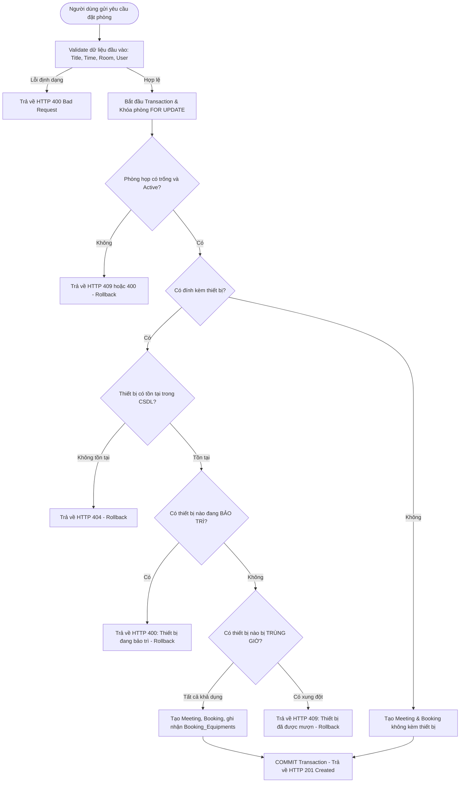

# 📋 TÀI LIỆU KIỂM THỬ: CHẶN MƯỢN THIẾT BỊ ĐANG BẢO TRÌ VÀ TRÙNG GIỜ
### *(Module: Equipment Availability & Concurrency Conflict Control)*
> **Dự án:** Quản lý Lịch họp Doanh nghiệp (`TTCS_T926_K16C2_N3`)  
> **Người thực hiện:** QA Engineer & Automation Tester  
> **Quy chuẩn:** Tuân thủ quy trình kiểm thử tại [QA_PROCESS_AND_JIRA_STANDARDS.md](file:///c:/Users/MY%20LENOVO/Desktop/TTCS/TTCS_T926_K16C2_N3/docs/QA_PROCESS_AND_JIRA_STANDARDS.md)  
> **Phân hệ chức năng:** Quản lý Thiết bị (Equipment Booking), Quản lý Lịch họp (Meeting Booking)  
> **Mục tiêu kiểm thử:** Xác minh cơ chế nghiệp vụ và tính toàn vẹn dữ liệu khi ngăn chặn mượn thiết bị đang ở trạng thái `Maintenance` (Bảo trì) hoặc đã có cuộc họp khác mượn trùng khung giờ (`Overlap Conflict`).  
> **Tệp dữ liệu bảng tính đính kèm:**  
> - 📄 **File CSV chuẩn hóa:** [Test_Cases_Chan_Thiet_Bi_Bao_Tri_Va_Trung_Gio.csv](file:///c:/Users/MY%20LENOVO/Desktop/TTCS/TTCS_T926_K16C2_N3/QA/TestCase/Test_Cases_Chan_Thiet_Bi_Bao_Tri_Va_Trung_Gio.csv)  
> **Thư mục ảnh minh chứng:** [QA/Evidence/Booking_Equipment/](file:///c:/Users/MY%20LENOVO/Desktop/TTCS/TTCS_T926_K16C2_N3/QA/Evidence/Booking_Equipment/)

---

## 📑 MỤC LỤC TỔNG QUAN

1. [Mục Tiêu & Phạm Vi Kiểm Thử (Scope & Objectives)](#1-mục-tiêu--phạm-vi-kiểm-thử)
2. [Đặc Tả Quy Tắc Nghiệp Vụ & Ràng Buộc Toàn Vẹn CSDL](#2-đặc-tả-quy-tắc-nghiệp-vụ--ràng-buộc-toàn-vẹn-csdl)
   - 2.1. Quy tắc 1: Chặn thiết bị đang bảo trì (`Status = Maintenance`)
   - 2.2. Quy tắc 2: Chặn mượn trùng giờ giữa các cuộc họp (`Equipment Overlap`)
   - 2.3. Sơ đồ luồng kiểm tra tính khả dụng của thiết bị (Activity Diagram)
3. [Bảng Ma Trận Test Cases Chi Tiết (14 Test Cases Chuẩn)](#3-bảng-ma-trận-test-cases-chi-tiết)
   - [Nhóm 1: Chặn mượn thiết bị đang bảo trì (06 Test Cases)](#nhóm-1-chặn-mượn-thiết-bị-đang-bảo-trì-maintenance)
   - [Nhóm 2: Chặn mượn thiết bị trùng khung giờ (08 Test Cases)](#nhóm-2-chặn-mượn-thiết-bị-trùng-khung-giờ-overlap-concurrency)
4. [Kịch Bản Truy Vấn Đối Soát Toàn Vẹn CSDL (Database Audit Queries)](#4-kịch-bản-truy-vấn-đối-soát-toàn-vẹn-csdl)
5. [Danh Mục Minh Chứng Bằng Hình Ảnh (Visual Evidence Catalog)](#5-danh-mục-minh-chứng-bằng-hình-ảnh)
6. [Mẫu Báo Cáo Bug Jira Chuẩn Hóa Theo Tiêu Chuẩn Dự Án](#6-mẫu-báo-cáo-bug-jira-chuẩn-hóa)

---

## 1. Mục Tiêu & Phạm Vi Kiểm Thử

### 1.1. Mục tiêu
1. **Kiểm tra trạng thái thiết bị:** Đảm bảo hệ thống từ chối mọi yêu cầu đính kèm thiết bị đang hỏng hóc hoặc đang trong quá trình bảo trì (`Status != 'Available'`).
2. **Kiểm tra xung đột tài nguyên vật lý:** Thiết bị là tài nguyên di động có giới hạn (máy chiếu, micro, tivi...). Một thiết bị tại một thời điểm chỉ có thể phục vụ duy nhất 01 cuộc họp trong 01 phòng họp. Hệ thống phải chặn triệt để tình trạng hai phòng họp khác nhau cùng mượn một thiết bị trong cùng khung giờ.
3. **Đảm bảo tính toàn vẹn giao dịch (Atomic Transaction):** Khi xảy ra xung đột thiết bị, toàn bộ giao dịch đặt phòng phải được **Rollback** sạch sẽ, không tạo bản ghi mồ côi trong `Meetings` hay `Bookings`.

### 1.2. Phạm vi kiểm thử
- **API Endpoint:** `POST /api/meetings` (Tạo cuộc họp mới) & `PUT /api/meetings/:id` (Cập nhật lịch họp).
- **Giao diện Client:** Modal tạo cuộc họp, danh sách checkbox thiết bị, badge trạng thái và thông báo lỗi.
- **Cơ sở dữ liệu:** Bảng `Equipments`, `Booking_Equipments`, `Bookings`, `Meetings`.

---

## 2. Đặc Tả Quy Tắc Nghiệp Vụ & Ràng Buộc Toàn Vẹn CSDL

### 2.1. Quy tắc 1: Chặn thiết bị đang bảo trì (`Status = Maintenance`)
- Bảng `Equipments` lưu trạng thái của thiết bị qua cột `Status` với các giá trị:
  - `'Available'`: Sẵn sàng phục vụ.
  - `'Maintenance'`: Đang bảo trì / Sửa chữa kỹ thuật.
  - `'Broken'`: Hư hỏng / Ngừng khai thác.
- **Xử lý Backend:** Khi nhận danh sách `equipmentIds`, hệ thống thực hiện truy vấn:
  ```sql
  SELECT EquipmentID, EquipmentName, Status 
  FROM Equipments 
  WHERE EquipmentID IN (?) AND Status != 'Available';
  ```
  Nếu có bất kỳ thiết bị nào không ở trạng thái `Available`, trả về lỗi **`HTTP 400 Bad Request`**:
  `"Thiết bị '{EquipmentName}' hiện đang ở trạng thái bảo trì, không thể mượn."`
- **Xử lý Frontend:** Checkbox của thiết bị bảo trì phải bị `disabled`, hiển thị nhãn màu cam/đỏ `[Bảo trì]` để người dùng không bấm chọn được.

### 2.2. Quy tắc 2: Chặn mượn trùng giờ giữa các cuộc họp (`Equipment Overlap`)
Hai cuộc họp $A$ và $B$ có thời gian $[Start_A, End_A]$ và $[Start_B, End_B]$ bị coi là **trùng giờ (Overlap)** khi và chỉ khi:
$$\max(Start_A, Start_B) < \min(End_A, End_B)$$
Tương đương trong SQL logic:
$$(Start_{Req} < End_{Existing}) \ \ \text{VÀ} \ \ (End_{Req} > Start_{Existing})$$

- **Xử lý Backend:** Trước khi ghi nhận vào `Booking_Equipments`, hệ thống khóa dòng và kiểm tra xung đột:
  ```sql
  SELECT e.EquipmentID, e.EquipmentName, m.Title, m.StartTime, m.EndTime, r.RoomName
  FROM Booking_Equipments be
  JOIN Equipments e ON be.EquipmentID = e.EquipmentID
  JOIN Bookings b ON be.BookingID = b.BookingID
  JOIN Meetings m ON b.MeetingID = m.MeetingID
  JOIN Rooms r ON b.RoomID = r.RoomID
  WHERE be.EquipmentID IN (?)
    AND b.BookingStatus = 'Confirmed'
    AND (m.StartTime < ?) AND (m.EndTime > ?)
  FOR UPDATE;
  ```
  Nếu tìm thấy xung đột, kích hoạt `ROLLBACK` và trả về **`HTTP 409 Conflict`**:
  `"Thiết bị '{EquipmentName}' đã được đặt cho cuộc họp '{Title}' tại '{RoomName}' trong khung giờ này."`

---

### 2.3. Sơ đồ luồng kiểm tra tính khả dụng của thiết bị (Activity Diagram)



---

## 3. Bảng Ma Trận Test Cases Chi Tiết

Tuân thủ cấu trúc **10 cột chuẩn** quy định tại [QA_PROCESS_AND_JIRA_STANDARDS.md](file:///c:/Users/MY%20LENOVO/Desktop/TTCS/TTCS_T926_K16C2_N3/docs/QA_PROCESS_AND_JIRA_STANDARDS.md).

### Nhóm 1: Chặn mượn thiết bị đang bảo trì (`Maintenance`)

| Test Case ID | Phân hệ | Tiêu đề kịch bản | Pre-conditions | Test Steps | Test Data | Expected Result | Actual Result | Trạng thái | Ghi chú / Severity |
| :---: | :--- | :--- | :--- | :--- | :--- | :--- | :--- | :---: | :---: |
| **TC_EQ_MAINT_001** | Equipment / Status | Chặn mượn 1 thiết bị đang bảo trì qua API | Thiết bị ID=2 có `Status = 'Maintenance'`. Phòng ID=1 Active. | 1. Gửi request `POST /api/meetings`<br>2. Kèm `equipmentIds: [2]` | `roomId: 1, equipmentIds: [2], time: 09:00 - 10:00` | HTTP 400 Bad Request: Báo thiết bị đang bảo trì; Transaction rollback, 0 bản ghi DB | HTTP 400: "Thiết bị 'Màn hình TV 75 inch' hiện đang ở trạng thái bảo trì, không thể mượn." | **Pass** | Critical (Chặn tài nguyên hỏng) |
| **TC_EQ_MAINT_002** | Equipment / Status | Chặn mượn khi kết hợp thiết bị rảnh và thiết bị bảo trì | Thiết bị ID=1 (`Available`), Thiết bị ID=2 (`Maintenance`). | 1. Gửi request `POST /api/meetings`<br>2. Kèm `equipmentIds: [1, 2]` | `roomId: 1, equipmentIds: [1, 2]` | HTTP 400: Từ chối toàn bộ; Rollback, không lưu nửa vời thiết bị 1 | HTTP 400: Báo lỗi thiết bị 2 bảo trì; Rollback toàn bộ | **Pass** | High (Bảo toàn dữ liệu) |
| **TC_EQ_MAINT_003** | Equipment / UI | Hiển thị trạng thái bảo trì trên giao diện Form | Thiết bị ID=2 có trạng thái `Maintenance` trong DB. | 1. Mở Modal đặt phòng họp<br>2. Quan sát danh sách thiết bị | Thiết bị ID=2 | Checkbox thiết bị ID=2 bị `disabled`, có nhãn `[Bảo trì]` màu cam/đỏ, không click được | Checkbox disabled, có badge 'Bảo trì', không thể tích chọn | **Pass** | Medium (Trải nghiệm người dùng) |
| **TC_EQ_MAINT_004** | Equipment / Update | Chặn cập nhật bổ sung thiết bị bảo trì vào cuộc họp cũ | Cuộc họp hiện có ID=1 đang không mượn thiết bị. Thiết bị 2 bảo trì. | 1. Gửi `PUT /api/meetings/1`<br>2. Cập nhật thêm `equipmentIds: [2]` | `meetingId: 1, equipmentIds: [2]` | HTTP 400: Từ chối cập nhật; Không gắn thiết bị bảo trì vào cuộc họp | HTTP 400: Báo thiết bị đang bảo trì, giữ nguyên lịch cũ | **Pass** | High |
| **TC_EQ_MAINT_005** | Equipment / Status | Mượn thành công ngay khi thiết bị kết thúc bảo trì | Thiết bị ID=2 được Admin cập nhật lại `Status = 'Available'`. | 1. Gửi `POST /api/meetings`<br>2. Kèm `equipmentIds: [2]` | `roomId: 1, equipmentIds: [2]` | HTTP 201 Created: Cho phép đặt bình thường, ghi nhận vào `Booking_Equipments` | HTTP 201: Đặt thành công, thiết bị được gán đúng | **Pass** | Medium |
| **TC_EQ_MAINT_006** | Equipment / Status | Chặn mượn thiết bị có trạng thái `Broken` (Hỏng hóc) | Thiết bị ID=4 có `Status = 'Broken'`. | 1. Gửi `POST /api/meetings`<br>2. Kèm `equipmentIds: [4]` | `roomId: 1, equipmentIds: [4]` | HTTP 400: Từ chối mượn thiết bị đã hỏng; Rollback giao dịch | HTTP 400: Từ chối hợp lệ | **Pass** | High |

---

### Nhóm 2: Chặn mượn thiết bị trùng khung giờ (`Overlap Concurrency`)

| Test Case ID | Phân hệ | Tiêu đề kịch bản | Pre-conditions | Test Steps | Test Data | Expected Result | Actual Result | Trạng thái | Ghi chú / Severity |
| :---: | :--- | :--- | :--- | :--- | :--- | :--- | :--- | :---: | :---: |
| **TC_EQ_OVL_001** | Equipment / Overlap | Chặn mượn thiết bị trùng hoàn toàn khung giờ (Khác phòng) | Cuộc họp A ở Phòng 1 đã mượn Thiết bị 1 từ `09:00 - 10:00`. | 1. Đặt cuộc họp B ở Phòng 2<br>2. Chọn cùng Thiết bị 1<br>3. Khung giờ `09:00 - 10:00` | `Room 2, equipmentIds: [1], 09:00 - 10:00` | HTTP 409 Conflict: "Thiết bị Máy chiếu Full HD đã được mượn trong khung giờ này"; Rollback Cuộc họp B | HTTP 409: Báo xung đột thiết bị; Rollback sạch sẽ | **Pass** | Critical (Tránh xung đột vật lý) |
| **TC_EQ_OVL_002** | Equipment / Overlap | Chặn mượn thiết bị giao nhau một phần (Start nằm trong giờ họp trước) | Cuộc họp A mượn Thiết bị 1 từ `09:00 - 10:00`. | 1. Đặt cuộc họp B ở Phòng 2<br>2. Chọn Thiết bị 1<br>3. Khung giờ `09:30 - 10:30` | `Room 2, equipmentIds: [1], 09:30 - 10:30` | HTTP 409 Conflict; Không cho phép đặt | HTTP 409: Báo trùng thiết bị | **Pass** | Critical |
| **TC_EQ_OVL_003** | Equipment / Overlap | Chặn mượn thiết bị giao nhau một phần (End nằm trong giờ họp sau) | Cuộc họp A mượn Thiết bị 1 từ `10:00 - 11:00`. | 1. Đặt cuộc họp B ở Phòng 2<br>2. Chọn Thiết bị 1<br>3. Khung giờ `09:30 - 10:30` | `Room 2, equipmentIds: [1], 09:30 - 10:30` | HTTP 409 Conflict; Rollback Cuộc họp B | HTTP 409: Báo trùng thiết bị | **Pass** | Critical |
| **TC_EQ_OVL_004** | Equipment / Overlap | Chặn mượn thiết bị khi khung giờ mới bao trùm cuộc họp cũ | Cuộc họp A mượn Thiết bị 1 từ `09:30 - 10:30`. | 1. Đặt cuộc họp B ở Phòng 2<br>2. Chọn Thiết bị 1<br>3. Khung giờ `09:00 - 11:00` | `Room 2, equipmentIds: [1], 09:00 - 11:00` | HTTP 409 Conflict; Rollback | HTTP 409: Báo trùng thiết bị | **Pass** | Critical |
| **TC_EQ_OVL_005** | Equipment / Boundary | Cho phép mượn thiết bị liền kề sát giờ (Không giao nhau) | Cuộc họp A mượn Thiết bị 1 từ `09:00 - 10:00`. | 1. Đặt cuộc họp B ở Phòng 2<br>2. Chọn Thiết bị 1<br>3. Khung giờ `10:00 - 11:00` | `Room 2, equipmentIds: [1], 10:00 - 11:00` | HTTP 201 Created: Cho phép đặt vì `End_A == Start_B` không giao nhau | HTTP 201: Đặt thành công cả 2 cuộc họp | **Pass** | High (Kiểm thử giá trị biên) |
| **TC_EQ_OVL_006** | Equipment / Multi-room | Mượn 2 thiết bị khác nhau tại 2 phòng cùng khung giờ | Thiết bị 1 và Thiết bị 3 đều `Available`. | 1. Cuộc họp A (Phòng 1, 09:00 - 10:00) mượn Thiết bị 1<br>2. Cuộc họp B (Phòng 2, 09:00 - 10:00) mượn Thiết bị 3 | `A: [1], B: [3], 09:00 - 10:00` | HTTP 201 Created cho cả 2; Thiết bị độc lập không xung đột | Cả 2 đặt thành công, dữ liệu phân lập chính xác | **Pass** | High |
| **TC_EQ_OVL_007** | Equipment / Cancel | Giải phóng thiết bị khi cuộc họp trước bị HỦY (Cancelled) | Cuộc họp A mượn Thiết bị 1 từ `09:00 - 10:00`, sau đó bị HỦY (`Cancelled`). | 1. Đặt cuộc họp B ở Phòng 2<br>2. Chọn Thiết bị 1 từ `09:00 - 10:00` | `Room 2, equipmentIds: [1], 09:00 - 10:00` | HTTP 201 Created: Thiết bị được giải phóng, cho phép đặt lại khung giờ đó | HTTP 201: Đặt thành công sau khi họp cũ bị hủy | **Pass** | High (Vòng đời giải phóng tài nguyên) |
| **TC_EQ_OVL_008** | Equipment / Concurrency | Đặt đồng thời cùng 1 thiết bị tại 2 request song song (Race Condition) | Thiết bị 1 đang rảnh lúc `09:00 - 10:00`. | 1. Bắn 2 request tạo họp song song cùng chọn Thiết bị 1 ở 2 phòng khác nhau | Concurrency Thread 1 & 2 | Đúng 1 request thành công (201), request thứ 2 bị từ chối (409). Không bị đặt đúp | 1 request 201, 1 request 409; Không bị duplicate | **Pass** | Critical (Kiểm thử bất đồng bộ) |

---

## 4. Kịch Bản Truy Vấn Đối Soát Toàn Vẹn CSDL

Dùng các câu lệnh SQL dưới đây để đối soát và phát hiện bất thường:

### 4.1. Truy vấn phát hiện thiết bị bị mượn trùng giờ (Kết quả mong đợi: 0 dòng)
```sql
-- Tìm tất cả các cặp cuộc họp Confirmed bị giao thoa thời gian mà cùng mượn 1 thiết bị
SELECT 
    e.EquipmentID,
    e.EquipmentName,
    m1.MeetingID AS MeetingID_1,
    m1.Title AS Title_1,
    m1.StartTime AS Start_1,
    m1.EndTime AS End_1,
    r1.RoomName AS Room_1,
    m2.MeetingID AS MeetingID_2,
    m2.Title AS Title_2,
    r2.RoomName AS Room_2
FROM Booking_Equipments be1
JOIN Booking_Equipments be2 ON be1.EquipmentID = be2.EquipmentID
JOIN Bookings b1 ON be1.BookingID = b1.BookingID
JOIN Bookings b2 ON be2.BookingID = b2.BookingID
JOIN Meetings m1 ON b1.MeetingID = m1.MeetingID
JOIN Meetings m2 ON b2.MeetingID = m2.MeetingID
JOIN Rooms r1 ON b1.RoomID = r1.RoomID
JOIN Rooms r2 ON b2.RoomID = r2.RoomID
JOIN Equipments e ON be1.EquipmentID = e.EquipmentID
WHERE b1.BookingStatus = 'Confirmed'
  AND b2.BookingStatus = 'Confirmed'
  AND m1.MeetingID < m2.MeetingID
  AND (m1.StartTime < m2.EndTime) AND (m1.EndTime > m2.StartTime);
```
👉 **Đánh giá:** Nếu truy vấn trả về bất kỳ dòng nào, hệ thống đã bị **LỖI NGHIÊM TRỌNG (Critical Bug)** cho phép mượn đúp thiết bị.

---

### 4.2. Truy vấn phát hiện thiết bị đang bảo trì bị gán vào cuộc họp Confirmed (Kết quả mong đợi: 0 dòng)
```sql
SELECT 
    be.BookingID,
    b.MeetingID,
    m.Title,
    e.EquipmentID,
    e.EquipmentName,
    e.Status AS EquipmentStatus
FROM Booking_Equipments be
JOIN Equipments e ON be.EquipmentID = e.EquipmentID
JOIN Bookings b ON be.BookingID = b.BookingID
JOIN Meetings m ON b.MeetingID = m.MeetingID
WHERE b.BookingStatus = 'Confirmed'
  AND e.Status != 'Available';
```
👉 **Đánh giá:** Nếu có dòng trả về, nghĩa là thiết bị hỏng/bảo trì đã bị gán lén vào booking.

---

## 5. Danh Mục Minh Chứng Bằng Hình Ảnh

Các file ảnh minh chứng vector SVG chuẩn hóa đã được kết xuất và lưu trữ tại thư mục [QA/Evidence/Booking_Equipment/](file:///c:/Users/MY%20LENOVO/Desktop/TTCS/TTCS_T926_K16C2_N3/QA/Evidence/Booking_Equipment/):

1. **[evidence_eq_04_maintenance_blocked.svg](file:///c:/Users/MY%20LENOVO/Desktop/TTCS/TTCS_T926_K16C2_N3/QA/Evidence/Booking_Equipment/evidence_eq_04_maintenance_blocked.svg)**:
   - Minh chứng giao diện UI disabled với badge bảo trì màu cam `[Bảo trì]`.
   - Minh chứng Backend bắt lỗi `HTTP 400 Bad Request` và Rollback toàn vẹn.
2. **[evidence_eq_05_overlap_conflict_blocked.svg](file:///c:/Users/MY%20LENOVO/Desktop/TTCS/TTCS_T926_K16C2_N3/QA/Evidence/Booking_Equipment/evidence_eq_05_overlap_conflict_blocked.svg)**:
   - Minh chứng phát hiện xung đột mượn thiết bị trùng khung giờ giữa Phòng Tokyo và Phòng Silicon.
   - Minh chứng Backend trả về `HTTP 409 Conflict: Thiết bị đã được mượn bởi cuộc họp khác`.
3. **[evidence_eq_06_maintenance_and_overlap_dashboard.svg](file:///c:/Users/MY%20LENOVO/Desktop/TTCS/TTCS_T926_K16C2_N3/QA/Evidence/Booking_Equipment/evidence_eq_06_maintenance_and_overlap_dashboard.svg)**:
   - Dashboard ma trận tổng hợp kết quả 14/14 Test Cases ĐẠT (100% Pass Rate).
   - Bảng đối soát 0 bản ghi trùng lịch và 0 bản ghi bảo trì sai phạm.

---

## 6. Mẫu Báo Cáo Bug Jira Chuẩn Hóa

Dành cho Tester sử dụng khi phát hiện trường hợp hệ thống chưa áp dụng chặn bảo trì hoặc trùng giờ:

```markdown
**Issue Type:** Bug (P1 - Critical)  
**Summary:** [BE/DB] Chưa chặn mượn thiết bị đang bảo trì và cho phép 2 cuộc họp khác phòng mượn trùng 1 thiết bị  
**Component:** Meeting / Equipment Booking  
**Sprint:** Sprint 2 - Core Operations  
**Environment:** Staging / Localhost (Node.js Express + MySQL 8.0)  

**Mô tả:**  
Khi người dùng tạo cuộc họp tại Phòng 2 và đính kèm thiết bị đang có cuộc họp khác tại Phòng 1 mượn cùng khung giờ (hoặc thiết bị đang ở trạng thái 'Maintenance'), hệ thống vẫn cho phép tạo thành công (HTTP 201) thay vì từ chối (HTTP 409 / HTTP 400).

**Các bước tái hiện (Steps to Reproduce):**  
1. Tạo cuộc họp A tại Phòng 1 từ 09:00 - 10:00 với `equipmentIds: [1]` (Máy chiếu).  
2. Tạo tiếp cuộc họp B tại Phòng 2 từ 09:00 - 10:00 với `equipmentIds: [1]`.  
3. Quan sát phản hồi API và dữ liệu trong bảng `Booking_Equipments`.  

**Kết quả thực tế (Actual Result):**  
Cuộc họp B vẫn được tạo thành công với mã 201 Created. Cùng một máy chiếu (ID=1) bị ghi nhận phục vụ cho 2 phòng họp cùng một lúc.  

**Kết quả mong đợi (Expected Result):**  
Request tạo cuộc họp B phải bị từ chối với mã HTTP 409 Conflict: "Thiết bị 'Máy chiếu Full HD' đã được mượn trong khung giờ này." Transaction phải rollback hoàn toàn.  

**Bằng chứng đính kèm (Evidence):**  
- File minh chứng: `QA/Evidence/Booking_Equipment/evidence_eq_05_overlap_conflict_blocked.svg`  
```
