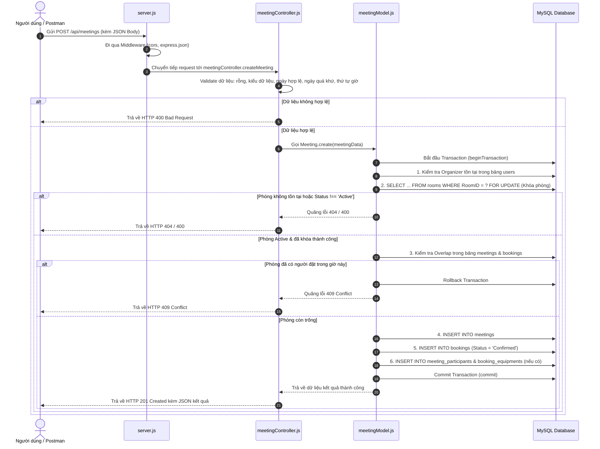

# TÀI LIỆU TỔNG HỢP CHỨC NĂNG, NGUYÊN LÝ HOẠT ĐỘNG & HƯỚNG DẪN KIỂM THỬ POSTMAN
*(Dự án: Hệ thống quản lý lịch họp doanh nghiệp - TTCS_T926_K16C2_N3)*

---

## 📑 MỤC LỤC
1. [Các Chức Năng Đã Hoàn Thành](#1-các-chức-năng-đã-hoàn-thành)
2. [Nguyên Lý Hoạt Động & Kiến Trúc Luồng Xử Lý](#2-nguyên-lý-hoạt-động--kiến-trúc-luồng-xử-lý)
   - [2.1. Kiến trúc phân tầng (MVC / Controller - Model)](#21-kiến-trúc-phân-tầng-mvc--controller---model)
   - [2.2. Cơ chế khóa dòng (FOR UPDATE) chống đặt trùng phòng (Race Condition)](#22-cơ-chế-khóa-dòng-for-update-chống-đặt-trùng-phòng-race-condition)
   - [2.3. Công thức toán học kiểm tra khoảng thời gian chồng lấn (Overlap)](#23-công-thức-toán-học-kiểm-tra-khoảng-thời-gian-chồng-lấn-overlap)
3. [Hướng Dẫn Sử Dụng Postman Để Kiểm Thử Chi Tiết](#3-hướng-dẫn-sử-dụng-postman-để-kiểm-thử-chi-tiết)
   - [3.1. Thiết lập chung trong Postman](#31-thiết-lập-chung-trong-postman)
   - [3.2. Case 1: Đặt phòng thành công (Chuẩn RESTful HTTP 201)](#case-1-đặt-phòng-thành-công-chuẩn-restful-http-201)
   - [3.3. Case 2: Kiểm tra tính năng chặn trùng lịch (HTTP 409 Conflict)](#case-2-kiểm-tra-tính-năng-chặn-trùng-lịch-http-409-conflict)
   - [3.4. Case 3: Kiểm tra chặn phòng đang bảo trì (HTTP 400 Bad Request)](#case-3-kiểm-tra-chặn-phòng-đang-bảo-trì-http-400-bad-request)
   - [3.5. Case 4: Kiểm tra chặn đặt lịch trong quá khứ (HTTP 400 Bad Request)](#case-4-kiểm-tra-chặn-đặt-lịch-trong-quá-khứ-http-400-bad-request)
   - [3.6. Case 5: Kiểm tra thời gian kết thúc trước bắt đầu (HTTP 400 Bad Request)](#case-5-kiểm-tra-thời-gian-kết-thúc-trước-bắt-đầu-http-400-bad-request)
   - [3.7. Case 6: Kiểm tra định dạng ngày giờ bị sai (HTTP 400 Bad Request)](#case-6-kiểm-tra-định-dạng-ngày-giờ-bị-sai-http-400-bad-request)
   - [3.8. Case 7: Kiểm tra khi Người tổ chức / Phòng không tồn tại (HTTP 404 Not Found)](#case-7-kiểm-tra-khi-người-tổ-chức--phòng-không-tồn-tại-http-404-not-found)
   - [3.9. Case 8: Đặt phòng tích hợp Người tham gia & Thiết bị (HTTP 201 Created)](#case-8-đặt-phòng-tích-hợp-người-tham-gia--thiết-bị-http-201-created)
   - [3.10. Case 9: Kiểm tra Route không tồn tại (HTTP 404 Route Not Found)](#case-9-kiểm-tra-route-không-tồn-tại-http-404-route-not-found)
4. [Bảng Tổng Hợp Mã Trạng Thái HTTP](#4-bảng-tổng-hợp-mã-trạng-thái-http)

---

## 1. Các Chức Năng Đã Hoàn Thành

1. **API Tạo Cuộc Họp & Đặt Phòng Họp (`POST /api/meetings`)**:
   - Cho phép người dùng đặt phòng với đầy đủ thông tin: Tiêu đề, mô tả, thời gian bắt đầu, kết thúc, mã người tổ chức, mã phòng họp, cờ lặp định kỳ.
   - Trả về mã cuộc họp (`meetingId`), mã lượt đặt (`bookingId`), tên phòng họp và thời gian đã được xác nhận.

2. **Chống Đặt Trùng Phòng Đồng Thời (Concurrency / Race Condition Protection)**:
   - Triệt tiêu 100% tình trạng hai người dùng cùng bấm nút đặt một phòng vào cùng khung giờ trong cùng một phần nghìn giây.
   - Đảm bảo tính toàn vẹn dữ liệu qua cơ chế khóa dòng độc quyền (Row Lock).

3. **Kiểm Tra Trạng Thái & Khả Dụng Của Phòng Họp**:
   - Bảng `rooms` phân loại phòng theo trạng thái: `Active` (hoạt động), `Maintenance` (bảo trì), `Inactive` (ngưng sử dụng).
   - Hệ thống tự động từ chối đặt lịch nếu phòng đang bảo trì hoặc ngưng hoạt động.

4. **Kiểm Tra Toàn Vẹn Khóa Ngoại (Foreign Key Validation)**:
   - Xác thực sự tồn tại của Người tổ chức (`OrganizerID` trong bảng `users`) và Phòng họp (`RoomID` trong bảng `rooms`) trước khi thực hiện thao tác.
   - Không bị sập server hay văng lỗi 500 mơ hồ, mà trả về lỗi 404 chuẩn xác.

5. **Xác Thực Dữ Liệu Thời Gian Nghiêm Ngặt (Strict Date-Time Validation)**:
   - Chặn đứng lỗi bypass khi client gửi chuỗi ngày giờ sai chuẩn (`Invalid Date`).
   - Chặn người dùng đặt cuộc họp ở thời điểm trong quá khứ.
   - Bắt buộc thời gian kết thúc phải diễn ra sau thời gian bắt đầu.

6. **Tích Hợp Người Tham Gia & Thiết Bị Phòng Họp (Full Relationship Support)**:
   - Hỗ trợ truyền mảng `participantIds` (danh sách mã người dùng) -> Lưu vào bảng `meeting_participants`.
   - Hỗ trợ truyền mảng `equipmentIds` (danh sách thiết bị cần dùng như máy chiếu, mic) -> Lưu vào bảng `booking_equipments`.

7. **Chuẩn Hóa Hạ Tầng Máy Chủ (Server Architecture & Security)**:
   - **Bảo mật**: Mật khẩu database và cổng server được tách riêng sang file [.env](file:///c:/DuAnThucTap_Backend/TTCS_T926_K16C2_N3/.env); có file [.gitignore](file:///c:/DuAnThucTap_Backend/TTCS_T926_K16C2_N3/.gitignore) ngăn chặn rò rỉ mã nguồn.
   - **CORS**: Cho phép Frontend (React, Vue, Vite, Mobile app) kết nối API mượt mà.
   - **Múi giờ**: Đồng bộ chuẩn múi giờ Việt Nam `+07:00` giữa Node.js và MySQL.
   - **Xử lý lỗi tập trung**: Xử lý 404 Route Not Found và Global Error Handler trả về định dạng JSON thống nhất `{ success, message }`.

---

## 2. Nguyên Lý Hoạt Động & Kiến Trúc Luồng Xử Lý

### 2.1. Kiến trúc phân tầng (MVC / Controller - Model)

Luồng đi của một yêu cầu (Request) từ khi Client gửi tới cho đến khi ghi vào Database:



---

### 2.2. Cơ chế khóa dòng (FOR UPDATE) chống đặt trùng phòng (Race Condition)

- **Vấn đề đặt ra:** Nếu 2 người dùng (A và B) cùng bấm nút "Đặt phòng" vào đúng tích tắc 09:00:00 cho cùng một phòng vào cùng khung giờ:
  - Nếu chỉ dùng câu lệnh `SELECT` kiểm tra thông thường, cả A và B đều đọc được kết quả là "Phòng trống". Sau đó cả hai đều chạy lệnh `INSERT`. Hậu quả: **Phòng bị đặt trùng (Double Booking)**.
- **Giải pháp áp dụng:**
  Trong Transaction, câu lệnh kiểm tra phòng được viết:
  ```sql
  SELECT RoomID, RoomName, Capacity, Status 
  FROM rooms 
  WHERE RoomID = ? 
  FOR UPDATE;
  ```
  - Khi request của người A chạy câu lệnh này, MySQL sẽ đặt một **khóa độc quyền (Exclusive Lock)** lên bản ghi của phòng đó.
  - Khi request của người B đến, MySQL bắt request B phải **chờ** cho đến khi transaction của người A hoàn tất (Commit hoặc Rollback).
  - Khi người A tạo cuộc họp thành công và Commit, request B mới được phép đọc. Lúc này request B kiểm tra Overlap thì đã thấy cuộc họp của A, và hệ thống sẽ báo ngay lỗi `409 Phòng đã có người đặt`.
  👉 **Kết quả:** Triệt tiêu hoàn toàn lỗi đặt trùng lịch do gửi đồng thời.

---

### 2.3. Công thức toán học kiểm tra khoảng thời gian chồng lấn (Overlap)

Giả sử cuộc họp cũ đã có trong cơ sở dữ liệu có khoảng thời gian từ `m.StartTime` đến `m.EndTime`.
Cuộc họp mới muốn đặt từ `reqStartTime` đến `reqEndTime`.

Hai khoảng thời gian giao nhau khi và chỉ khi:
$$\text{m.StartTime} < \text{reqEndTime} \quad \text{VÀ} \quad \text{m.EndTime} > \text{reqStartTime}$$

Câu SQL trong [meetingModel.js](file:///c:/DuAnThucTap_Backend/TTCS_T926_K16C2_N3/models/meetingModel.js#L68-L76):
```sql
SELECT m.MeetingID 
FROM meetings m
JOIN bookings b ON m.MeetingID = b.MeetingID
WHERE b.RoomID = ? 
  AND b.BookingStatus = 'Confirmed'
  AND (m.StartTime < ?) AND (m.EndTime > ?)
```
*(Tham số truyền vào tương ứng: `[roomId, reqEndTime, reqStartTime]`)*

- **Ví dụ kiểm chứng:**
  - Lịch đã có: `09:00` đến `10:00`.
  - Đặt mới `10:00` đến `11:00`:
    - `09:00 < 11:00` (Đúng) nhưng `10:00 > 10:00` (Sai) -> **Không trùng** (cuộc họp liền kề được chấp nhận).
  - Đặt mới `09:30` đến `10:30`:
    - `09:00 < 10:30` (Đúng) VÀ `10:00 > 09:30` (Đúng) -> **Bị trùng lịch -> Chặn ngay**.

---

## 3. Hướng Dẫn Sử Dụng Postman Để Kiểm Thử Chi Tiết

### 3.1. Thiết lập chung trong Postman

1. Mở ứng dụng **Postman**.
2. Nhấn nút **New** hoặc dấu **`+`** để mở một tab Request mới.
3. Chọn phương thức: **`POST`** (màu cam).
4. Điền URL:
   ```text
   http://localhost:3000/api/meetings
   ```
5. Chuyển sang tab **Body** (nằm ngay dưới thanh URL):
   - Chọn mục **`raw`**.
   - Ở menu thả xuống phía bên phải (mặc định đang là `Text`), bạn chọn đổi thành **`JSON`**.

---

### Case 1: Đặt phòng thành công (Chuẩn RESTful HTTP 201)

* **Mục đích:** Kiểm tra quy trình đặt phòng hợp lệ với đầy đủ thông tin.
* **Method:** `POST`
* **URL:** `http://localhost:3000/api/meetings`
* **Body (JSON):**
  ```json
  {
    "title": "Họp Chiến Lược Phát Triển Sản Phẩm",
    "description": "Thảo luận kế hoạch ra mắt quý 4",
    "startTime": "2026-12-10 09:00:00",
    "endTime": "2026-12-10 11:00:00",
    "organizerId": 1,
    "roomId": 1
  }
  ```
* **Bấm `Send`**
* **Kết quả kỳ vọng:**
  - **Status Code:** `201 Created`
  - **Response Body:**
    ```json
    {
      "success": true,
      "message": "Tạo cuộc họp và đặt phòng thành công.",
      "data": {
        "meetingId": 4,
        "bookingId": 3,
        "title": "Họp Chiến Lược Phát Triển Sản Phẩm",
        "roomId": 1,
        "roomName": "Phòng Họp Sáng Tạo 01",
        "startTime": "2026-12-10 09:00:00",
        "endTime": "2026-12-10 11:00:00",
        "organizerId": 1,
        "participantCount": 0,
        "equipmentCount": 0
      }
    }
    ```

---

### Case 2: Kiểm tra tính năng chặn trùng lịch (HTTP 409 Conflict)

* **Mục đích:** Đảm bảo hệ thống phát hiện và chặn khi khung giờ bị trùng lặp với cuộc họp ở Case 1 (09:00 - 11:00 ngày 10/12/2026 tại phòng 1).
* **Method:** `POST`
* **URL:** `http://localhost:3000/api/meetings`
* **Body (JSON):** *(Thử đặt khung giờ 09:30 - 10:30, chèn vào giữa cuộc họp trên)*
  ```json
  {
    "title": "Họp Trùng Giờ Cần Bị Chặn",
    "description": "Thử nghiệm tính năng chống trùng phòng",
    "startTime": "2026-12-10 09:30:00",
    "endTime": "2026-12-10 10:30:00",
    "organizerId": 1,
    "roomId": 1
  }
  ```
* **Bấm `Send`**
* **Kết quả kỳ vọng:**
  - **Status Code:** `409 Conflict`
  - **Response Body:**
    ```json
    {
      "success": false,
      "message": "Phòng họp \"Phòng Họp Sáng Tạo 01\" đã có người đặt trong khung giờ này."
    }
    ```

---

### Case 3: Kiểm tra chặn phòng đang bảo trì (HTTP 400 Bad Request)

* **Mục đích:** Phòng ID = 2 đang có trạng thái `Maintenance` trong cơ sở dữ liệu. Hệ thống phải từ chối không cho đặt.
* **Method:** `POST`
* **URL:** `http://localhost:3000/api/meetings`
* **Body (JSON):**
  ```json
  {
    "title": "Họp Phòng Hội Nghị",
    "startTime": "2026-12-15 14:00:00",
    "endTime": "2026-12-15 16:00:00",
    "organizerId": 1,
    "roomId": 2
  }
  ```
* **Bấm `Send`**
* **Kết quả kỳ vọng:**
  - **Status Code:** `400 Bad Request`
  - **Response Body:**
    ```json
    {
      "success": false,
      "message": "Phòng họp \"Phòng Họp Hội Nghị 02\" hiện không khả dụng (Trạng thái: Maintenance)."
    }
    ```

---

### Case 4: Kiểm tra chặn đặt lịch trong quá khứ (HTTP 400 Bad Request)

* **Mục đích:** Không cho phép tạo cuộc họp ở thời điểm đã trôi qua.
* **Method:** `POST`
* **URL:** `http://localhost:3000/api/meetings`
* **Body (JSON):** *(Đặt thời gian năm 2020)*
  ```json
  {
    "title": "Họp Ngược Thời Gian",
    "startTime": "2020-01-01 08:00:00",
    "endTime": "2020-01-01 09:00:00",
    "organizerId": 1,
    "roomId": 1
  }
  ```
* **Bấm `Send`**
* **Kết quả kỳ vọng:**
  - **Status Code:** `400 Bad Request`
  - **Response Body:**
    ```json
    {
      "success": false,
      "message": "Thời gian bắt đầu không thể diễn ra trong quá khứ."
    }
    ```

---

### Case 5: Kiểm tra thời gian kết thúc trước bắt đầu (HTTP 400 Bad Request)

* **Mục đích:** Đảm bảo thứ tự thời gian logic: giờ kết thúc phải sau giờ bắt đầu.
* **Method:** `POST`
* **URL:** `http://localhost:3000/api/meetings`
* **Body (JSON):** *(Bắt đầu lúc 15h nhưng kết thúc lúc 14h)*
  ```json
  {
    "title": "Họp Lỗi Thứ Tự Giờ",
    "startTime": "2026-12-20 15:00:00",
    "endTime": "2026-12-20 14:00:00",
    "organizerId": 1,
    "roomId": 1
  }
  ```
* **Bấm `Send`**
* **Kết quả kỳ vọng:**
  - **Status Code:** `400 Bad Request`
  - **Response Body:**
    ```json
    {
      "success": false,
      "message": "Thời gian kết thúc phải diễn ra sau thời gian bắt đầu."
    }
    ```

---

### Case 6: Kiểm tra định dạng ngày giờ bị sai (HTTP 400 Bad Request)

* **Mục đích:** Kiểm tra bộ lọc phòng ngừa lỗi JavaScript `Invalid Date bypass`.
* **Method:** `POST`
* **URL:** `http://localhost:3000/api/meetings`
* **Body (JSON):**
  ```json
  {
    "title": "Họp Sai Chuỗi Thời Gian",
    "startTime": "ngay-mai-luc-chin-gio",
    "endTime": "2026-12-20 10:00:00",
    "organizerId": 1,
    "roomId": 1
  }
  ```
* **Bấm `Send`**
* **Kết quả kỳ vọng:**
  - **Status Code:** `400 Bad Request`
  - **Response Body:**
    ```json
    {
      "success": false,
      "message": "Định dạng ngày giờ không hợp lệ (hỗ trợ chuẩn ISO 8601 hoặc YYYY-MM-DD HH:mm:ss)."
    }
    ```

---

### Case 7: Kiểm tra khi Người tổ chức / Phòng không tồn tại (HTTP 404 Not Found)

* **Mục đích:** Đảm bảo xử lý lỗi khóa ngoại mượt mà, trả về 404 thay vì văng lỗi sập server 500.
* **Method:** `POST`
* **URL:** `http://localhost:3000/api/meetings`
* **Body (JSON):** *(Truyền `organizerId: 99999` không có trong database)*
  ```json
  {
    "title": "Họp Với Người Tổ Chức Không Tồn Tại",
    "startTime": "2026-12-22 09:00:00",
    "endTime": "2026-12-22 10:00:00",
    "organizerId": 99999,
    "roomId": 1
  }
  ```
* **Bấm `Send`**
* **Kết quả kỳ vọng:**
  - **Status Code:** `404 Not Found`
  - **Response Body:**
    ```json
    {
      "success": false,
      "message": "Người tổ chức với ID 99999 không tồn tại."
    }
    ```

---

### Case 8: Đặt phòng tích hợp Người tham gia & Thiết bị (HTTP 201 Created)

* **Mục đích:** Kiểm tra tính năng nâng cao: tự động lưu dữ liệu vào 4 bảng cùng lúc (`meetings`, `bookings`, `meeting_participants`, `booking_equipments`).
* **Method:** `POST`
* **URL:** `http://localhost:3000/api/meetings`
* **Body (JSON):**
  ```json
  {
    "title": "Họp Tổng Kết Cuối Năm Toàn Công Ty",
    "description": "Báo cáo KPI và trao thưởng",
    "startTime": "2026-12-28 13:30:00",
    "endTime": "2026-12-28 17:00:00",
    "organizerId": 1,
    "roomId": 1,
    "participantIds": [1],
    "equipmentIds": [1]
  }
  ```
* **Bấm `Send`**
* **Kết quả kỳ vọng:**
  - **Status Code:** `201 Created`
  - **Response Body:**
    ```json
    {
      "success": true,
      "message": "Tạo cuộc họp và đặt phòng thành công.",
      "data": {
        "meetingId": 5,
        "bookingId": 4,
        "title": "Họp Tổng Kết Cuối Năm Toàn Công Ty",
        "roomId": 1,
        "roomName": "Phòng Họp Sáng Tạo 01",
        "startTime": "2026-12-28 13:30:00",
        "endTime": "2026-12-28 17:00:00",
        "organizerId": 1,
        "participantCount": 1,
        "equipmentCount": 1
      }
    }
    ```

---

### Case 9: Kiểm tra Route không tồn tại (HTTP 404 Route Not Found)

* **Mục đích:** Kiểm tra bộ bắt lỗi 404 của máy chủ khi người dùng gõ sai đường dẫn API.
* **Method:** `GET`
* **URL:** `http://localhost:3000/api/unknown-endpoint`
* **Bấm `Send`**
* **Kết quả kỳ vọng:**
  - **Status Code:** `404 Not Found`
  - **Response Body:**
    ```json
    {
      "success": false,
      "message": "Tuyến đường không tồn tại: GET /api/unknown-endpoint"
    }
    ```

---

## 4. Bảng Tổng Hợp Mã Trạng Thái HTTP

| Mã HTTP | Tên mã | Ý nghĩa & Khi nào xuất hiện |
|:---:|:---|:---|
| **201** | `Created` | Tạo cuộc họp và đặt phòng thành công. Dữ liệu đã lưu an toàn vào DB. |
| **400** | `Bad Request` | Dữ liệu gửi lên sai quy tắc: thiếu trường bắt buộc, sai định dạng ngày giờ, đặt ngày trong quá khứ, giờ kết thúc trước giờ bắt đầu, hoặc phòng đang bảo trì (`Maintenance`). |
| **404** | `Not Found` | Không tìm thấy tài nguyên: `organizerId` không có trong bảng `users`, `roomId` không có trong bảng `rooms`, hoặc gõ sai đường dẫn URL. |
| **409** | `Conflict` | Xung đột lịch: Phòng họp đã có người đặt trong khoảng giờ yêu cầu (tính năng chống trùng lịch hoạt động). |
| **500** | `Internal Server Error` | Lỗi máy chủ ngoài dự kiến (được ghi log chi tiết trên console server). |
